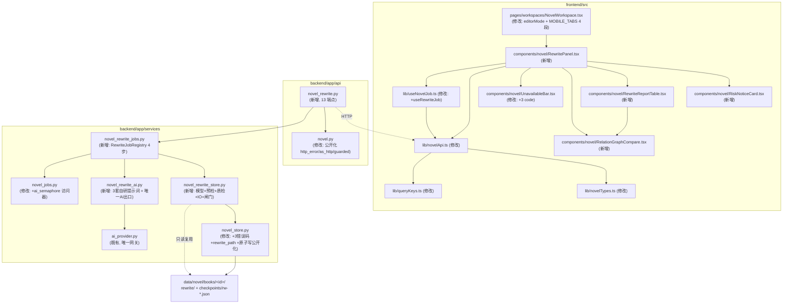
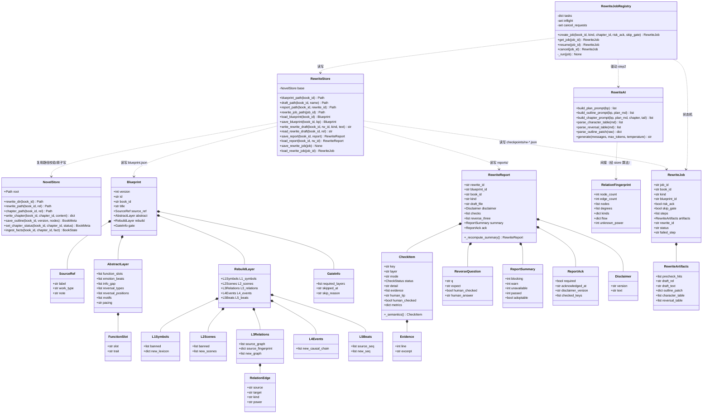

# 系统架构设计（增量）— 小说工作区 · 换元仿写工作台

| 项 | 内容 |
|---|---|
| 文档语言 | 中文 |
| 项目名 | `novel_rewrite_workbench`（增量子模块） |
| 宿主项目 | `E:/ai_codes/ai_personal_panel/tsp-fresh`（FastAPI 3018 + React 3011） |
| 上游输入 | `deliverables/novel-workspace/PRD-rewrite.md`（增量 PRD，569 行，已冻结） |
| 既有基线 | `deliverables/novel-workspace/ARCHITECTURE.md`（Phase 4，v1.0） |
| 作者 | 高见远（架构师） |
| 版本 | v1.0（增量） |
| 已采用裁定 | Q1=硬拒绝原文 / Q2=L1·L2·L3·L5 的 fail 硬阻断 / Q3=只在当前书 / Q4=轴库不纳入 / Q5=四段式风险告知 |

> **本篇的事实基准**：所有后端函数签名、路径校验入口、原子写实现、job 状态机结构、
> 路由挂载写法、前端组件契约、测试注入约定，均在 `tsp-fresh` 仓库内**实读确认**
> （`novel_store.py` 1485 行 / `novel_ai.py` 576 行 / `novel_jobs.py` 394 行 /
> `api/novel.py` 580 行 / `NovelWorkspace.tsx` / `useNovelJob.ts` / `UnavailableBar.tsx`），
> 未凭 PRD 想象。凡与 PRD 草案不一致处，统一收在 §11「设计纠错」，逐条给出理由。
>
> **增量纪律**：本文只写「换元仿写」的变更部分。`ARCHITECTURE.md` 已确立的分层、
> 错误信封、原子写、路径校验、乐观锁、asyncio job 机制、设计 token，全部沿用不重复。

---

## 1. 增量方案与选型

### 1.1 实读确认的宿主事实（本设计的硬前提）

| 事实 | 实测结论（文件:行） | 对本次设计的影响 |
|---|---|---|
| 路径校验唯一入口 | `novel_store.py:571` `chapter_path(book_id, rel_file)` 内部 `validate_rel_path(rel, self.book_dir(book_id))` + **二次校验「必须位于 `正文/` 内」**；`:346` `validate_rel_path` 用 `(root/rel).resolve()` 前缀判定 | 仿写域必须**同构**再造一个 `rewrite_path()`，且二次校验「必须位于 `rewrite/` 内」。这是「生成阶段零写入权威数据」的**结构性保证**（不是靠自觉） |
| 原子写 | `novel_store.py:445` `_atomic_write_text(path, text, *, newline)`（`.tmp` + `fsync` + `os.replace` + Windows WinError5 退避重试 `_REPLACE_RETRIES=6` + 进程内 `_WRITE_LOCK = threading.RLock()`）；`:495` `_atomic_write_json` | 两者**私有**（下划线）。仿写域不得复制实现。裁定：公开化别名（§1.2-B1） |
| 异常体系 | `:134` `NovelStoreError(RuntimeError)` → `NovelNotFound`(404) / `NovelValidationError`(422，带 `code`) / `NovelConflict`(409) | 新异常**继承 `NovelValidationError`** 即可自动享受 `_as_http` 的 422 + code 翻译，**零改动错误翻译表** |
| 错误码常量表 | `:114-128` 共 15 个 `ERR_*` 常量 | 新增 3 个常量追加在表尾（同文件、同风格） |
| job 状态机 | `novel_jobs.py:86` `NovelJobRegistry`；`STEP_NAMES` 4 步固定；`:50` `_SEMAPHORE = asyncio.Semaphore(MAX_CONCURRENT_JOBS=2)`（模块级）；`:105` `create_job` 内 `asyncio.create_task` | 仿写步骤语义不同 → **独立 registry**；但 **semaphore 必须共享**（AI 网关是共享配额） |
| job_id 反解 | `:409` `parse_job_id()` 强制 `head.startswith("job-")`；`:648` `job_path()` 靠它反解 book_id | `rw-` 前缀与 `parse_job_id` **不兼容** → 仿写 job 必须有自己的 `make/parse` + `rewrite_job_path()`，**不可复用 `NovelStore.save_job/load_job`** |
| AI 唯一出口 | `novel_ai.py:527` `async def generate_draft(messages, *, max_tokens=None, temperature=DRAFT_TEMPERATURE) -> str`，内部 `await ai_provider.generate_ai_text(...)`，捕获 `RuntimeError/ValueError` → `AiCallError` | 仿写**照此再建一个** `novel_rewrite_ai.py` 出口（与既有 `novel_ai.py` 纪律一致），API/jobs 层禁止直接调 `ai_provider` |
| 路由层薄壳 | `api/novel.py:49` `APIRouter(prefix="/api/novel")`；`:72` `_http_error` / `:77` `_as_http` / `:102` `_guarded`；`:55` `shared_store()` DI | 新建 `api/novel_rewrite.py` 复用这套翻译口径 |
| 挂载写法 | `main.py:31` 批量 import 块内已有 `novel,`；`:510` `app.include_router(novel.router)` | 加 `novel_rewrite,` 一行 + `include_router` 一行 |
| 大纲乐观锁 | `:867` `save_outline(book_id, version, nodes)`：`int(version) != book.version` → `NovelConflict`；成功后 `book.version += 1` | 大纲采纳**必须**走它并带 version → 409 `version_conflict` |
| 写正文入口 | `:1007` `write_chapter()`（`newline=""`，不改 version）；`:1186` `adopt_draft()`（读 `drafts/<draft_id>.md`，`status=published`，`version += 1`） | `adopt_draft` 绑定**既有** `drafts/` 目录，仿写草稿在 `rewrite/drafts/` → **不用它**；改走 `write_chapter` + `set_chapter_status`（§11-A2） |
| 测试约定 | `tests/` **无 conftest.py**；`test_api_novel.py:62` `store = NovelStore(root=tmp_path)` + `:66` `app.dependency_overrides[novel_api.shared_store] = lambda: store` | 仿写测试同样**自包含**，用同一注入姿势 |
| 前端轮询 | `useNovelJob.ts`：`POLL_INTERVAL_MS = 1500`，`NOVEL_JOB_TERMINAL = ['done','failed','cancelled']`，`QK.novelJob(jobId)` | 仿写 job 端点不同 → 在同文件加 `useRewriteJob()`，**复用终态集合与间隔**（不新建文件） |
| 移动端分段 | `NovelWorkspace.tsx:27` `MOBILE_TABS` 3 段；`type MobileTab = 'books'\|'chapters'\|'editor'` | 扩为 4 段：保留 key `editor`（既有行为零改动），label 改「写作」，新增 `{key:'rewrite', label:'仿写'}` |
| unavailable 文案 | `UnavailableBar.tsx`：`UnavailableCode` 联合类型 + `ICONS`/`TONES`/`DEFAULT_MESSAGES` 三个 `Record<UnavailableCode, …>` 穷尽映射 | 新增 3 个 code → **tsc 会强制补齐三张表**（编译期硬保证，漏一个就编译失败） |
| TS 严格度 | `strict` + `noUnusedLocals` + `noUnusedParameters` | 仿写组件不得留未使用变量/参数 |

### 1.2 五个架构决策（回答主理人 §五）

#### 决策 1 · 数据层：**新建独立 service + 对 `novel_store.py` 做最小增量**（不是二选一，是两者都做）

| 动作 | 内容 | 理由 |
|---|---|---|
| **修改** `novel_store.py`（+55 行） | ① 3 个新错误码常量；② `REWRITE_DIR = "rewrite"` 常量；③ `rewrite_dir(book_id)` / `rewrite_path(book_id, rel)` 两个方法；④ 公开化 `atomic_write_text` / `atomic_write_json`（保留 `_` 私有名做别名，既有 12 处调用点**一行不动**） | ① 错误码表必须单点，否则前后端会漂移；② **`rewrite_path()` 必须和 `chapter_path()` 放在同一个类里** —— 「路径校验唯一入口」这条纪律的价值就在于「不会有人抄漏一份」。把仿写路径函数丢到新文件，等于开了第二个入口；③ 原子写**绝不复制实现**（复制 = 两份 WinError5 退避逻辑，将来改一处漏一处） |
| **新建** `novel_rewrite_store.py`（~520 行） | Pydantic 领域模型（Blueprint / RewriteReport / CheckItem / …）+ 预检四规则 + 五项质检算法 + 报告组装 + 仿写域读写 + 采纳闸门校验 + 权威快照工具 | 领域逻辑是仿写特有的，塞进 `novel_store.py` 会让它从 1485 行涨到 2000+，且把「文件系统事实层」和「仿写业务规则」两个职责混在一起 |

**依赖方向**（严格单向，无环）：

```
api/novel_rewrite.py ──> services/novel_rewrite_jobs.py ──> services/novel_rewrite_ai.py
        │                          │                                  │
        │                          └──> services/novel_rewrite_store.py┘
        │                                        │
        └──> services/novel_store.py <───────────┘   （只依赖 validate_id / validate_rel_path /
                     │                                rewrite_path / atomic_write_* / 异常类 / 常量）
                     └──> 文件系统 data/novel/books/<id>/ …
```

- `novel_rewrite_store` **只 import** `novel_store` 的公开件，**不 import** `novel_ai` / `novel_jobs`（纯算法 + IO，可脱离 HTTP 与事件循环单测）。
- `novel_rewrite_ai` **是唯一** `await ai_provider.generate_ai_text` 的地方（经 `novel_ai.generate_draft` 同构实现，但**不复用 `novel_ai` 的提示词**，因为仿写提示词是完全不同的五层重建语境）。更准确地说：`novel_rewrite_ai` 内部直接 `await ai_provider.generate_ai_text(...)` 一次（与 `novel_ai.generate_draft` 同构、同异常处理），**不 import `novel_ai`**（避免两个 AI 模块互相纠缠）。
- `novel_rewrite_jobs` 依赖 `novel_rewrite_store`（IO）+ `novel_rewrite_ai`（AI）+ `novel_jobs.ai_semaphore()`（并发闸门）。
- **不存在反向 import**。

#### 决策 2 · 任务编排：**新建 `RewriteJobRegistry`，共享 semaphore，复用 `checkpoints/` 目录**

| 议题 | 裁定 | 理由 |
|---|---|---|
| 改造 vs 新建 | **新建** `novel_rewrite_jobs.py`（~230 行） | 既有 4 步是 `context → draft_text → fact_snapshot → ingest`（每步都围绕「一章正文」），仿写 4 步是 `precheck → generate → evaluate → finalize`（step3 是**本地算法**，step1 是本地预检），语义完全不同。硬塞进 `_run_step` 的 if/elif 会让两个状态机互相污染，且 `test_api_novel.py` 已有针对既有行为的断言（如「resume 不重跑 step1」），改造风险远大于 230 行新代码 |
| `Semaphore(2)` | **共享**既有 `_SEMAPHORE`。改法：在 `novel_jobs.py` 追加一行访问器 `def ai_semaphore() -> asyncio.Semaphore: return _SEMAPHORE`（+6 行含 docstring） | AI 网关是**共享外部配额**。若仿写另起 `Semaphore(2)`，「1 个续写 + 1 个仿写」实际并发就是 4，把用户 Key 打爆。共享后全局上限恒为 2 |
| job_id 前缀 `rw-` | `rw-<book_id>-<YYYYmmddHHMMSS>-<hex4>`；`make_rewrite_job_id()` / `parse_rewrite_job_id()` 自建（复用 `validate_id`）；checkpoint 落 **既有** `books/<id>/checkpoints/rw-*.json` | PRD §5.1 明确「仿写 job 复用 `checkpoints/`，job_id 前缀 `rw-`」。**不复用** `NovelStore.save_job/load_job`（它们走 `parse_job_id`，只认 `job-` 前缀，会 422）。目录布局与 PRD 逐字一致 |
| 端点 | 仿写 job 用独立端点 `GET/POST /api/novel/books/{id}/rewrite/jobs/{job_id}` | 既有 `GET /api/novel/jobs/{id}` 走 `parse_job_id`，`rw-` 进去必 422。独立端点语义清晰，且不影响既有端点的任何断言 |

仿写 4 步状态机（与既有 4 步同构，可 resume/cancel）：

| Step | 做什么 | 触碰范围 |
|---|---|---|
| 1 `precheck` | 本地四规则预检蓝图自由文本 + L3/L5 闸门判据（缺表且未 `skip_gate` → **本步直接 failed**，不进下一步） | 只读 |
| 2 `generate` | 一次 `generate_ai_text`（plan / outline / chapter-draft 三选一）→ 原子写 `rewrite/drafts/<rewrite_id>.md` 或 `.outline.json` | **只写 `rewrite/`** |
| 3 `evaluate` | **本地零依赖**：跑 5 项自动算法（L1/L2/L3/L5/⑦/⑧）+ 复用 `novel_ai.lint_text()` → 组装 8 项 `CheckItem` | 只读 |
| 4 `finalize` | 组装 `RewriteReport`（`summary` **强制重算**）→ 原子写 `rewrite/reports/<rewrite_id>.json`；`status=done` | **只写 `rewrite/`** |

> step3 是纯 CPU（LCS 64×64 DP、指纹哈希），毫秒级，**不占 semaphore 之外的资源**，与既有 job 的 step1/step4 同理。

#### 决策 3 · 采纳闸门：**路径层结构性保证 + 快照三重断言**

三重防护，从硬到软：

1. **结构性（最强）**：`RewriteStore` 的所有写方法都经 `store.rewrite_path(book_id, rel)`，而该方法强制「必须位于 `books/<id>/rewrite/` 内」（与 `chapter_path()` 强制「必须在 `正文/` 内」完全同构）。**因此仿写代码在路径层就不可能写出 `rewrite/`**，无论写什么文件名。
2. **可测性（pytest）**：新增 `capture_authoritative_snapshot(store, book_id) -> dict`，返回
   ```python
   {
     "book_mtime_ns": int,        # book.json 的 st_mtime_ns
     "book_version": int,         # book.json 的乐观锁版本
     "state_mtime_ns": int,
     "state_sha256": str,
     "chapters": {"正文/ch-001.md": {"mtime_ns": int, "sha256": str}, ...},  # 排序
   }
   ```
   测试：`before = capture(...)` → 跑 plan/outline/chapter-draft 三条生成链路 → `after = capture(...)` → `assert before == after`。**mtime + version + 文件清单（含内容哈希）三重**。
3. **流程性**：草稿采纳走 `write_chapter`（既有「写正文」唯一权威入口）；大纲采纳走 `save_outline(book_id, version, nodes)`，**version 由前端携带**，过期 → 409 `version_conflict`。

#### 决策 4 · 错误码：**只加 3 个常量 + 3 个异常子类，零改动 `_as_http`**

```python
# 追加在 novel_store.py:128 之后（同表、同风格）
ERR_REWRITE_SOURCE_REJECTED = "rewrite_source_rejected"   # 422
ERR_REWRITE_GATE_BLOCKED    = "rewrite_gate_blocked"      # 422
ERR_REWRITE_ACK_REQUIRED    = "rewrite_ack_required"      # 422
```

```python
# novel_rewrite_store.py —— 全部继承 NovelValidationError
class RewriteSourceRejectedError(NovelValidationError): ...   # code=rewrite_source_rejected
class RewriteGateBlockedError(NovelValidationError): ...      # code=rewrite_gate_blocked
class RewriteAckRequiredError(NovelValidationError): ...      # code=rewrite_ack_required
```

因为 `api/novel.py:87` 已有 `if isinstance(exc, NovelValidationError): return _http_error(422, exc.code, str(exc))`，
**三个新异常自动获得 422 + 正确 code 的翻译，`_as_http` 一行不改**。这是选择「继承」而非「新增分支」的唯一理由。

#### 决策 5 · 前端：**面板整体替换右栏内容区，复用轮询 hook 不新建文件**

- `NovelWorkspace.tsx` 新增 `editorMode: 'write' | 'rewrite'`（默认 `'write'`）与 `riskAck: boolean`。
  模式切换条 `[写作 | 仿写]` 内联在右栏容器顶部（约 15 行 TSX，**不新建组件文件**）；
  `editorMode === 'rewrite'` 时右栏内容区**整体替换**为 `<RewritePanel/>`，当前章节正文收起为可展开抽屉。
- 左栏 / 中栏 **零改动**（仍是同一本书的同一套数据）。
- `MOBILE_TABS` 3 → 4 段（保留 `editor` key，label 改为「写作」，新增 `rewrite`）。
- `useNovelJob.ts` 追加 `useRewriteJob(jobId)`（+20 行），复用 `isJobTerminal` / `POLL_INTERVAL_MS` /
  `NOVEL_JOB_TERMINAL`，新增 `QK.novelRewriteJob(jobId)`。**终态语义与轮询节奏两处一致，放同文件才不会改歪**。

### 1.3 依赖方向图



---

## 2. 完整文件清单

后端根：`E:/ai_codes/ai_personal_panel/tsp-fresh/backend/`
前端根：`E:/ai_codes/ai_personal_panel/tsp-fresh/frontend/`

### 2.1 后端（新增 4 / 修改 4）

| # | 绝对路径 | 新增/修改 | 职责 | 预估行数 |
|---|---|---|---|---|
| **B1** | `backend/app/services/novel_store.py` | **修改** | ① 追加 3 个 `ERR_REWRITE_*` 常量（`:128` 后）<br>② 追加 `REWRITE_DIR = "rewrite"` 常量<br>③ 追加 `rewrite_dir(book_id)` / `rewrite_path(book_id, rel)`（与 `chapter_path()` 同构：先 `validate_rel_path`，再强制「必须位于 `rewrite/` 内」）<br>④ 追加 `atomic_write_text` / `atomic_write_json` **公开别名**（私有 `_` 名保留为引用，既有 12 处调用点不动） | **+55** |
| **B2** | `backend/app/services/novel_rewrite_store.py` | **新增** | ① Pydantic 领域模型：`Blueprint` / `SourceRef` / `FunctionSlot` / `AbstractLayer` / `RelationEdge` / `L1Symbols` / `L2Scenes` / `L3Relations` / `L4Events` / `L5Beats` / `RebuildLayer` / `GateInfo`；`RewriteReport` / `CheckItem` / `Evidence` / `ReverseQuestion` / `ReportSummary` / `ReportAck` / `Disclaimer`；`RewriteJob` / `RewriteArtifacts`<br>② 输入侧预检四规则 `precheck_text()` / `precheck_blueprint()`<br>③ 质检算法：`banned_term_hits()` / `relation_fingerprint()` / `compare_fingerprint()` / `lcs_len()` / `lcs_trace()` / `check_one_to_one()` / `check_isomorphic_reversal()`<br>④ 报告组装 `build_report()`（8 项 + 反向三问 + `summary` 强制重算）<br>⑤ 仿写域 IO：`save_blueprint` / `load_blueprint` / `write_rewrite_draft` / `read_rewrite_draft` / `save_report` / `load_report` / `save_rewrite_job` / `load_rewrite_job`<br>⑥ 闸门：`is_gate_ready()` / `require_gate()` / `require_adoptable()`<br>⑦ 工具：`capture_authoritative_snapshot()`（P0-10 三重断言）<br>⑧ 3 个异常类 + 常量表（`DISCLAIMER_VERSION` / `DISCLAIMER_TEXT` / 各阈值） | **~520** |
| **B3** | `backend/app/services/novel_rewrite_ai.py` | **新增** | ① 3 套**自研**提示词：`build_plan_prompt`（五层重建设定卡）/ `build_outline_prompt`（六章级大纲补丁 JSON）/ `build_chapter_prompt`（分章草稿）<br>② 每套提示词内含**负面约束段**（PRD §2.6 九条禁止项改写为指令）<br>③ 结构化块解析：`parse_character_table()`（新角色-功能位表）/ `parse_reversal_table()`（反转登记表）/ `parse_outline_patch()`（→ 可被 `OutlineVolume/OutlineChapter` 校验）<br>④ 唯一 AI 出口 `async def generate(messages, *, max_tokens, temperature)`（同 `novel_ai.generate_draft` 的异常纪律）<br>⑤ 文件头注明「**自研，未复制第三方提示词**」 | **~300** |
| **B4** | `backend/app/services/novel_rewrite_jobs.py` | **新增** | ① `RewriteJobRegistry`：create / get / resume / cancel（与 `NovelJobRegistry` 同构）<br>② 4 步状态机 `STEP_NAMES = ("precheck","generate","evaluate","finalize")`<br>③ `make_rewrite_job_id()` / `parse_rewrite_job_id()`<br>④ 复用 `novel_jobs.ai_semaphore()`；`asyncio.create_task` + 协作式取消<br>⑤ `shared_rewrite_job_registry()` 单例 | **~230** |
| **B5** | `backend/app/services/novel_jobs.py` | **修改** | 追加 `def ai_semaphore() -> asyncio.Semaphore`（返回模块级 `_SEMAPHORE`），供仿写 registry 共享 | **+6** |
| **B6** | `backend/app/api/novel.py` | **修改** | 追加 3 行公开别名：`http_error = _http_error` / `as_http = _as_http` / `guarded = _guarded`（既有私有名保留，既有端点不动） | **+5** |
| **B7** | `backend/app/api/novel_rewrite.py` | **新增** | `APIRouter(prefix="/api/novel", tags=["novel-rewrite"])`；13 个端点（§4.3）；请求模型 8 个；复用 `novel.shared_store` / `novel.http_error` / `novel.guarded` | **~330** |
| **B8** | `backend/app/main.py` | **修改** | `:31` 批量 import 块加 `novel_rewrite,` 一行；`:510` 后加 `app.include_router(novel_rewrite.router)` 一行 | **+2** |
| **B9** | `backend/tests/test_novel_rewrite_store.py` | **新增** | 预检四规则（正负 + 豁免）、拓扑指纹（全等/度数同/孤立节点/边类型不同/空图）、LCS（阈值边界 2/3 与 1/2、同义归一、超长截断、Jaccard 打乱顺序）、⑦一对一映射、⑧同构反转、**状态语义四值断言**、报告 `summary` 强制重算、`unavailable ≠ pass`、免责文案关键字、**零写入三重快照**、路径穿越、原子写无 `.tmp` 残留 | **~380** |
| **B10** | `backend/tests/test_api_novel_rewrite.py` | **新增** | 13 端点契约；`risk_ack` 缺失 → 422 `rewrite_ack_required`；L3 空 → 422 `rewrite_gate_blocked`；原文粘贴 → 422 `rewrite_source_rejected` 且响应**不含原文**；无 ack → adopt 422；version 过期 → 409；AI 未配置 → 503 `ai_unavailable`；`rw-` job 轮询与 resume | **~260** |

### 2.2 前端（新增 4 / 修改 6）

| # | 绝对路径 | 新增/修改 | 职责 | 预估行数 |
|---|---|---|---|---|
| **F1** | `frontend/src/lib/novelTypes.ts` | **修改** | 追加仿写类型：`CheckStatus`（四值联合）、`Blueprint` / `SourceRef` / `FunctionSlot` / `RelationEdge` / `RebuildLayer` / `GateInfo`；`RewriteReport` / `CheckItem` / `Evidence` / `ReverseQuestion` / `ReportSummary` / `ReportAck`；`RewriteJob` / `RewriteJobStatus`；`PrecheckHit`；文件头补「与 `novel_rewrite_store.py` Pydantic 模型手工同步」 | **+130** |
| **F2** | `frontend/src/lib/novelApi.ts` | **修改** | 追加 13 个仿写端点封装（复用既有 `request`；自动保存类传 `quiet: true`）；追加 `rewriteStatusTone()` 状态色映射辅助 | **+150** |
| **F3** | `frontend/src/lib/queryKeys.ts` | **修改** | 追加 `novelRewriteBlueprint(bookId)` / `novelRewriteReport(rewriteId)` / `novelRewriteJob(jobId)` | **+3** |
| **F4** | `frontend/src/lib/useNovelJob.ts` | **修改** | 追加 `useRewriteJob(jobId)`（复用 `isJobTerminal` / `POLL_INTERVAL_MS` / `QK.novelRewriteJob`） | **+20** |
| **F5** | `frontend/src/components/novel/RewritePanel.tsx` | **新增** | 仿写工作台主面板：① 风险卡挂载位 ② 蓝图摘要（来源/节拍/功能位/闸门红绿灯）③ 生成操作区（设定卡 / 大纲 / 本章草稿 + job 进度）④ 报告挂载位 ⑤ 采纳区（阻断文案 / 采纳按钮 disabled 逻辑）；**单一滚动区 `min-h-0 flex-1 overflow-y-auto`** | **~380** |
| **F6** | `frontend/src/components/novel/RiskNoticeCard.tsx` | **新增** | 常驻风险卡：**可折叠为一行摘要、永不消失**（无关闭按钮）；3 条必知 + 9 条禁止项 + `risk_ack` 勾选框 + 预检失败示例展开 + 固定小字「预检只做形态判断，不构成法律判断」 | **~150** |
| **F7** | `frontend/src/components/novel/RewriteReportTable.tsx` | **新增** | 报告抬头（不可关闭）+ 8 项对照表（状态徽标 / 证据 / `human_tip` / 勾选框）+ 反向校验三问 + 汇总计数（阻断/提醒/待核）+ 采纳二次确认弹窗。`Record<CheckStatus, {label,tone,icon}>` **穷尽映射** | **~230** |
| **F8** | `frontend/src/components/novel/RelationGraphCompare.tsx` | **新增** | 两张关系图**并排**（原作 vs 新作）：节点列表 + 度数序列 + 有向边（`kind` / `power`）+ 指纹差异标红；纯自研 div/SVG 布局，**零依赖**（P2-2 的完整 SVG 可视化不在本次） | **~140** |
| **F9** | `frontend/src/pages/workspaces/NovelWorkspace.tsx` | **修改** | ① `editorMode` / `riskAck` / `rewriteJobId` 状态 ② 右栏顶部 `[写作|仿写]` 切换条（内联 ~15 行）③ `MobileTab` 加 `'rewrite'`，`MOBILE_TABS` 加第 4 段 ④ 右栏内容区按 mode 二选一 ⑤ 采纳成功后 `invalidateQueries` 并自动展开正文抽屉 | **+40** |
| **F10** | `frontend/src/components/novel/UnavailableBar.tsx` | **修改** | `UnavailableCode` 加 `'rewrite_source_rejected'` / `'rewrite_gate_blocked'` / `'rewrite_ack_required'`；补齐 `ICONS` / `TONES` / `ICON_TONES` / `DEFAULT_MESSAGES` 四张穷尽表 | **+12** |

**合计**：新增 10 个文件（后端 6 / 前端 4），修改 10 个文件（后端 4 / 前端 6）。
后端净增 ≈ +68 行既有文件改动 + 4 个新文件 ≈ 1500 行；前端净增 ≈ +355 行既有文件改动 + 4 个新文件 ≈ 900 行。

---

## 3. 数据结构与接口

### 3.1 Pydantic 模型（`backend/app/services/novel_rewrite_store.py`）

```python
# ─────────────── 常量与阈值 ───────────────
REWRITE_DIR = "rewrite"                 # 与 novel_store.CHAPTERS_DIR 同构
BLUEPRINT_FILE = "blueprint.json"
RW_DRAFTS_DIR, RW_REPORTS_DIR = "drafts", "reports"

DISCLAIMER_VERSION = "rw-disclaimer-v1"
DISCLAIMER_TEXT = (
    "本报告是规则命中清单，不是查重报告，也不是法律意见。"
    "它只提示风险，不对原创性或侵权风险作出任何承诺。"
    "最终是否可用，由你本人逐条核对后决定。"
)

# 预检阈值（PRD §2.2.1）
REWRITE_INPUT_LIMIT = 1200      # R-len：单字段字数上限
QUOTE_MIN_CHARS     = 30        # R-quote：引号片段最短字数
QUOTE_MIN_HITS      = 3         # R-quote：命中处数
PARA_MIN_RUN        = 5         # R-para：连续散文段数
EXEMPT_MIN_MARKERS  = 3         # R-exempt：结构化标记行数
EXCERPT_CHARS       = 40        # hits 里回显的上下文长度（绝不回显全文）

# 算法阈值
MAX_SEQ_LEN         = 64        # L5 序列长度上限（超出截断并 warn）
LCS_FAIL_RATIO      = 2 / 3     # ≥ → fail（闭区间，命门层从严）
LCS_WARN_RATIO      = 1 / 2     # ≥ → warn
LCS_JACCARD_WARN    = 0.8       # LCS 低但多重集重合高 → 疑似「打乱顺序照搬」
L3_FAIL_SIM         = 0.75      # 指纹综合相似度 ≥ → fail
L3_WARN_SIM         = 0.5
L3_KIND_JACCARD_FAIL = 0.8      # 度数全等 且 类型/权力 Jaccard ≥ → fail
OTO_FAIL_JACCARD    = 0.8       # ⑦ 角色数相同且功能位多重集 Jaccard ≥
OTO_WARN_JACCARD    = 0.6
REVERSAL_POS_TOL    = 0.1       # ⑧ 反转位置容差（归一化到 0-1 进度）
NGRAM_SIZE          = 12        # ⑤ 原句比对（P1-2 启用，P0 恒 unavailable）

CheckStatus = Literal["pass", "warn", "fail", "unavailable"]

# ─────────────── 异常 ───────────────
class RewriteError(RuntimeError): ...
class RewriteSourceRejectedError(NovelValidationError):   # 422 rewrite_source_rejected
    def __init__(self, message: str, hits: list[dict] | None = None): ...
    hits: list[dict]                                       # 供路由层放进 detail
class RewriteGateBlockedError(NovelValidationError): ...   # 422 rewrite_gate_blocked
class RewriteAckRequiredError(NovelValidationError): ...   # 422 rewrite_ack_required

# ─────────────── 蓝图 blueprint.json ───────────────
class SourceRef(BaseModel):
    label: str = ""          # 来源标注（用户自填，可空）
    work_type: str = ""      # 题材域（抽象层）
    note: str = ""           # 结构化拆书笔记（须过 R-exempt 或 R-len 以下）

class FunctionSlot(BaseModel):
    slot: str = ""           # 对手 / 导师 / 盟友 / 背叛者 …
    trait: str = ""          # 表面提携实则压制

class AbstractLayer(BaseModel):
    function_slots: list[FunctionSlot] = Field(default_factory=list)
    emotion_beats: list[str] = Field(default_factory=list)
    info_gap: list[str] = Field(default_factory=list)
    reversal_types: list[str] = Field(default_factory=list)
    reversal_positions: list[float] = Field(default_factory=list)  # ★可空；空 → ⑧ 位置维度 unavailable
    motifs: list[str] = Field(default_factory=list)
    pacing: str = ""

class RelationEdge(BaseModel):
    """关系图有向边。from/to 是 Python 保留字 → 沿用既有 RelationDelta 的别名做法。"""
    model_config = ConfigDict(populate_by_name=True)
    source: str = Field(default="", alias="from")
    target: str = Field(default="", alias="to")
    kind: str = ""           # 关系类型：师徒 / 同门 / 敌对 / 管理 / 血缘 …
    power: str = ""          # 权力流向："高→低" / "低→高" / "对等"

class L1Symbols(BaseModel):
    banned: list[str] = Field(default_factory=list)          # 原作专名黑名单（判据）
    new_lexicon: dict[str, str] = Field(default_factory=dict)

class L2Scenes(BaseModel):
    banned: list[str] = Field(default_factory=list)          # 标志场景黑名单（判据）
    new_scenes: list[str] = Field(default_factory=list)

class L3Relations(BaseModel):
    source_graph: list[RelationEdge] = Field(default_factory=list)      # ★原作关系图（判据）
    source_fingerprint: dict[str, object] | None = None                 # 兼容 PRD 草案：只读展示，不作判据
    new_graph: list[RelationEdge] = Field(default_factory=list)         # ★新作关系图（判据）

class L4Events(BaseModel):
    new_causal_chain: list[str] = Field(default_factory=list)

class L5Beats(BaseModel):
    source_seq: list[str] = Field(default_factory=list)
    new_seq: list[str] = Field(default_factory=list)

class RebuildLayer(BaseModel):
    L1_symbols: L1Symbols = Field(default_factory=L1Symbols)
    L2_scenes: L2Scenes = Field(default_factory=L2Scenes)
    L3_relations: L3Relations = Field(default_factory=L3Relations)
    L4_events: L4Events = Field(default_factory=L4Events)
    L5_beats: L5Beats = Field(default_factory=L5Beats)

class GateInfo(BaseModel):
    required_layers: list[str] = Field(default_factory=lambda: ["L3", "L5"])
    skipped_at: str | None = None
    skip_reason: str = ""

class Blueprint(BaseModel):
    version: int = 1
    id: str = ""                 # bp-<YYYYmmddHHMMSS>-<hex4>
    book_id: str = ""
    title: str = ""
    created_at: str = ""
    updated_at: str = ""
    source_ref: SourceRef = Field(default_factory=SourceRef)
    abstract: AbstractLayer = Field(default_factory=AbstractLayer)
    rebuild: RebuildLayer = Field(default_factory=RebuildLayer)
    gate: GateInfo = Field(default_factory=GateInfo)

# ─────────────── 指纹与命中 ───────────────
class RelationFingerprint(BaseModel):
    node_count: int = 0
    edge_count: int = 0
    nodes: list[str] = Field(default_factory=list)         # 排序后
    degrees: list[int] = Field(default_factory=list)       # 无向度数列，降序
    kinds: dict[str, int] = Field(default_factory=dict)    # 关系类型多重集
    flow: dict[str, int] = Field(default_factory=dict)     # 权力流向多重集 {-1,0,1,unknown}
    unknown_power: int = 0                                 # power 无法解析的边数

class Evidence(BaseModel):
    line: int | None = None
    excerpt: str = ""                                       # ≤ 60 字

class CheckItem(BaseModel):
    key: str                    # 见 §3.2 八项 key 枚举
    layer: str                  # L1 / L2 / L3 / L4 / L5
    mode: str                   # auto | semi_auto | manual
    status: CheckStatus
    detail: str = ""
    evidence: list[Evidence] = Field(default_factory=list)
    human_tip: str = ""
    human_checked: bool = False
    checked_at: str | None = None
    metrics: dict[str, object] = Field(default_factory=dict)   # 算法中间量，供 UI 展示可核对性

    @model_validator(mode="after")
    def _semantics(self) -> "CheckItem":
        if self.status == "fail" and not (self.evidence or self.detail):
            raise ValueError("fail 必须给出证据或说明，禁止无据阻断")
        if self.status == "unavailable" and not self.human_tip:
            raise ValueError("unavailable 必须给出 human_tip（如何人工核对）")
        if self.status == "unavailable" and self.human_checked is True and not self.checked_at:
            self.checked_at = now_iso()
        return self

class ReverseQuestion(BaseModel):
    q: str
    expect: str                 # 期望答案（"不能" / "不是"）
    human_checked: bool = False
    human_answer: str | None = None

class ReportSummary(BaseModel):
    blocking: int = 0           # fail 数
    warn: int = 0
    unavailable: int = 0
    passed: int = 0
    adoptable: bool = False

class ReportAck(BaseModel):
    required: bool = True
    acknowledged_at: str | None = None
    disclaimer_version: str | None = None
    checked_keys: list[str] = Field(default_factory=list)   # ★勾选结果随 ack 落盘（Q2）

class Disclaimer(BaseModel):
    version: str = DISCLAIMER_VERSION
    text: str = DISCLAIMER_TEXT

class RewriteReport(BaseModel):
    rewrite_id: str             # rw-<book_id>-<ts>-<hex4>
    blueprint_id: str = ""
    book_id: str = ""
    chapter_id: str | None = None
    kind: str = "chapter"       # plan | outline | chapter
    draft_file: str = ""        # 相对 rewrite/ 的路径
    generated_at: str = ""
    disclaimer: Disclaimer = Field(default_factory=Disclaimer)
    checks: list[CheckItem] = Field(default_factory=list)
    reverse_three: list[ReverseQuestion] = Field(default_factory=list)
    summary: ReportSummary = Field(default_factory=ReportSummary)
    ack: ReportAck = Field(default_factory=ReportAck)

    @model_validator(mode="after")
    def _recompute_summary(self) -> "RewriteReport":
        """summary 永远是 checks 的函数，外部传什么都不算（硬保证：
        不可能出现「有 fail 但 adoptable=True」，也不可能把 unavailable 数成 pass）。"""
        ...
        return self

# ─────────────── 仿写 job（checkpoints/rw-*.json）───────────────
class RewriteArtifacts(BaseModel):
    precheck_hits: list[dict] = Field(default_factory=list)
    draft_rel: str | None = None
    draft_text: str | None = None
    outline_patch: dict | None = None
    character_table: list[dict] = Field(default_factory=list)   # ⑦ 的输入
    reversal_table: list[dict] = Field(default_factory=list)    # ⑧ 的输入

class RewriteJob(BaseModel):
    job_id: str = ""            # rw-<book_id>-<ts>-<hex4>
    book_id: str = ""
    chapter_id: str | None = None
    kind: str = "plan"          # plan | outline | chapter
    blueprint_id: str = ""
    risk_ack: bool = False
    skip_gate: bool = False
    created_at: str = ""
    updated_at: str = ""
    steps: list[JobStep] = Field(default_factory=list)      # 复用 novel_store.JobStep
    artifacts: RewriteArtifacts = Field(default_factory=RewriteArtifacts)
    rewrite_id: str | None = None
    status: str = "queued"      # queued|running|done|failed|cancelled
    failed_step: str | None = None
```

### 3.2 八项质检的 `key` 枚举与模式（PRD §2.4 → 可执行定稿）

| # | `key` | `layer` | `mode` | 判据来源 | 无样本时 |
|---|---|---|---|---|---|
| 1 | `proper_noun` | L1 | `auto` | 产物文本 ∩ `rebuild.L1_symbols.banned` | `banned` 空 → **unavailable** |
| 2 | `signature_scene` | L2 | `auto` | 产物文本 ∩ `rebuild.L2_scenes.banned` | `banned` 空 → **unavailable** |
| 3 | `relation_topology` | L3 | `auto` | `compare_fingerprint(source_graph, new_graph)`（§5.2） | 任一侧无边 → **unavailable** |
| 4 | `beat_sequence` | L5 | `auto` | `lcs_len(norm(source_seq), norm(new_seq)) / max(len)`（§5.3） | 任一侧空 → **unavailable** |
| 5 | `near_duplicate` | L1 | `semi_auto` | 有 `banned_quotes` 样本 → 12-gram；**P0 无样本入口 → 恒定 `unavailable`** | **P0 恒 unavailable** |
| 6 | `unique_prop` | L1/L2 | `semi_auto` | `L1.banned` ∩ 道具词 + 独立 `banned_props` 关键字匹配 | 空 → **unavailable** |
| 7 | `one_to_one_character` | L3 | `auto` | `check_one_to_one(abstract.function_slots, artifacts.character_table)`（§5.4） | AI 结构化块解析不到 → **unavailable** |
| 8 | `isomorphic_reversal` | L5 | `auto` | `check_isomorphic_reversal(abstract.reversal_types/positions, artifacts.reversal_table)`（§5.5） | AI 结构化块解析不到 → **unavailable** |

**自动/人工边界总账**：P0 **全自动 4 项**（1,2,3,4）；**依赖 AI 结构化块 2 项**（7,8，解析失败即 unavailable，绝不 pass）；**半自动/恒不可用 2 项**（5,6）。
**反向校验三问**为纯人工项（`reverse_three`，3 条，必须全勾选）。

### 3.3 磁盘文件最终 schema

```
data/novel/books/<book_id>/
├── book.json                       # ★仿写全链路零写入★
├── state.json                      # ★仿写全链路零写入★
├── 正文/*.md                        # ★仿写生成阶段零写入（仅 adopt 时写）★
├── checkpoints/
│   ├── job-*.json                  # 既有：续写/润色 job
│   └── rw-*.json                   # ★新增★ RewriteJob
└── rewrite/                        # ★新增★ 仿写域（rewrite_path() 强制其内）
    ├── blueprint.json              # → Blueprint（version / id / source_ref / abstract / rebuild / gate）
    ├── drafts/
    │   ├── rw-<...>.md             # 仿写正文草稿 / 设定卡 md
    │   └── rw-<...>.outline.json   # 大纲补丁（未采纳前不是权威）
    └── reports/
        └── rw-<...>.json           # → RewriteReport（含 ack）
```

> **对 PRD §5.1 的一处删减**：`rewrite/runs/` **不做**。job 的完整留痕已在
> `checkpoints/rw-*.json`（`artifacts` 含全部生成参数与中间产物），再落一份 `runs/`
> 是冗余且会引入「两份真相」。（见 §11-A6）

### 3.4 `novel_rewrite_store.py` 服务函数签名

```python
# ── 预检（本地零依赖，不调 AI）──
def precheck_text(field: str, text: str) -> list[PrecheckHit]:
    """四规则：R-exempt 优先（≥3 行结构化标记 → 直接放行）；
       否则依次 R-len / R-quote / R-para。命中返回 [{field, rule, excerpt, hint}]。"""

def precheck_blueprint(bp: Blueprint) -> list[PrecheckHit]:
    """遍历全部自由文本字段：source_ref.note / abstract.* 长文本 /
       rebuild.L4_events.new_causal_chain 逐项 / L1.new_lexicon 的 value / pacing。"""

def clean_precheck_response(hits: list[PrecheckHit]) -> dict:
    """构造 422 响应体：含 hits + 引导示例，**绝不回显被拒原文全文**（P0-3④）。"""

# ── 质检算法（纯函数，全部可脱离 IO 单测）──
def banned_term_hits(text: str, banned: list[str]) -> list[Evidence]:
    """黑名单子串匹配（大小写不敏感、去空白后比对），返回行号 + ≤60 字 excerpt。"""

def relation_fingerprint(edges: list[RelationEdge]) -> RelationFingerprint: ...
def compare_fingerprint(src: RelationFingerprint, new: RelationFingerprint) -> tuple[CheckStatus, dict]: ...
def lcs_len(a: list[str], b: list[str]) -> int: ...
def lcs_trace(a: list[str], b: list[str]) -> list[str]: ...
def multiset_jaccard(a: dict[str, int], b: dict[str, int]) -> float: ...
def check_one_to_one(source_slots: list[FunctionSlot], new_roles: list[dict]) -> tuple[CheckStatus, dict]: ...
def check_isomorphic_reversal(types: list[str], positions: list[float],
                              new_reversals: list[dict], total: int) -> tuple[CheckStatus, dict]: ...
def normalize_beat(tag: str) -> str: ...
def normalize_slot(slot: str) -> str: ...
def normalize_reversal(kind: str) -> str: ...

# ── 报告 ──
def build_report(*, rewrite_id, blueprint, kind, draft_text, outline_patch,
                 character_table, reversal_table, total_chapters) -> RewriteReport:
    """组装 8 项 + 反向三问；summary 由 RewriteReport 的 validator 强制重算。"""

def apply_checks(report: RewriteReport, checks: list[dict], reverse: list[dict]) -> RewriteReport:
    """落勾选（幂等，可多次调）：warn/unavailable 项 + 反向三问。checked_at 同步写入。"""

def write_ack(report: RewriteReport) -> RewriteReport:
    """写 ack：acknowledged_at + disclaimer_version + checked_keys（勾选留痕）。"""

def require_adoptable(report: RewriteReport) -> None:
    """服务端二次校验（不信前端）：blocking==0 且 全部 warn/unavailable 已勾选
       且 反向三问全勾选 且 ack 已写 → 否则 raise RewriteAckRequiredError(422)。"""

# ── 闸门 ──
def is_gate_ready(bp: Blueprint) -> tuple[bool, list[str]]:
    """L3：source_graph 与 new_graph 均非空；L5：source_seq 与 new_seq 均非空。
       返回 (ready, missing_layers)。ready 是**计算值**，不落盘（避免盘/算不一致）。"""

def require_gate(bp: Blueprint, *, skip: bool = False) -> None:
    """未 ready 且未 skip → raise RewriteGateBlockedError(422, missing=[...])。
       skip=True → 放行，但调用方必须写 gate.skipped_at / skip_reason。"""

# ── IO（全部经 store.rewrite_path，路径层结构性保证）──
class RewriteStore:
    def __init__(self, store: NovelStore | None = None) -> None: ...
    @property
    def base(self) -> NovelStore: ...

    def rewrite_dir(self, book_id: str) -> Path: ...
    def blueprint_path(self, book_id: str) -> Path: ...
    def draft_path(self, book_id: str, name: str) -> Path: ...
    def report_path(self, book_id: str, rewrite_id: str) -> Path: ...

    def load_blueprint(self, book_id: str) -> Blueprint:
        """不存在 → 返回空 Blueprint（不落盘），与 get_state 同风格。"""
    def save_blueprint(self, book_id: str, bp: Blueprint) -> Blueprint:
        """**先跑 precheck_blueprint**，命中即 raise RewriteSourceRejectedError（不落盘）。"""
    def write_rewrite_draft(self, book_id: str, rewrite_id: str, kind: str, text: str) -> str:
        """→ 相对 rewrite/ 的路径。md 用 newline=""；outline.json 用 atomic_write_json。"""
    def read_rewrite_draft(self, book_id: str, rel: str) -> str: ...
    def save_report(self, book_id: str, report: RewriteReport) -> RewriteReport: ...
    def load_report(self, book_id: str, rewrite_id: str) -> RewriteReport: ...
    def list_reports(self, book_id: str) -> list[dict]: ...

    def rewrite_job_path(self, job_id: str) -> Path:
        """checkpoints/rw-*.json（复用既有 checkpoints 目录 + validate_id）。"""
    def save_rewrite_job(self, job: RewriteJob) -> None: ...
    def load_rewrite_job(self, job_id: str) -> RewriteJob: ...

# ── 测试/审计工具（P0-10）──
def capture_authoritative_snapshot(store: NovelStore, book_id: str) -> dict:
    """{book_mtime_ns, book_version, state_mtime_ns, state_sha256,
        chapters: {rel: {mtime_ns, sha256}}} —— mtime + version + 内容哈希 三重。"""
```

### 3.5 `novel_rewrite_ai.py` 服务函数签名

```python
# 文件头：# 自研，未复制第三方提示词。许可证 MIT（与宿主项目一致）。

PLAN_MAX_TOKENS, OUTLINE_MAX_TOKENS, CHAPTER_MAX_TOKENS = 3000, 3000, 4000
PLAN_TEMPERATURE, OUTLINE_TEMPERATURE, CHAPTER_TEMPERATURE = 0.8, 0.5, 0.85

_NEGATIVE_CONSTRAINTS = (...)   # PRD §2.6 九条禁止项改写为负面指令，三套提示词共用

def build_plan_prompt(bp: Blueprint) -> list[Message]:
    """五层重建设定卡：L1 新符号 / L2 新场景 / L3 新关系图（必须换权力流向）/
       L4 新因果链 / L5 新桥段序列 + 两段机器可解析块（新角色表 / 反转登记表）。"""

def build_outline_prompt(bp: Blueprint, plan_md: str) -> list[Message]:
    """六章级大纲补丁 JSON：可被 OutlineVolume/OutlineChapter 直接 model_validate；
       含信息增量表 / 伏笔登记表 / 刺激点分布。**只输出 JSON，不写 book.json**。"""

def build_chapter_prompt(bp: Blueprint, plan_md: str, chapter: OutlineChapter,
                         context_tail: str) -> list[Message]: ...

def parse_character_table(md: str) -> list[dict]:
    """抽取 ```rw-roles 围栏内 JSON → [{name, slot}]；解析失败返回 []（→ ⑦ unavailable）。"""

def parse_reversal_table(md: str) -> list[dict]:
    """抽取 ```rw-reversals 围栏内 JSON → [{type, chapter_index, position_ratio}]。"""

def parse_outline_patch(raw: str) -> dict:
    """剥围栏 → json.loads → OutlineTree.model_validate；失败 raise（不落盘半份补丁）。"""

async def generate(messages: list[Message], *, max_tokens: int | None = None,
                   temperature: float = PLAN_TEMPERATURE) -> str:
    """唯一 AI 出口：await ai_provider.generate_ai_text(...)；
       捕获 RuntimeError/ValueError → novel_ai.AiCallError；空结果视为失败。"""
```

### 3.6 API 端点表（`backend/app/api/novel_rewrite.py`）

统一错误响应沿用既有：`HTTPException(status_code=N, detail={"code": ..., "message": ...})`。
`rewrite_id` 与 job_id 同构：`rw-<book_id>-<ts>-<hex4>`。

| # | 方法 | 路径（前缀 `/api/novel/books/{book_id}/rewrite`） | 请求体 | 响应体 | 错误码 |
|---|---|---|---|---|---|
| R1 | GET | `/blueprint` | — | `{ok, blueprint, ready, missing_layers}` | `invalid_id`(422) `not_found`(404) |
| R2 | PUT | `/blueprint` | `{blueprint}` | `{ok, blueprint, ready, missing_layers}` | **`rewrite_source_rejected`(422)** `invalid_payload`(422) |
| R3 | POST | `/precheck` | `{fields: {name: text}}` 或 `{blueprint}` | `{ok, passed, hits:[{field,rule,excerpt,hint}], sample}` | **`rewrite_source_rejected`(422)** |
| R4 | POST | `/plan` | `{risk_ack: bool, skip_gate?: bool, skip_reason?: str}` | `RewriteJob`（**202**） | **`rewrite_gate_blocked`(422)** **`rewrite_ack_required`(422)** `ai_unavailable`(503) `ai_error`(503) `not_found` |
| R5 | POST | `/outline` | `{risk_ack, skip_gate?, skip_reason?, version?: int}` | `RewriteJob`（202） | 同 R4 |
| R6 | POST | `/chapter-draft` | `{chapter_id, risk_ack, skip_gate?, skip_reason?}` | `RewriteJob`（202） | 同 R4 + `invalid_id`（chapter_id） |
| R7 | GET | `/reports/{rewrite_id}` | — | `{ok, report}` | `not_found` |
| R8 | POST | `/reports/{rewrite_id}/check` | `{checks:[{key, human_checked}], reverse:[{index, human_checked}]}` | `{ok, report}`（勾选已落盘，幂等） | `not_found` `invalid_payload` |
| R9 | POST | `/reports/{rewrite_id}/adopt` | `{ack: true, target?: "chapter"\|"outline", version?: int, fact?: dict}` | `{ok, chapter?, outline?, state?, views_rebuilt}` | **`rewrite_ack_required`(422)** `version_conflict`(409) `fact_parse_failed`(422) `not_found` |
| R10 | GET | `/jobs/{job_id}` | — | `RewriteJob` | `invalid_id` `not_found` |
| R11 | POST | `/jobs/{job_id}/resume` | — | `RewriteJob` | `job_busy`(409) `job_not_resumable`(409) `not_found` |
| R12 | POST | `/jobs/{job_id}/cancel` | — | `RewriteJob` | `not_found` |
| R13 | GET | `/reports` | `?kind=` | `{ok, reports:[{rewrite_id, kind, generated_at, blocking, adoptable}]}` | `not_found` |

**说明**

- R4/R5/R6 **必须** `risk_ack=true`（T2 服务端二次校验），缺失 → 422 `rewrite_ack_required`。
- R4/R5/R6 在 `create_job` 前就做 `ai_status()` 检查（fail-closed，与 `novel_jobs.create_job:140` 同姿势）：AI 不可用 → **503 + `ai_unavailable`**，不建 job、不 mock。
- R2 在落盘前跑完整预检；命中即 422，**一个字节都不落**（P0-3③ 的表达性要求）。
- R9 的 `fact` 走既有 `_validate_fact()` 逻辑（从 `api/novel.py` 复用同一 helper，需 import）。
- 写后自检**不新增端点**，复用既有 `POST /api/novel/books/{book_id}/lint`（PRD P0-6②：产物带上 lint 命中清单 —— 由 job step3 在后端内部调用 `novel_ai.lint_text()` 并写入 `checks` 的补充项 / `metrics`）。

### 3.7 类图



---

## 4. 程序调用流程

### 4.1 时序图 ① — 仿写全链路（precheck → plan → outline → chapter-draft → report → 人工核对 → adopt）

```mermaid
sequenceDiagram
    autonumber
    actor U as 作者
    participant UI as RewritePanel.tsx
    participant API as api/novel_rewrite.py
    participant RJ as RewriteJobRegistry
    participant RS as RewriteStore
    participant RA as novel_rewrite_ai
    participant AI as ai_provider.generate_ai_text
    participant ST as NovelStore
    participant FS as data/novel/books/&lt;id&gt;/

    U->>UI: 右栏切到「仿写」
    UI->>API: GET /rewrite/blueprint
    API->>RS: load_blueprint（不存在返回空 Blueprint，不落盘）
    API-->>UI: {blueprint, ready, missing_layers}
    Note over UI: RiskNoticeCard 常驻展开（可折叠不可关闭）<br/>未勾 risk_ack → 三个生成按钮 disabled

    U->>UI: 填蓝图（拆书笔记/功能位/情绪节拍/L3 两图/L5 两序列）
    UI->>API: POST /rewrite/precheck {fields}
    API->>RS: precheck_text 逐字段
    alt 命中 R-len/R-quote/R-para 且未过 R-exempt
        API-->>UI: 422 {code:rewrite_source_rejected, hits:[{field,rule,excerpt}], sample}
        Note over UI: 红条 + 展开「结构笔记应该长什么样」示例<br/>**不回显原文全文**
    else 通过（含 R-exempt 豁免）
        API-->>UI: 200 {ok:true, passed:true}
        UI->>API: PUT /rewrite/blueprint {blueprint}
        API->>RS: precheck_blueprint 再跑一遍（服务端强制）
        API->>RS: save_blueprint
        RS->>ST: rewrite_path(book, "blueprint.json")
        ST->>FS: 原子写 rewrite/blueprint.json
        API-->>UI: 200 {ok, ready, missing_layers}
    end

    U->>UI: 勾选风险 + 点「生成设定卡」
    UI->>API: POST /rewrite/plan {risk_ack:true}
    alt risk_ack 缺失
        API-->>UI: 422 {code:rewrite_ack_required}
    else risk_ack=true
        API->>RJ: create_job(book, kind=plan, risk_ack=true)
        RJ->>RA: (前) ai_status()
        alt AI 未配置
            RA-->>RJ: available=false
            RJ-->>API: AiCallError
            API-->>UI: 503 {code:ai_unavailable, reason}
            Note over UI: UnavailableBar 显式声明，不 mock 生成
        else AI 可用
            RJ->>RS: require_gate(blueprint, skip)
            alt L3/L5 缺表且未 skip
                RS-->>RJ: RewriteGateBlockedError(missing=[L3])
                RJ-->>API: 422 {code:rewrite_gate_blocked, missing:[L3]}
                Note over UI: 「L3 关系拓扑与 L5 桥段序列是命门…可显式跳过但产物会标记未过闸门」
            else 闸门通过（或已 skip → 写 gate.skipped_at）
                RJ->>FS: 原子写 checkpoints/rw-*.json（4 步 pending, status=queued）
                RJ->>RJ: asyncio.create_task(_run) + 共享 Semaphore(2) 排队
                API-->>UI: 202 {job_id: rw-...}
            end
        end
    end

    UI->>API: GET /rewrite/jobs/{job_id}（每 1.5s，useRewriteJob）
    API->>RJ: get_job → 读盘（权威在磁盘，刷新不丢）

    Note over RJ,FS: ── Step 1 precheck（本地）──
    RJ->>RS: precheck_blueprint + is_gate_ready
    RJ->>FS: 写 checkpoint（step1=done, artifacts.precheck_hits）

    Note over RJ,AI: ── Step 2 generate（唯一 AI 调用）──
    RJ->>RA: build_plan_prompt(blueprint) → await generate(messages)
    RA->>AI: await generate_ai_text(...)
    AI-->>RA: 设定卡 md（含 rw-roles / rw-reversals 围栏）
    alt 调用失败 / 返回空
        RA-->>RJ: AiCallError
        RJ->>FS: 写 checkpoint（step2=failed, failed_step=generate）
        Note over UI: 「本次生成失败，可重试该步骤」（已完成的 step 产物保留）
    else 成功
        RA-->>RJ: 设定卡 md
        RJ->>RS: write_rewrite_draft(book, rw-..., "plan", md)
        RS->>ST: rewrite_path(book, "drafts/rw-....md")
        ST->>FS: 原子写（md 用 newline=""）
        RJ->>RA: parse_character_table / parse_reversal_table
        RJ->>FS: 写 checkpoint（step2=done, draft_rel, character_table, reversal_table）
    end

    Note over RJ,RS: ── Step 3 evaluate（本地零依赖算法）──
    RJ->>RS: banned_term_hits(draft, L1.banned / L2.banned)
    RJ->>RS: relation_fingerprint(source_graph) / (new_graph) → compare_fingerprint
    RJ->>RS: lcs_len(norm(source_seq), norm(new_seq)) → ratio
    RJ->>RS: check_one_to_one(function_slots, character_table)
    RJ->>RS: check_isomorphic_reversal(types, positions, reversal_table)
    RJ->>RJ: novel_ai.lint_text(draft)（复用既有四规则）
    Note over RJ: 无样本项（⑤原句 / ⑥道具）一律置 unavailable + human_tip<br/>**绝不置 pass**
    RJ->>FS: 写 checkpoint（step3=done）

    Note over RJ,FS: ── Step 4 finalize ──
    RJ->>RS: build_report(...) → RewriteReport（validator 强制重算 summary）
    RS->>ST: rewrite_path(book, "reports/rw-....json")
    ST->>FS: 原子写 rewrite/reports/rw-....json
    RJ->>FS: 写 checkpoint（step4=done, status=done）
    Note over FS: 至此 book.json / state.json / 正文/ **字节未变**（P0-10）

    UI->>API: GET /rewrite/reports/{rewrite_id}
    API-->>UI: {report}
    Note over UI: RewriteReportTable：抬头（不可关闭）+ 8 项对照<br/>fail=红色阻断 / warn=琥珀 / unavailable=灰色「待核」≠ pass<br/>RelationGraphCompare 并排两张关系图 + 两行桥段序列

    U->>UI: 逐项勾选 warn/unavailable + 反向三问（3 问全勾）
    UI->>API: POST /rewrite/reports/{id}/check {checks, reverse}
    API->>RS: apply_checks（幂等，checked_at 落盘）
    API-->>UI: {ok, report}（summary.adoptable 重算）

    alt 存在 fail 项
        Note over UI: 采纳按钮 disabled + 「存在 N 项阻断，不可采纳。<br/>请修改蓝图后重新生成，或在草稿里手动替换后重新自检」
    else 无 fail
        U->>UI: 点「采纳进正文」→ 二次确认弹窗（不可跳过）
        UI->>API: POST /rewrite/reports/{id}/adopt {ack:true, version?}
        API->>RS: require_adoptable(report)（服务端二次校验，不信前端）
        alt 未全勾选 / 未 ack
            RS-->>API: RewriteAckRequiredError
            API-->>UI: 422 {code:rewrite_ack_required}
        else 通过
            API->>RS: write_ack(report)（acknowledged_at + disclaimer_version + checked_keys）
            API->>ST: write_chapter(book, chapter_id, draft_text)
            ST->>FS: 原子写 正文/ch-00N.md（newline=""）
            API->>ST: set_chapter_status(book, chapter_id, "published")
            API->>ST: rebuild_views(book_id)
            API-->>UI: 200 {ok, chapter, abs_path, views_rebuilt}
            Note over UI: 正文抽屉自动展开并刷新；中栏状态点刷新
        end
    end
```

### 4.2 时序图 ② — 采纳闸门的数据流（version 乐观锁 + ack 落盘 + 零写入断言）

```mermaid
sequenceDiagram
    autonumber
    actor U as 作者
    participant UI as RewritePanel / RewriteReportTable
    participant API as api/novel_rewrite.py
    participant RS as RewriteStore
    participant ST as NovelStore
    participant FS as data/novel/books/&lt;id&gt;/

    Note over FS: ── 生成阶段（P0-4/5/6）：只写 rewrite/ ──
    Note over ST,FS: book.json / state.json / 正文/ 零写入<br/>结构性保证：RewriteStore 全部写经 ST.rewrite_path()<br/>该方法强制「必须位于 books/&lt;id&gt;/rewrite/ 内」
    Note over FS: 可测保证：capture_authoritative_snapshot()<br/>mtime_ns + version + sha256 三重断言 before==after

    U->>UI: 报告逐项勾选（warn / unavailable / 反向三问）
    UI->>API: POST /rewrite/reports/{id}/check
    API->>RS: apply_checks(report, checks, reverse)
    RS->>RS: 仅改 human_checked / checked_at；status 与 summary 由 validator 重算
    RS->>ST: rewrite_path(book, "reports/rw-....json")
    ST->>FS: 原子写 reports/rw-....json
    API-->>UI: {ok, report}
    Note over UI: 勾选已落盘 —— 刷新页面不丢（Q2「勾选结果随 ack 落盘」的前半）

    U->>UI: 点「采纳」→ 二次确认弹窗（T4，不可跳过）
    UI->>API: POST /rewrite/reports/{id}/adopt {ack:true, target:"outline", version:7}
    API->>RS: load_report(book, rewrite_id)

    rect rgb(245,245,245)
    Note over API,RS: ── 服务端二次校验（不信前端）──
    API->>RS: require_adoptable(report)
    RS->>RS: ① summary.blocking == 0 ?<br/>② 全部 warn/unavailable 项 human_checked ?<br/>③ 反向三问全 human_checked ?<br/>④ ack.acknowledged_at 非空 ?
    alt 任一不满足
        RS-->>API: RewriteAckRequiredError(422)
        API-->>UI: 422 {code:rewrite_ack_required, message:"…请先完成全部勾选与二次确认"}
    end
    end

    API->>RS: write_ack(report)
    RS->>FS: 原子写 reports/rw-....json（acknowledged_at / disclaimer_version / checked_keys）
    Note over FS: 留痕：用户当时看到的是 rw-disclaimer-v1，勾选了哪些项

    alt target = "chapter"
        API->>RS: read_rewrite_draft(book, draft_rel)
        API->>ST: write_chapter(book, chapter_id, draft_text)
        ST->>FS: 原子写 正文/ch-00N-*.md（newline=""，不改 version）
        API->>ST: set_chapter_status(book, chapter_id, "published")
        ST->>FS: 原子写 book.json（status 变更；version 不变 → 不破坏大纲乐观锁）
        opt 携带 fact
            API->>ST: ingest_facts(book, chapter_id, ChapterFact)
            ST->>FS: 原子写 state.json
        end
        API->>ST: rebuild_views(book_id)
        ST->>FS: 原子写 views/*.md（排序化，幂等）
        API-->>UI: 200 {ok, chapter, word_count, abs_path, views_rebuilt}

    else target = "outline"
        API->>RS: read_rewrite_draft → outline_patch
        API->>ST: save_outline(book_id, version=7, nodes=patch.nodes)
        alt 磁盘 version != 7
            ST-->>API: NovelConflict
            API-->>UI: 409 {code:version_conflict, message:"大纲已被其他地方修改，请刷新后重试"}
            Note over UI: 提示「刷新大纲后重新采纳」；不静默覆盖（乐观锁的意义）
        else version 匹配
            ST->>FS: 原子写 book.json（version 7→8）
            ST->>FS: 联动新建/删除 正文/*.md（仅本书 正文/ 内）
            API->>ST: rebuild_views(book_id)
            API-->>UI: 200 {ok, book:{version:8, ...}}
        end
    end

    UI->>UI: invalidateQueries([novelChapters, novelOutline, novelState, novelView])
    Note over UI: 一次采纳只处理一个产物；无批量采纳、无一键全书（P3）
```

---

## 5. 核心算法伪码

> 全部**标准库实现**，零第三方依赖。全部为**纯函数**（无 IO、无 AI），可脱离事件循环单测。

### 5.1 输入侧预检四规则（PRD §2.2.1 → 可执行）

```python
_STRUCT_MARKER_RE = re.compile(
    r"^\s*(?:[-*+]\s|\||#{1,6}\s|[A-Za-z一-龥]{1,12}\s*[:：])", re.MULTILINE
)
_QUOTE_RE = re.compile(r"[“\"「『]([^”\"」』]{1,400}?)[”\"」』]")
_SENT_END = "。！？!?…」』”）\"'"

def precheck_text(field: str, text: str) -> list[PrecheckHit]:
    t = (text or "").strip()
    if not t:
        return []
    hits: list[PrecheckHit] = []
    n = count_words(t)                       # 复用 novel_store.count_words（不含空白）

    # ── R-exempt 结构化豁免：优先级最高，命中即整体放行 ──
    if len(_STRUCT_MARKER_RE.findall(t)) >= EXEMPT_MIN_MARKERS:      # ≥3 行 - / | / # / key: value
        return []                            # 视为笔记，直接放行

    # ── R-len 长度 ──
    if n > REWRITE_INPUT_LIMIT:                                       # 1200
        hits.append(_hit(field, "R-len", t,
            "单字段超过 1200 字且无结构化标记，疑似原文全文"))

    # ── R-quote 对白密度：引号包裹片段 ≥30 字，出现 ≥3 处 ──
    long_quotes = [m for m in _QUOTE_RE.findall(t) if count_words(m) >= QUOTE_MIN_CHARS]
    if len(long_quotes) >= QUOTE_MIN_HITS:
        hits.append(_hit(field, "R-quote", t,
            f"出现 {len(long_quotes)} 处 ≥30 字的引号片段，疑似对白摘录"))

    # ── R-para 段落连续性：连续 ≥5 段以句号/引号结尾 ──
    run = best = 0
    for line in t.splitlines():
        s = line.strip()
        if not s:
            run = 0
            continue
        run = run + 1 if s[-1] in _SENT_END else 0
        best = max(best, run)
    if best >= PARA_MIN_RUN:
        hits.append(_hit(field, "R-para", t,
            f"连续 {best} 段以句号/引号结尾且无列表标记，疑似散文原文"))
    return hits

def _hit(field, rule, text, hint) -> PrecheckHit:
    return {"field": field, "rule": rule,
            "excerpt": _excerpt(text),          # ≤40 字，**绝不回显全文**
            "hint": hint}

def _excerpt(text: str) -> str:
    """取首个 R-* 命中位置附近 40 字作为 excerpt；绝不返回完整字段内容。"""
    ...
```

**边界与裁定**

| 情形 | 处理 |
|---|---|
| 笔记含 3 行 `- ` 列表，但正文 3000 字 | **放行**（R-exempt 优先，豁免前三条）。诚实：预检只做形态判断 |
| 引号片段 29 字 × 5 处 | 不命中 R-quote（<30 字）。但可能命中 R-len 或 R-para |
| 空字段 / 纯 ASCII 短字段 | 直接返回 `[]` |
| `key: value` 用中文冒号 | `_STRUCT_MARKER_RE` 同时匹配 `:` 与 `：` |
| 响应体 | `hits` 只含 `field/rule/excerpt(≤40)/hint`，**不含被拒原文**（P0-3④ 单测断言） |

### 5.2 L3 关系拓扑指纹（★命门★）

**数据结构**：角色为节点，关系为**有向边**（`from → to`），边带 `kind`（关系类型）与 `power`（权力流向）。

```python
def relation_fingerprint(edges: list[RelationEdge]) -> RelationFingerprint:
    """无向度数 + 有向类型多重集 + 权力流向多重集。"""
    nodes = sorted({e.source for e in edges} | {e.target for e in edges})
    deg = {n: 0 for n in nodes}
    for e in edges:                       # 度数按**无向**计：社会关系是双向连接
        deg[e.source] += 1
        deg[e.target] += 1
    return RelationFingerprint(
        node_count=len(nodes),
        edge_count=len(edges),
        nodes=nodes,
        degrees=sorted(deg.values(), reverse=True),          # 降序度数序列
        kinds=dict(Counter(_norm_kind(e.kind) for e in edges)),
        flow=dict(Counter(_power_sign(e.power) for e in edges)),
        unknown_power=sum(1 for e in edges if _power_sign(e.power) == "unknown"),
    )

def _power_sign(power: str) -> str:
    """'高→低'（施压/支配）→ '-1'；'低→高'（被压制/仰视）→ '+1'；
       '对等'/'平级' → '0'；无法解析 → 'unknown'。"""
    p = re.sub(r"\s", "", str(power or ""))
    if "高" in p and "低" in p:
        return "-1" if p.index("高") < p.index("低") else "+1"
    if any(k in p for k in ("对等", "平级", "平行", "均衡")):
        return "0"
    return "unknown"

def compare_fingerprint(src: RelationFingerprint,
                        new: RelationFingerprint) -> tuple[CheckStatus, dict]:
    # ── 边界 1：无样本 → unavailable（绝不 pass）──
    if src.edge_count == 0 or new.edge_count == 0:
        return "unavailable", {"reason": "原作关系图或新作关系图为空，无法自动比对"}

    # ── 边界 2：规模差异极大 → 直接 pass（图都重构了）──
    m = max(src.edge_count, new.edge_count)
    if abs(src.edge_count - new.edge_count) > max(2, 0.5 * m):
        return "pass", {"reason": "关系图规模显著不同", "src_edges": ..., "new_edges": ...}

    # ── 度数序列对齐：短序列补 0（防「多一个孤立人」就判 pass 的漏洞）──
    L = max(len(src.degrees), len(new.degrees))
    a = src.degrees + [0] * (L - len(src.degrees))
    b = new.degrees + [0] * (L - len(new.degrees))
    same_degrees = (a == b)                      # 排序后逐项相等，**不允许容差**

    kind_j = multiset_jaccard(src.kinds, new.kinds)
    flow_j = multiset_jaccard(src.flow, new.flow)

    # ── L3-A：三元组全等 → fail（PRD「完全相同 → fail」）──
    if same_degrees and src.kinds == new.kinds and src.flow == new.flow:
        return "fail", {"reason": "关系拓扑指纹与原作完全相同", "degrees": a}

    # ── L3-B：度数全等 + 类型/权力高度重合 → fail ──
    if same_degrees and (kind_j >= L3_KIND_JACCARD_FAIL or flow_j >= L3_KIND_JACCARD_FAIL):
        return "fail", {"reason": "度数序列相同且关系类型/权力流向高度重合", ...}

    # ── L3-C：度数同但类型分布不同 → warn（PRD 原文口径）──
    if same_degrees:
        return "warn", {"reason": "度数序列相同但类型分布不同，请人工并排比对两张关系图", ...}

    # ── 综合相似度 ──
    deg_sim = 1.0 - sum(abs(x - y) for x, y in zip(a, b)) / max(1, sum(a + b))
    sim = 0.5 * deg_sim + 0.3 * kind_j + 0.2 * flow_j
    if sim >= L3_FAIL_SIM:  return "fail", {"sim": round(sim, 3), ...}
    if sim >= L3_WARN_SIM:  return "warn", {"sim": round(sim, 3), ...}
    return "pass", {"sim": round(sim, 3), ...}

def multiset_jaccard(a: dict[str, int], b: dict[str, int]) -> float:
    """多重集 Jaccard = Σmin / Σmax（保序保重数）。"""
    keys = set(a) | set(b)
    inter = sum(min(a.get(k, 0), b.get(k, 0)) for k in keys)
    union = sum(max(a.get(k, 0), b.get(k, 0)) for k in keys)
    return inter / union if union else 0.0
```

**边界情况定死**

| 情形 | 裁定 |
|---|---|
| **角色数不同** | 不构成 fail 的直接依据；度数列长度不同时补 0 对齐再比。若节点名集合**完全不同**（真换了人）→ 通常 `sim` 会低 → pass。若节点名集合**相同**只是换称呼 → 这是「换词不换构」，由 L3-A/B 捕获（度数与类型都相同） |
| **孤立节点**（度数 0） | **保留在序列中**（降序末尾的 0 是有效信息），短序列补 0 对齐 |
| **边类型集合不同** | 用**多重集** Jaccard，非集合相等。「师徒×2+敌对×1」vs「师徒×1+敌对×1+同门×1」→ inter=1+1+0=2, union=2+1+1=4 → 0.5 → 不触发 L3-B |
| **`power` 全不可解析** | `unknown` 单独成桶；`unknown_power == edge_count` → 该项降级为 **`unavailable`**（权力流向无法量化，需人工比对），**绝不 pass** |
| **任一侧空图** | `unavailable`（无样本） |
| **阈值取值理由** | 度数权重 0.5（结构主干）> 类型 0.3（关系性质）> 权力 0.2（PRD 强调但较难结构化） |

### 5.3 L5 桥段序列 LCS（★命门★）

**序列元素**：功能位标签（如「受辱 / 隐忍 / 反击 / 反转 / 清算」）。
**标签集合**：**自研枚举 + 用户自由输入**混合 —— 内置 24 个 `BEAT_TAGS`，配 ~30 条 `BEAT_SYNONYMS`
同义词归一；用户自由输入的词归一化后保留原样，**只与完全相同的词匹配**（不做模糊匹配），
并在报告 `metrics.unrecognized` 里列出（提示用户，不阻断）。

```python
BEAT_TAGS = ("受辱","隐忍","反击","反转","清算","误解","孤立","爆发达","余痛","失去",
             "获得","背叛","结盟","试炼","揭露","逃亡","追击","抉择","牺牲","重逢",
             "伪装","布局","收网","顿悟")
BEAT_SYNONYMS = {"打脸":"反击","翻盘":"反击","打压下":"受辱","受压":"受辱","翻身":"爆发达",
                 "高潮":"爆发达","真相大白":"揭露","掉马":"揭露","开挂":"获得","逆袭":"爆发达",
                 ...}   # 自研，约 30 条

def normalize_beat(tag: str) -> str:
    t = re.sub(r"[（(].*?[)）]", "", str(tag or ""))     # 去括号注释
    t = re.sub(r"\s+", "", t).lower()
    return BEAT_SYNONYMS.get(t, t)

def lcs_len(a: list[str], b: list[str]) -> int:
    """标准 DP，滚动数组。长度上限 MAX_SEQ_LEN=64 → 64×64=4096 格，毫秒级。"""
    a, b = a[:MAX_SEQ_LEN], b[:MAX_SEQ_LEN]
    if not a or not b:
        return 0
    prev = [0] * (len(b) + 1)
    for x in a:
        cur = [0] * (len(b) + 1)
        for j, y in enumerate(b, 1):
            cur[j] = prev[j - 1] + 1 if x == y else (prev[j] if prev[j] >= cur[j - 1] else cur[j - 1])
        prev = cur
    return prev[len(b)]

def lcs_trace(a: list[str], b: list[str]) -> list[str]:
    """回溯出公共子序列本身（长度 ≤64，保留完整 DP 表，内存可忽略）。
       报告里展示「到底是哪几个桥段撞了」—— 这是可核对性的关键。"""

def check_beat_sequence(source_seq, new_seq) -> tuple[CheckStatus, dict]:
    a = [normalize_beat(x) for x in source_seq if str(x).strip()]
    b = [normalize_beat(x) for x in new_seq if str(x).strip()]
    if not a or not b:
        return "unavailable", {"reason": "原作桥段序列或新作桥段序列为空，无法自动比对"}

    truncated = len(a) > MAX_SEQ_LEN or len(b) > MAX_SEQ_LEN
    n = lcs_len(a, b)
    m = max(len(a[:MAX_SEQ_LEN]), len(b[:MAX_SEQ_LEN]))
    ratio = n / m
    jac = multiset_jaccard(Counter(a), Counter(b))     # 顺序无关的重合度
    common = lcs_trace(a[:MAX_SEQ_LEN], b[:MAX_SEQ_LEN])

    metrics = {"lcs_len": n, "max_len": m, "ratio": round(ratio, 3),
               "jaccard": round(jac, 3), "common": common, "truncated": truncated,
               "src_norm": a, "new_norm": b}

    # ── 阈值边界裁定：恰好 2/3 → fail（闭区间，命门层从严，与 PRD「≥」字面一致）──
    if ratio >= LCS_FAIL_RATIO - 1e-9:
        return "fail", metrics
    if ratio >= LCS_WARN_RATIO - 1e-9:
        return "warn", metrics
    # ── 补强：「打乱顺序照搬」（PRD §2.6 禁止项 7）：LCS 低但多重集高度重合 ──
    if jac >= LCS_JACCARD_WARN:
        return "warn", {**metrics, "reason": "顺序不同但桥段集合高度重合，疑似打乱顺序照搬"}
    return "pass", metrics
```

**阈值边界总结**

| `ratio = LCS / max(len)` | 判定 |
|---|---|
| `≥ 2/3`（**含恰好等于**） | **fail**（硬阻断） |
| `≥ 1/2` 且 `< 2/3`（含恰好 1/2） | **warn** |
| `< 1/2` 且 `jaccard ≥ 0.8` | **warn**（疑似打乱顺序照搬） |
| `< 1/2` 且 `jaccard < 0.8` | **pass** |
| 任一侧空序列 | **unavailable** |

> 浮点比较统一用 `ratio >= T - 1e-9`，避免 `2/3` 的二进制表示导致「恰好等于」被判成 warn。
> 单测必须覆盖 `ratio` 恰好 `2/3` 与恰好 `1/2` 两组用例（P0-14）。

### 5.4 ⑦ 一对一人物映射检测

```python
SLOT_SYNONYMS = {"师父":"导师","师长":"导师","师傅":"导师","反派":"对手","敌人":"对手",
                 "伙伴":"盟友","同伴":"盟友","内鬼":"背叛者","叛徒":"背叛者", ...}  # 自研

def normalize_slot(slot: str) -> str:
    t = re.sub(r"\s+", "", str(slot or ""))
    return SLOT_SYNONYMS.get(t, t)

def check_one_to_one(source_slots: list[FunctionSlot],
                     new_roles: list[dict]) -> tuple[CheckStatus, dict]:
    """PRD：角色数相同 且 功能位一一对应 → fail（典型「换人名不换构」）。"""
    if not source_slots or not new_roles:
        return "unavailable", {"reason": "缺原作功能位表或新作角色表，需人工核对"}

    n_src, n_new = len(source_slots), len(new_roles)
    src_ms = Counter(normalize_slot(s.slot) for s in source_slots)
    new_ms = Counter(normalize_slot(r.get("slot", "")) for r in new_roles)

    # 必要条件：角色数不同 → 不构成一对一（PRD 明说）
    if n_src != n_new:
        return "pass", {"src_count": n_src, "new_count": n_new,
                        "reason": "角色数不同，不构成一对一映射"}

    # 功能位多重集完全相等 → 最硬的一档
    if src_ms == new_ms:
        return "fail", {"src_slots": dict(src_ms), "new_slots": dict(new_ms),
                        "reason": "角色数相同且功能位一一对应 —— 典型「换人名不换关系结构」"}

    j = multiset_jaccard(dict(src_ms), dict(new_ms))
    if j >= OTO_FAIL_JACCARD:
        return "fail", {"jaccard": round(j, 3), ...}
    if j >= OTO_WARN_JACCARD:
        return "warn", {"jaccard": round(j, 3), ...}
    return "pass", {"jaccard": round(j, 3), ...}
```

**输入来源**：`new_roles` 来自 AI 设定卡里的 ```rw-roles 结构化块（`[{"name":..., "slot":...}]`）。
**解析失败 → `unavailable`**（绝不 pass），并在 `human_tip` 里给出「请手动列出新作角色及其功能位」。
`source_slots` 来自蓝图 `abstract.function_slots`（用户填的、本来就是抽象层信息）。

### 5.5 ⑧ 同构反转底牌检测

```python
REVERSAL_SYNONYMS = {"真假身份":"身份错位","身份反转":"身份错位","信息差":"信息差误会",
                     "误会":"信息差误会","底牌错位":"底牌错位","隐藏底牌":"底牌错位", ...}  # 自研

def normalize_reversal(kind: str) -> str:
    t = re.sub(r"\s+", "", str(kind or ""))
    return REVERSAL_SYNONYMS.get(t, t)

def check_isomorphic_reversal(src_types: list[str], src_positions: list[float],
                              new_reversals: list[dict],
                              total_chapters: int) -> tuple[CheckStatus, dict]:
    """PRD：反转类型 + 出现章节位置与原作一致 → fail。"""
    if not src_types or not new_reversals:
        return "unavailable", {"reason": "缺原作反转类型或新作反转登记表，需人工核对"}

    src_kinds = {normalize_reversal(t) for t in src_types}
    # 原作位置：优先用用户填的 reversal_positions（0-1 进度），
    # 若为章序号（>1）则归一化为 (idx-1)/max(1,total-1)
    src_pos = [_to_ratio(p, total_chapters) for p in (src_positions or [])]

    hits = []
    for r in new_reversals:
        if normalize_reversal(r.get("type", "")) not in src_kinds:
            continue                                   # 类型不同 → 合法重建，不计
        rp = r.get("position_ratio")
        if rp is None and r.get("chapter_index") is not None:
            rp = _to_ratio(r["chapter_index"], total_chapters)
        if src_pos and rp is not None:
            same = any(abs(rp - p) <= REVERSAL_POS_TOL for p in src_pos)
            hits.append({"type": r.get("type"), "same_position": same, "position": rp})
        else:
            # 位置信息缺失（任一侧）→ 无法判定，标 None
            hits.append({"type": r.get("type"), "same_position": None, "position": rp})

    if not hits:
        return "pass", {"reason": "未出现与原作同类型的反转"}
    if any(h["same_position"] is True for h in hits):
        return "fail", {"hits": hits, "reason": "反转类型与出现位置均与原作一致"}
    if any(h["same_position"] is None for h in hits):
        return "warn", {"hits": hits,
                        "reason": "反转类型与原作相同，但位置信息不足 —— 请人工核对出现章节"}
    return "pass", {"hits": hits, "reason": "反转类型相同但出现位置不同（路径已重建）"}
```

**四态裁定**

| 类型 | 位置 | 判定 |
|---|---|---|
| 相同 | 相同（容差 0.1） | **fail** |
| 相同 | 任一侧缺失 | **warn**（需人工核对出现章节） |
| 相同 | 不同 | **pass**（换了位置 —— 合法重建） |
| 不同 | — | **pass** |
| 缺样本 | — | **unavailable** |

### 5.6 状态语义的硬保证（四态不可混淆）

| 层 | 保证机制 |
|---|---|
| **类型系统（后端）** | `CheckStatus = Literal["pass","warn","fail","unavailable"]` —— Pydantic 在 `model_validate` 时拒绝第四值以外的任何字符串 |
| **模型校验（后端）** | `CheckItem._semantics()`：`fail` 必须有 `evidence` 或 `detail`（禁止无据阻断）；`unavailable` 必须有 `human_tip`（必须告诉用户怎么人工核） |
| **汇总（后端）** | `RewriteReport._recompute_summary()`：**`summary` 永远是 `checks` 的函数**，外部传什么都无效 → **不可能出现「有 fail 但 `adoptable=True`」**，也不可能把 `unavailable` 数进 `passed` |
| **序列化（后端）** | `model_dump(mode="json")` 输出的 `status` 只能是四值之一；`checks` 的 key 集合有 schema 快照单测 |
| **编译期（前端）** | `type CheckStatus = 'pass' \| 'warn' \| 'fail' \| 'unavailable'`；`RewriteReportTable` 用 `Record<CheckStatus, {label,tone,icon}>` **穷尽映射** —— 少写一个键 `tsc --noEmit` 直接失败。`unavailable` → 灰标「待核」，`fail` → 红标「阻断」 |
| **运行时（前端）** | 采纳按钮 `disabled = summary.blocking > 0 \|\| !allChecked \|\| !riskAck`；`fail` 项不渲染勾选框（勾了也不放行） |
| **服务端（最终）** | `require_adoptable()` **二次校验**，不信前端。缺任一条件 → 422 `rewrite_ack_required` |
| **测试** | ① 遍历 8 项断言 `status in 四值`；② 无样本场景断言 `status == "unavailable"` **且 `!= "pass"`**；③ 构造「有 fail」的报告断言 `summary.adoptable is False`；④ 报告全文 + 前端文案关键字断言不含「保证过原创检测 / 保证不侵权 / 已通过查重 / 保证原创」 |

---

## 6. 任务列表（有序、含依赖、按可并行性分组）

> 总原则：**后端数据层与算法内核先行**（它是全部判定的唯一真相源）→ AI 与编排 → 路由 →
> 前端可**与后端并行编码**（§3.6 端点契约与 §3.1 模型已冻结）。

### T01 · 后端数据层 + 算法内核（★最大块，全部真相源★）

| 项 | 内容 |
|---|---|
| **依赖** | 无（可立即开工） |
| **并行** | 可与 **T04**（前端基础设施）同时开工 —— 共享 §3.1/§3.6 契约，无代码依赖 |
| **涉及文件** | **修改** `backend/app/services/novel_store.py`（+55）<br>**新增** `backend/app/services/novel_rewrite_store.py`（~520）<br>**新增** `backend/tests/test_novel_rewrite_store.py`（~380） |
| **要点** | ① `novel_store.py`：3 个 `ERR_REWRITE_*` 常量 + `REWRITE_DIR` + `rewrite_dir()` / `rewrite_path()`（**与 `chapter_path()` 同构：先 `validate_rel_path`，再强制「必须在 `rewrite/` 内」**）+ `atomic_write_text/json` 公开别名<br>② Pydantic 模型按 §3.1 落地；`RelationEdge` 用 `Field(alias="from"/"to")`（沿用既有 `RelationDelta` 做法）<br>③ 预检四规则（§5.1），`R-exempt` 优先<br>④ 五项算法（§5.2–§5.5）：指纹 / LCS / 一对一 / 同构反转 / 黑名单命中<br>⑤ `build_report()` + `RewriteReport._recompute_summary()` 强算 + `_semantics()` 校验<br>⑥ `apply_checks` / `write_ack` / `require_adoptable` / `is_gate_ready` / `require_gate`<br>⑦ 3 个异常类继承 `NovelValidationError`（自动 422 翻译）<br>⑧ `capture_authoritative_snapshot()`<br>⑨ 全部写经 `store.rewrite_path()`，JSON 用 `newline="\n"`、md 用 `newline=""` |
| **完成判据** | `pytest tests/test_novel_rewrite_store.py -q` 全绿且覆盖：<br>· 2000 字无标记散文 → `R-len`；改成 `- ` 列表 → **放行**（R-exempt）；3 处 ≥30 字引号 → `R-quote`；连续 5 段句号结尾 → `R-para`；`hits` **不含原文全文**<br>· 指纹：三元组全等 → `fail`；度数同类型不同 → `warn`；空图 → `unavailable`；孤立节点补 0 对齐；`power` 全不可解析 → `unavailable`；规模差异 → `pass`<br>· LCS：`ratio` **恰好 2/3 → fail**、**恰好 1/2 → warn**；同义归一（`打脸`≡`反击`）；超 64 截断；`jaccard≥0.8` 且 `ratio<1/2` → warn「打乱顺序」；空序列 → `unavailable`<br>· ⑦ 角色数不同 → pass；角色数同 + 功能位多重集相等 → fail；无角色表 → `unavailable`<br>· ⑧ 类型+位置同 → fail；类型同位置缺 → warn；类型同位置不同 → pass<br>· 状态语义：无样本项 `status == "unavailable"` **且 `!= "pass"`**；有 fail 时 `summary.adoptable is False`<br>· 免责文案不含「保证过原创检测/保证不侵权/已通过查重/保证原创」<br>· **零写入**：跑完 plan/outline/chapter 三条生成后 `capture()` 前后**完全相等**<br>· `rewrite_path()` 传 `../`、绝对路径、`book.json` → 抛 `path_escape`(422) |

### T02 · 后端 AI 层 + 仿写任务编排

| 项 | 内容 |
|---|---|
| **依赖** | **T01** |
| **涉及文件** | **新增** `backend/app/services/novel_rewrite_ai.py`（~300）<br>**新增** `backend/app/services/novel_rewrite_jobs.py`（~230）<br>**修改** `backend/app/services/novel_jobs.py`（+6：`ai_semaphore()`） |
| **要点** | ① 3 套**自研**提示词；文件头注明「**自研，未复制第三方提示词**」；每套含 PRD §2.6 九条禁止项的负面约束段<br>② 结构化块解析：`parse_character_table` / `parse_reversal_table` / `parse_outline_patch`（解析失败即 `unavailable`，**不落盘半份**）<br>③ 唯一 AI 出口 `generate()`（复用 `ai_provider.generate_ai_text`，异常纪律同 `novel_ai.generate_draft`）<br>④ `RewriteJobRegistry`：4 步 `precheck→generate→evaluate→finalize`；复 `novel_jobs.ai_semaphore()`；`make/parse_rewrite_job_id`；协作式取消；resume 时 `done`→`skipped` 保留 `at`<br>⑤ step3 是**本地算法**（调 T01 的纯函数）+ 复用 `novel_ai.lint_text()`<br>⑥ step4 只写 `rewrite/reports/` |
| **完成判据** | `pytest` 绿且：monkeypatch `ai_configured=False` → `create_job` 抛 `AiCallError(code="ai_unavailable")`，**不建 job、不 mock**；stub provider 下 prompt **包含** L3 新图全部边 + L5 新序列全部标签；`rw-` job_id 能被 `parse_rewrite_job_id` 无歧义反解；step2 注入失败 → `failed_step="generate"` 且 step1 产物仍在；resume 后 step1 `at` **未被改写**；并发 3 个 job 时实际并发 ≤2（共享 semaphore 断言） |

### T03 · 后端路由 + 挂载 + 契约测试

| 项 | 内容 |
|---|---|
| **依赖** | **T02** |
| **涉及文件** | **修改** `backend/app/api/novel.py`（+5：公开别名）<br>**新增** `backend/app/api/novel_rewrite.py`（~330）<br>**修改** `backend/app/main.py`（+2）<br>**新增** `backend/tests/test_api_novel_rewrite.py`（~260） |
| **要点** | ① `APIRouter(prefix="/api/novel", tags=["novel-rewrite"])`，13 端点按 §3.6<br>② 复用 `novel.shared_store` / `novel.http_error` / `novel.guarded`（**不复制错误翻译表**）<br>③ `main.py` 批量 import 块加 `novel_rewrite,` + `include_router`<br>④ 测试用 `TestClient` + `NovelStore(root=tmp_path)` + `dependency_overrides` 注入（**无 conftest，自包含**）<br>⑤ R4/R5/R6 返回 **202**；AI 不可用 → **503**；`risk_ack` 缺失 → 422 `rewrite_ack_required` |
| **完成判据** | `pytest tests/test_api_novel_rewrite.py -q` 全绿；`ruff check backend/` 通过（口径含 tests，line-length 100 / py311）；13 条路由全部注册；`risk_ack=false` → 422 + `detail.code == "rewrite_ack_required"`；L3 空表 → 422 `rewrite_gate_blocked`；粘贴原文 → 422 `rewrite_source_rejected` 且响应体**不含**原文正文；无 ack → `adopt` 422；version 过期 → 409 `version_conflict` |

### T04 · 前端基础设施 + 类型/API/hook + 容器接入

| 项 | 内容 |
|---|---|
| **依赖** | T03（**仅为联调**；契约已冻结，**可与 T01 并行编码**） |
| **涉及文件** | **修改** `frontend/src/lib/novelTypes.ts`（+130）、`novelApi.ts`（+150）、`queryKeys.ts`（+3）、`useNovelJob.ts`（+20）<br>**修改** `frontend/src/pages/workspaces/NovelWorkspace.tsx`（+40）<br>**修改** `frontend/src/components/novel/UnavailableBar.tsx`（+12） |
| **要点** | ① `CheckStatus` 四值联合类型；`Blueprint` / `RewriteReport` / `CheckItem` 等镜像；文件头注明「与 `novel_rewrite_store.py` 手工同步」<br>② `novelApi` 追加 13 端点；自动保存类传 `quiet: true`<br>③ `useRewriteJob()` 复用 `isJobTerminal` / `POLL_INTERVAL_MS`。`QK.novelRewriteJob`<br>④ `NovelWorkspace`：`editorMode` / `riskAck` / `rewriteJobId`；右栏顶部 `[写作\|仿写]` 切换条（**内联，不新建组件**）；`MobileTab` 加 `'rewrite'`，`MOBILE_TABS` 4 段<br>⑤ `UnavailableBar` 加 3 个 code，**补齐 `ICONS`/`TONES`/`ICON_TONES`/`DEFAULT_MESSAGES` 四张穷尽表**<br>⑥ **不改 `WorkspaceShell.tsx`**；左栏/中栏零改动 |
| **完成判据** | `tsc --noEmit` 退出码 0（`noUnusedLocals`/`noUnusedParameters` 全过 —— `UnavailableBar` 的穷尽 Record 漏键会在此暴露）；`pnpm build` 通过；仿写态下左栏/中栏结构与行为不变；<768px 分段控件 4 段且既有 3 段行为不变 |

### T05 · 前端仿写面板组件群 + 联调验收

| 项 | 内容 |
|---|---|
| **依赖** | **T04**（组件挂在右栏容器内）；T03 用于联调 |
| **涉及文件** | **新增** `frontend/src/components/novel/RewritePanel.tsx`（~380）<br>**新增** `frontend/src/components/novel/RiskNoticeCard.tsx`（~150）<br>**新增** `frontend/src/components/novel/RewriteReportTable.tsx`（~230）<br>**新增** `frontend/src/components/novel/RelationGraphCompare.tsx`（~140） |
| **要点** | ① 风险卡**可折叠为一行但永不消失**（无关闭按钮）+ `risk_ack` 勾选框 + 预检失败示例 + 固定小字「预检只做形态判断，不构成法律判断」<br>② 报告抬头不可关闭；8 项对照 + `Record<CheckStatus, …>` 穷尽映射；`unavailable` → 灰标「待核」**不是绿色 pass**；`fail` → 红标且不渲染勾选框<br>③ `RelationGraphCompare`：两张关系图并排 + 度数序列 + 两行桥段序列并排（纯 div/自研 SVG，零依赖）<br>④ 采纳二次确认弹窗（不可跳过）；有 fail → 采纳按钮 `disabled` + 阻断文案<br>⑤ 采纳成功后 `invalidateQueries` + 正文抽屉自动展开<br>⑥ 单一滚动区 `min-h-0 flex-1 overflow-y-auto`；域色 `#22c55e` 只用于状态点/图标 |
| **完成判据** | `tsc --noEmit` 与 `pnpm build` 通过；AI 未配置时面板顶部 `UnavailableBar` 且 reason 非空；所有列表空态均有文案（非空白）；`fail` 项下采纳按钮禁用；`unavailable` 渲染为灰标；1280/1024/375 三种宽度无整页滚动条；股票/港股/美股/热点工作区冒烟无回归 |

### 6.6 并行性与依赖图

```mermaid
graph TD
    T01["T01 后端数据层 + 算法内核<br/>novel_store.py(改) + novel_rewrite_store.py(新)<br/>+ test_novel_rewrite_store.py(新)"]
    T02["T02 AI 层 + 仿写任务编排<br/>novel_rewrite_ai.py(新) + novel_rewrite_jobs.py(新)<br/>+ novel_jobs.py(改 ai_semaphore)"]
    T03["T03 路由 + 挂载 + 契约测试<br/>novel_rewrite.py(新) + novel.py(改) + main.py(改)<br/>+ test_api_novel_rewrite.py(新)"]
    T04["T04 前端基础设施 + 容器接入<br/>novelTypes/novelApi/queryKeys/useNovelJob(改)<br/>+ NovelWorkspace(改) + UnavailableBar(改)"]
    T05["T05 仿写面板组件群 + 联调验收<br/>RewritePanel + RiskNoticeCard<br/>+ RewriteReportTable + RelationGraphCompare"]

    T01 --> T02 --> T03
    T04 --> T05
    T03 -.联调契约.-> T05
    T01 -.可与 T04 并行<br/>（共享 §3.1/§3.6 冻结契约）.-> T04
```

- **T01 与 T04 可完全并行**（无代码依赖，只共享本文档冻结的模型与端点契约）。
- **T02 依赖 T01**（算法内核是 job step3 的唯一真相源）。
- **T03 依赖 T02**（路由需要 service 就绪）。
- **T05 依赖 T04**；T05 与 T03 的联调可交叉进行。
- 关键路径：T01 → T02 → T03；并行支线：T01 ‖ T04 → T05。

---

## 7. 依赖包清单

**结论：零新增第三方依赖。** ✅（与 PRD §2.7 及主理人硬约束一致）

| 端 | 已具备（无需新增） | 本次用途 |
|---|---|---|
| 后端 | `pydantic>=2.7` | 领域模型、`Literal` 四态、`Field(alias=...)`、`model_validator` 强算 `summary` |
| 后端 | `fastapi>=0.115` | `APIRouter` / `HTTPException` / `Depends` |
| 后端 | `openai>=1.40`（**经 `ai_provider`**） | 唯一 LLM 通道，**不新建客户端** |
| 后端 | 标准库 `re` / `json` / `hashlib` / `collections.Counter` / `asyncio` / `uuid` / `datetime` | 预检正则、LCS DP、多重集 Jaccard、内容哈希、并发闸门 |
| 后端 | `pytest>=8.0` + `pytest-asyncio`（`asyncio_mode="auto"`） | 自包含测试，async 无需装饰器 |
| 前端 | `@tanstack/react-query@^5` | `useRewriteJob` 轮询 + 缓存失效 |
| 前端 | `lucide-react` / `clsx` / `tailwind-merge` | 图标与条件类名 |
| 前端 | `react@^18.3` | `useState` / `useMemo` |

**明确不引入**：任何图论库（networkx）、任何文本相似度库（difflib 虽在标准库但语义不符，LCS 自研 DP 更可控）、
任何查重/相似度 API、任何 LLM SDK、任何任务队列。

> 实施中若发现**必须**新增依赖 → 先停止并说明理由 + 体积/许可证评估，同步更新 `pyproject.toml` 与 PRD，**不得先斩后奏**。

---

## 8. 共享知识（跨文件约定，工程师必读）

### 8.1 路径安全（沿用并扩展既有纪律）

- **既有唯一入口**：`novel_store.validate_id(value, what)`（`^[a-z0-9-]{1,64}\Z`）+ `validate_rel_path(rel, root)`。
- **仿写域唯一入口**：`NovelStore.rewrite_path(book_id, rel)` —— 与 `chapter_path()` **同构**：
  1. `validate_rel_path(rel, self.book_dir(book_id))`（防 `../`、绝对路径、盘符）；
  2. **二次强制「必须位于 `books/<id>/rewrite/` 内」** —— 否则 `rewrite` 域的文件名可以指向
     `book.json` / `state.json` / `正文/*.md`，一次原子写就能毁掉一本书。
- **禁止**在 `api/novel_rewrite.py` 或任何组件里手工拼路径。所有路径经 `RewriteStore` 的方法产出。
- 仿写 job 的 checkpoint 例外地落在**既有** `checkpoints/`（PRD §5.1 明确），走 `rewrite_job_path()` +
  `validate_id(job_id)`，**不走** `rewrite_path()`。

### 8.2 原子写（**复用，绝不复制**）

- 通过 `novel_store.atomic_write_text(path, text, *, newline)` / `atomic_write_json(path, payload)`
  （本次公开化的别名，实现仍是 `_atomic_write_text`：`.tmp` + `fsync` + `os.replace` +
  WinError5 退避重试 6 次 + 进程内 `RLock`）。
- **换行差异（易踩坑）**：
  - JSON（`blueprint.json` / `reports/*.json` / `drafts/*.outline.json`）：`newline="\n"`；
  - 草稿 Markdown（`drafts/*.md`）：`newline=""`（字节级保留，**Windows 上不把 `\n` 写成 `\r\n`**）。
- 全部 `encoding="utf-8"`（中文目录名在 Windows 下的前提）。
- 失败时清理 `.tmp`（既有实现已保证），单测模拟 `os.replace` 前异常断言**无 `.tmp` 残留**。

### 8.3 错误码（单点定义）

定义位置：**`novel_store.py` 顶部常量表**（既有 15 个之后追加 3 个）：

```python
ERR_REWRITE_SOURCE_REJECTED = "rewrite_source_rejected"   # 422
ERR_REWRITE_GATE_BLOCKED    = "rewrite_gate_blocked"      # 422
ERR_REWRITE_ACK_REQUIRED    = "rewrite_ack_required"      # 422
```

- 三个新异常**继承 `NovelValidationError`** → 自动享受 `api/novel.py:87` 的
  `_http_error(422, exc.code, str(exc))` 翻译，**`_as_http` 一行不改**。
- `api/novel_rewrite.py` 复用 `novel.http_error` / `novel.as_http` / `novel.guarded`（同包 import，
  通过 `novel.py` 新增的 3 行公开别名，**不 import 私有名**）。

### 8.4 前后端类型对齐

- 后端 Pydantic 是**唯一权威**；前端 `novelTypes.ts` 是**手写镜像**（无代码生成依赖）。
  文件头必须写：
  ```
  // 与 backend/app/services/novel_rewrite_store.py 的 Pydantic 模型手工同步。
  // 任一侧改字段名，必须同步改另一侧，并更新 test_novel_rewrite_store.py 的 schema 快照用例。
  ```
- `test_novel_rewrite_store.py` 放**字段名快照用例**（断言 `Blueprint.model_fields` /
  `RewriteReport.model_fields` / `CheckItem.model_fields` 的键集合），防手滑改名导致前后端静默错位。
- 时间格式沿用既有：ISO 8601 带本地偏移，`datetime.now().astimezone().isoformat()`。前端只做展示格式化。
- 枚举（`CheckStatus` / `kind` / `mode`）收窄为 TS 联合类型，拼错编译期报错。

### 8.5 AI 通道纪律（合规红线）

- **唯一出口**：`novel_rewrite_ai.generate()`；**禁止**在 `api/novel_rewrite.py` 或
  `novel_rewrite_jobs.py` 里直接调 `ai_provider`。
- 复用 `app/services/ai_provider.py` 的 `generate_ai_text`；**禁止另建 LLM 客户端**。
- 捕获 `RuntimeError` / `ValueError` → `AiCallError`；**空结果视为失败**（不落盘空草稿）。
- **禁止 mock 生成、禁止空列表冒充成功**。AI 不可用 → 503 `ai_unavailable` + 中文 reason。
- **提示词全部自研**：`novel_rewrite_ai.py` 文件头必须含「**自研，未复制第三方提示词**」。
  只借鉴参考提示词包的**机制**（五层拓扑重建 / 三张必填表 / 反向校验三问），**不复制原文**。
- 单测加一条**关键字扫描**：断言仓库内 `提示词` 相关字符串不含参考包标志性原文片段。
- AGPL/GPL 参考项目（QMAI / AI_NovelGenerator / NovelForge / ReNovel-AI）**只借鉴概念，不搬代码**。

### 8.6 状态语义纪律（本次新增的核心纪律）

```
pass          —— 规则未命中
warn          —— 需人工确认，勾选后方可采纳
fail          —— 硬阻断，不出现可用的「采纳」按钮，不可降级为 warn
unavailable   —— 无样本 / 无法自动比对，必须由人工核对；绝不等于 pass
```

- 后端 `Literal` + `model_validator` + `summary` 强算，三层保证。
- 前端 `Record<CheckStatus, …>` 穷尽映射，编译期保证。
- **任何"没样本就报 pass"的实现视为缺陷**，单测逐项断言。

### 8.7 文案纪律（只提示，不保证）

- 报告与 UI **禁止**出现：「保证过原创检测」「保证不侵权」「已通过查重」「保证原创」等承诺型表述。
- 免责抬头 `DISCLAIMER_TEXT` 单点定义在 `novel_rewrite_store.py`，**不得在各组件里另写一份**。
- 报告抬头**不可关闭、不可折叠掉**；风险卡可折叠为一行摘要但**永不消失**（无关闭按钮）。
- pytest 关键字断言覆盖后端常量 + 前端组件文案。

### 8.8 测试与 lint 纪律

- 新增测试放 `backend/tests/`，命名 `test_novel_rewrite_store.py` / `test_api_novel_rewrite.py`，
  **自包含**（无 `conftest.py`，用 `tmp_path` + `NovelStore(root=tmp_path)` + `dependency_overrides` 注入）。
- `ruff` 口径：`line-length=100`、`py311`、`select=["E","F","I","N","UP","B","SIM","RUF"]`，**含 tests**。
- **pytest 基线 2637 passed / 1 xfailed / 0 failed 不得新增失败**；新增用例 ≥ 30 条（P0-14①）。
- 前端 `tsc --noEmit` 必须退出码 0。

### 8.9 git 纪律

- **本次只改文件，不执行 `git add` / `commit` / 分支切换**（宿主仓有「服务在线期间禁止主仓 git 写操作」的纪律）。
- git 操作由主理人在停服后统一执行。

---

## 9. 工程纪律清单（交付前逐条自查）

- [ ] 仿写生成全链路执行后，`book.json` / `state.json` / `正文/` **零变更**（三重快照断言）
- [ ] 粘贴原文类内容 → 422 + hits，**不回显全文、不落盘**
- [ ] L3 或 L5 表未填 → 422 `rewrite_gate_blocked`（skip 时落 `gate.skipped_at`）
- [ ] 报告 ≥8 项对照 + 3 条反向校验三问；`unavailable` **不显示为 pass**
- [ ] 报告/UI 全文**不含**「保证过原创检测 / 保证不侵权 / 已通过查重 / 保证原创」
- [ ] 有 `fail` 项 → 采纳按钮禁用；无 ack → `POST /adopt` 返回 422
- [ ] 风险卡常驻可折叠**不可关闭**；生成前 `risk_ack` 未传 → 服务端 422
- [ ] 采纳走既有 `write_chapter` / `save_outline`（带 version）/ `ingest_facts`
- [ ] AI 不可用 → `UnavailableBar` 显式声明，**无 mock 生成**
- [ ] `novel_rewrite_ai.py` 文件头含「自研，未复制第三方提示词」；提示词关键字扫描用例通过
- [ ] 轴库（94 语体 / 137KB JSON）**未入库、未进入 `data/`**
- [ ] 零新增第三方依赖；`ruff`（含 tests）通过；`tsc --noEmit` 通过
- [ ] pytest 基线 2637 passed / 0 failed **不新增失败**；新增用例 ≥30
- [ ] 未改动 `WorkspaceShell.tsx`；股票/港股/美股/热点工作区回归通过
- [ ] 仿写 job 与既有 job **共享 `Semaphore(2)`**（全局并发 ≤2）
- [ ] **未执行任何 git 提交/切分支**

---

## 10. 待明确事项（需主理人复核，附我的建议）

| # | 事项 | 背景 | **我的建议** |
|---|---|---|---|
| **A1** | `blueprint.rebuild.L3_relations.source_fingerprint` 的定位 | PRD §5.2 草案让用户**手填** `{degrees:[3,2,2,1], kinds:[...]}`。但① 用户手填度数序列极易填错；② UI 要「并排展示两张关系图」，本来就需要结构化的 `source_graph`；③ 算法判据若用两种输入会导致分支爆炸 | **建议降级为只读展示字段**：判据**只用** `source_graph` + `new_graph`（结构化边列表），指纹由算法算出；`source_fingerprint` 保留在 schema 里仅作兼容与展示，**不参与比对**。前端蓝图表单只提供「原作关系图」的结构化录入（from/to/kind/power 四列），度数序列由后端算出后回显 |
| **A2** | 仿写草稿采纳时是否置 `published` / 是否 `version += 1` | 既有 `adopt_draft()` 会读 `drafts/<id>.md`（**既有** drafts 目录）并 `version += 1`；而仿写草稿在 `rewrite/drafts/`，用不上。既有 `write_chapter()` 只写正文、**不改 version**、不置 `published` | **建议**：`write_chapter()` + `set_chapter_status(..., "published")`，**不动 `version`**。理由：① `version` 是前端大纲乐观锁凭据，章节采纳不该让它失效；② 避免与「大纲采纳带 version」双重 +1 造成 409 误报；③ `adopt_draft()` 绑定既有 `drafts/` 目录，仿写不复用它以免目录耦合 |
| **A3** | 报告第 ⑤ 项（原句/近复制句）在 P0 **恒为 `unavailable`** 是否可接受 | PRD §2.2 硬裁定：原句摘录**只允许**作为 `banned_terms` 黑名单的比对样本，且「P1 见 §4 P1-4」。因此 P0 **没有合法的原句样本入口**，12-gram 比对无从执行 | **建议接受**：P0 第 ⑤ 项恒定 `unavailable` + 强 `human_tip`（「未提供原作摘录样本，此项无法自动比对，需你人工核对 —— 不会显示为通过」）。这恰恰是 D2「诚实不可用」最有力的体现。12-gram 比对放 P1-2 启用 |
| **A4** | ⑦ / ⑧ 依赖 AI 输出结构化块（```rw-roles / ```rw-reversals），解析失败即 `unavailable` | 若 AI 不按格式输出，这两项会经常 `unavailable`，用户需人工填写 | **建议接受**，并加两条补强：① 提示词里给**完整 JSON 示例**（few-shot），并把 `temperature` 压到 0.5；② 前端提供「手工补录新角色表 / 反转登记表」入口（写回 `RewriteJob.artifacts`），补录后重跑 step3 即可转自动判定。**禁止**用解析失败的空列表冒充 pass |
| **A5** | 移动端（<768px）第 4 段「仿写」是否提供完整质检报告 | 报告有 8 项 + 反向三问 + 并排关系图，手机上纵向很长 | **建议提供完整报告**（单列纵向、表格转卡片堆叠），但**并排关系图在 <768px 改为上下堆叠**。理由：P3 要求「必须逐项核对才能采纳」，手机上砍掉报告等于开了「移动端免核对」的口子，与 D2 冲突 |
| **A6** | `rewrite/runs/` 目录是否保留 | PRD §5.1 标注为「（可选）生成参数留痕」 | **建议删除该目录**：`checkpoints/rw-*.json` 的 `artifacts` 已完整留痕（precheck_hits / draft_rel / character_table / reversal_table），再落一份 `runs/` 是冗余且引入「两份真相」 |

---

## 11. 设计纠错（与 PRD 草案不一致处，已在本文档裁定）

| # | PRD 原文 | 实测问题 | 本设计裁定 |
|---|---|---|---|
| ① | §5.2 `L3_relations.source_fingerprint` 为**输入**字段（手填度数序列） | 用户手填极易错；且 UI 要并排展示两张关系图本就需结构化边 | 判据改用 `source_graph` + `new_graph`；`source_fingerprint` 降级只读展示（同 A1） |
| ② | §5.1 `rewrite/runs/` | 与 `checkpoints/rw-*.json` 的 `artifacts` 重复 | 不做该目录（同 A6） |
| ③ | §2.4 第 ③ 项「关系拓扑指纹重合度」只说「完全相同 → fail，度数同类型不同 → warn」 | 缺中间地带与边界（角色数不同、孤立节点、空图、power 不可解析） | §5.2 定死三档 fail + 两档 warn + `unavailable`，并给 6 条边界裁定 |
| ④ | §2.4 第 ④ 项「LCS ≥ max(len)×2/3 → fail」 | 「恰好等于 2/3」算 fail 还是 warn 未定；序列元素与归一化规则未定 | §5.3 定死：**恰好 2/3 → fail**（闭区间，命门层从严）；自研 24 标签 + ~30 同义词归一；补「jaccard ≥ 0.8 且 ratio < 1/2 → warn（打乱顺序照搬）」 |
| ⑤ | §2.4 第 ⑦⑧ 项只给原则（「角色数相同且功能位一一对应」「反转类型+章节位置均同」） | 无可执行的输入来源与算法 | §5.4 / §5.5 定死算法 + 输入来源（AI 结构化块）+ 四态裁定 + 无样本 → `unavailable` |
| ⑥ | §5.1「仿写 job 复用 `checkpoints/`，job_id 前缀 `rw-`」 | 与既有 `parse_job_id()`（强制 `job-` 前缀）**不兼容**，`NovelStore.save_job/load_job` 会 422 | 仿写 job 用**独立** `make/parse_rewrite_job_id` + `rewrite_job_path()` + 独立端点；目录布局与 PRD 逐字一致 |
| ⑦ | §4 P0-1「新增 `novel_rewrite_store.py`：`rewrite_dir()` / `blueprint_path()` …路径校验收敛到唯一入口」 | 若把路径函数放新文件，等于**开了第二个路径校验入口**，违背 `chapter_path()` 的唯一入口纪律 | 路径函数放 `novel_store.py`（`rewrite_dir` / `rewrite_path`），领域模型与算法放新文件（§1.2-决策 1） |
| ⑧ | §4 P0-10「草稿 → 走既有 `write_chapter`」 | 既有 `adopt_draft()` 绑定 `drafts/` 目录且会 `version += 1` | 走 `write_chapter()` + `set_chapter_status()`，不动 `version`（同 A2） |
| ⑨ | §2.2.1 预检「对所有自由文本字段」 | 未列举字段清单 | §3.4 `precheck_blueprint()` 明确列举：`source_ref.note`、`abstract.*` 长文本、`L4.new_causal_chain` 逐项、`L1.new_lexicon` 的 value、`pacing` |
| ⑩ | §2.5 T2「勾选值不入盘也需在请求里带 `risk_ack=true`」 | 勾选态是否落盘未定 | `risk_ack` **只在请求里带**（不入盘，每次生成都要重勾 —— 更符合「不可跳过」）；**报告项的勾选则必须落盘**（刷新不丢，随 ack 留痕） |

---

## 12. 附：验收门禁映射（PRD §4 P0 → 本文档落点）

| P0 | 落点 |
|---|---|
| P0-1 `rewrite/` 数据域 | §1.2-决策1 / §3.3 / §8.1 / §8.2；T01 判据（路径穿越 + 无 `.tmp` 残留） |
| P0-2 结构蓝图录入 | §3.1 `Blueprint`；端点 R1/R2；T01 判据 |
| P0-3 输入侧原文预检 | §5.1；端点 R3 + R2 内强制；T01 判据（3 条规则 + 豁免 + 不回显全文） |
| P0-4 设定卡生成 | §3.5 `build_plan_prompt`；端点 R4；T02 判据（503 + 不 mock） |
| P0-5 大纲生成（不写 `book.json`） | §3.5 `parse_outline_patch`；端点 R5；T01 零写入快照 |
| P0-6 分章草稿生成 + lint | §3.5 `build_chapter_prompt`；job step3 复用 `novel_ai.lint_text()`；端点 R6 |
| P0-7 五层硬闸门 | §3.4 `is_gate_ready` / `require_gate`；§5.2–§5.5；端点 R4/R5/R6 |
| P0-8 原创质检报告 8 项 | §3.2 / §5.2–§5.5 / §5.6；端点 R7 |
| P0-9 风险告知与核对清单 | §5.6；端点 R8/R9；F6 `RiskNoticeCard` / F7 `RewriteReportTable` |
| P0-10 采纳闸门（★P3★） | §1.2-决策3 / §4.2 时序图 / §3.4 `require_adoptable` + `capture_authoritative_snapshot`；端点 R9 |
| P0-11 路由层 | §3.6（13 端点）；T03 |
| P0-12 仿写面板 UI | §1.2-决策5；F5/F6/F7/F8 + F9 容器接入 |
| P0-13 诚实不可用 | §8.5 / §8.6；F10 `UnavailableBar` 扩展；T05 判据 |
| P0-14 测试与 lint 门禁 | §8.8；B9 / B10（≥30 条用例）；`ruff`（含 tests）+ `tsc --noEmit` |
