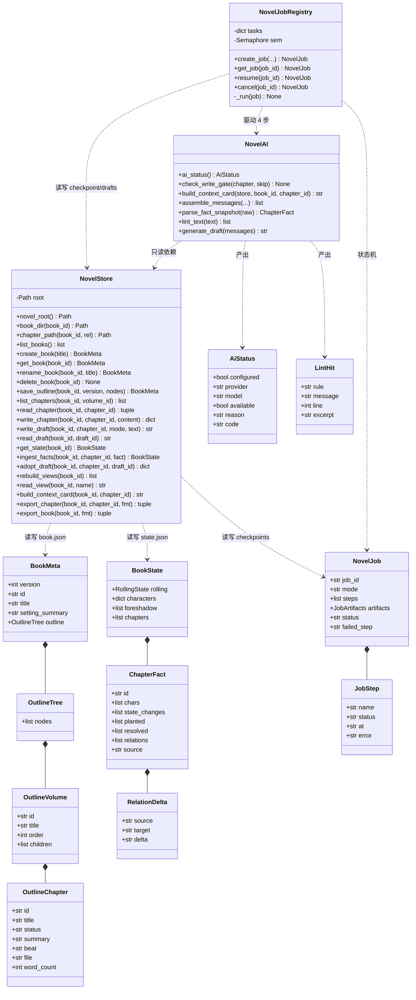
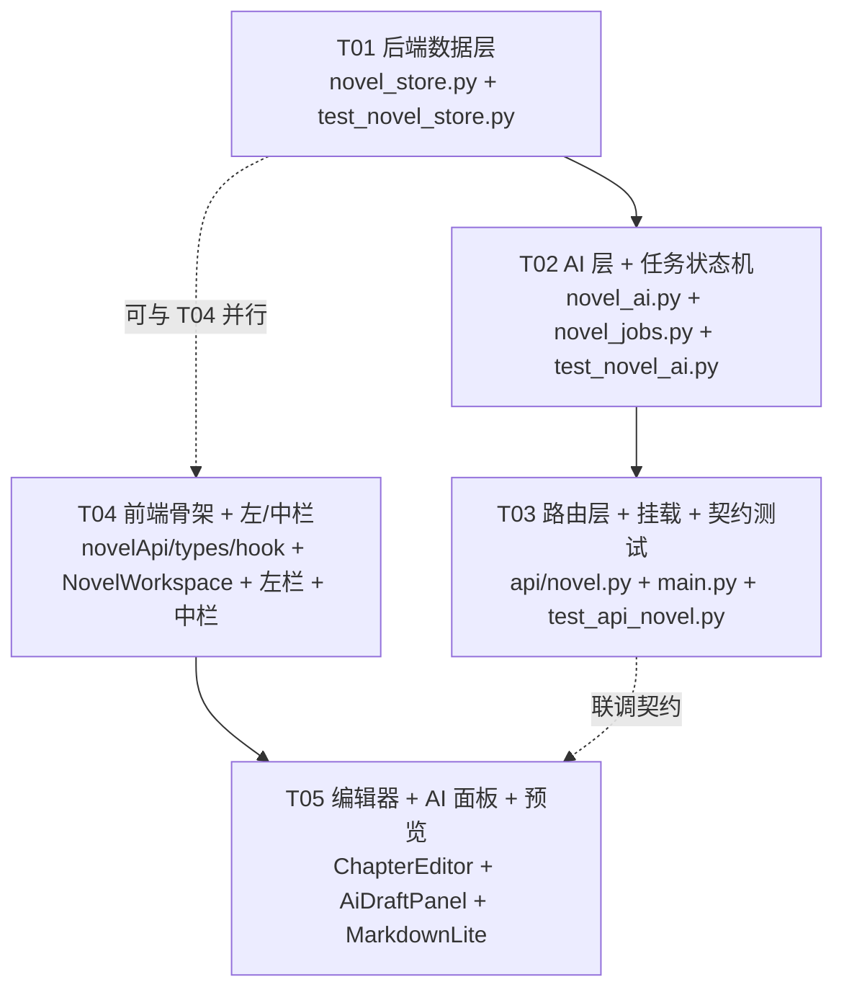

# 系统架构设计 — 小说工作区（Phase 4 落地）

| 项 | 内容 |
|---|---|
| 文档语言 | 中文 |
| 项目名 | `novel_workspace` |
| 宿主项目 | `E:/ai_codes/ai_personal_panel/tsp-fresh` |
| 上游输入 | `deliverables/novel-workspace/PRD.md`（v1.0，已冻结） |
| 作者 | 高见远（架构师） |
| 版本 | v1.0 |
| 已拍板决策 | Q1=A（异步 job + 轮询）；Q2=A（零新增依赖，自研 `MarkdownLite`）；Q3/Q4/Q5/Q6 按 PRD 默认 |

> **本篇的事实基准**：所有后端函数签名、路由挂载写法、测试约定均在 `tsp-fresh` 仓库内**实读确认**，未凭 PRD 想象。凡与 PRD 草案不一致处，在 §9「设计纠错」中显式列出并给出理由。

---

## 1. 实现方案与选型

### 1.1 实读确认的宿主事实（设计的前提）

| 事实 | 实测结论 | 影响 |
|---|---|---|
| `app/services/ai_provider.py` 的公开函数 | `generate_ai_text(messages, *, temperature=0.3, max_tokens=3000, timeout=180.0) -> str`（**async**）、`stream_ai_text(...)`（async generator）、`ai_configured(provider=None) -> bool`、`current_ai_provider() -> str`、`current_ai_model() -> str`、`codex_cli_available() -> bool`、`current_ai_context_window() -> int`、`current_ai_max_output_tokens() -> int`；`Message = dict[str, str]` | PRD §3.3 假设的五个名字**全部正确**，可直接复用 |
| `generate_ai_text` 是否阻塞事件循环 | **不阻塞**。OpenAI 分支走 `AsyncOpenAI`（`await client.chat.completions.create`）；Codex 分支内部已用 `await asyncio.to_thread(_run_codex_process, ...)` 包裹 `subprocess.run` | 见 §1.3：job 用**纯 asyncio**，不需要 `run_in_executor` |
| 输入超窗行为 | `_check_input_budget()` 在超窗时 `raise ValueError("输入过长: ...")` | 续写前先本地估窗，失败即 job step 失败，不静默截断（P0-8③） |
| AI 失败异常类型 | `RuntimeError`（Key 未配置 / Codex CLI 失败 / 传输错误）；`ValueError`（超窗） | `novel_ai` 捕获这两种 → 统一 fail-closed |
| `app/main.py` 挂载写法 | `from app.api import xxx as xxx_api`（部分在 `from app.api import (...)` 批量块内）+ `app.include_router(xxx.router)`；`app/api/__init__.py` 只有一行 docstring，**无需登记** | 新增 `from app.api import novel as novel_api` + `app.include_router(novel_api.router)`，插在 `app.include_router(rps.router)` 之后、扩展路由之前 |
| 路由前缀约定 | 各文件自带 `APIRouter(prefix="/api/xxx", tags=[...])`，`main.py` 不再加前缀 | `novel.py` 用 `APIRouter(prefix="/api/novel", tags=["novel"])` |
| `settings.data_dir` | `Path`，已在 `@model_validator` 中解析为绝对路径（frozen 时指向 exe 同级） | store 根 = `settings.data_dir / "novel"` |
| 原子写既有实现 | `app/services/mining_jobs.py:590-609` 的 `_atomic_write_json` / `_atomic_write_text`（`.tmp` + `os.fsync` + `os.replace`，失败 `unlink(missing_ok=True)`） | **照此姿势复制语义**（不跨模块 import 私有函数，见 §7.2） |
| 测试约定 | `backend/tests/` 扁平 `test_*.py`（另有 `tests/backtest/`、`tests/services/` 子目录）；**没有 `conftest.py`**；`pyproject.toml` 设 `asyncio_mode = "auto"`；`ruff` line-length=100、`target-version=py311`、`select=["E","F","I","N","UP","B","SIM","RUF"]` | 测试必须**自包含**（`NovelStore(root=tmp_path)` 构造注入，不 monkeypatch 全局 settings）；async 端点测试无需装饰器 |
| 前端请求层 | `src/lib/api.ts` 的 `async function request<T>(path, init?)`（**未 export**）+ `export const api = {...}`；失败自动 `toast(msg,'error')`，支持 `quiet` 选项；`detail` 为对象时 `JSON.stringify` | `novelApi.ts` 需复用 → 对 `api.ts` 做 2 处**单行**改动（§7.6） |
| 前端可用依赖 | `@tanstack/react-query@^5`、`lucide-react`、`clsx`、`tailwind-merge` 已在 `package.json` | 轮询用 `useQuery(refetchInterval)`，**零新增依赖** |
| 路由 | `router.tsx:46` `const NovelWorkspace = lazy(() => import('./pages/workspaces').then(m => ({ default: m.NovelWorkspace })))`；`:157` `{ path: 'novel', element: <NovelWorkspace /> }` | 改为 `lazy(() => import('./pages/workspaces/NovelWorkspace'))` |
| 设计 token | `tailwind.config.ts` 已映射 `bg-base/bg-surface/bg-elevated/border-border/text-foreground/text-secondary/text-muted/accent`，`rounded-card=8px`、`rounded-btn=6px`；亮色在 `:root`、暗色在 `html.dark` | 直接用 token，不写死颜色；域色 `#22c55e` 仅用于状态点/图标 |
| TS 严格度 | `strict` + `noUnusedLocals` + `noUnusedParameters` | 组件内不得留未使用变量/参数，`tsc --noEmit` 否则失败 |
| `.gitignore` | `data/**` 已忽略 | 小说稿默认不入库（Q6=A），UI 只如实展示绝对路径 |

### 1.2 分层与职责边界

```
┌─────────────────────────────────────────────────────────────┐
│ frontend/src/pages/workspaces/NovelWorkspace.tsx            │  状态编排 / 三栏布局 / 移动端分段
│   ├─ components/novel/BookshelfOutlinePanel.tsx  左栏       │
│   ├─ components/novel/ChapterListPanel.tsx       中栏       │
│   ├─ components/novel/ChapterEditor.tsx          右栏       │
│   ├─ components/novel/AiDraftPanel.tsx           右栏底部   │
│   ├─ components/novel/MarkdownLite.tsx           只读渲染   │
│   └─ components/novel/UnavailableBar.tsx         fail-closed│
│        ↓ src/lib/novelApi.ts（复用 api.ts 的 request）      │
│        ↓ src/lib/useNovelJob.ts（轮询 hook）                │
└─────────────────────────────────────────────────────────────┘
                        HTTP  /api/novel/*
┌─────────────────────────────────────────────────────────────┐
│ backend/app/api/novel.py        薄路由：参数校验 → 调 service → │
│                                 结构化错误码（不写业务逻辑）  │
└─────────────────────────────────────────────────────────────┘
        ↓                    ↓                     ↓
┌──────────────────┐ ┌──────────────────┐ ┌──────────────────┐
│ novel_store.py   │ │ novel_ai.py      │ │ novel_jobs.py    │
│ 文件系统事实层    │ │ 上下文/提示词/    │ │ job 状态机        │
│ Pydantic 模型     │ │ 快照解析/lint    │ │ asyncio 编排      │
│ 权威读写+原子写   │ │ 唯一 AI 出口     │ │ checkpoint 落盘   │
└──────────────────┘ └──────────────────┘ └──────────────────┘
        ↓                    ↓
   data/novel/books/<id>/…   app/services/ai_provider.py（唯一网关）
```

**依赖方向严格单向**：`api → {store, ai, jobs}`、`jobs → {store, ai}`、`ai → {store, ai_provider}`、`store → 文件系统`。**不存在反向 import**，因此每个 service 都能脱离 HTTP 单测。

**为什么这样切**：
- `store` 与 `ai` 分开：P1 本地优先要求"权威数据不进内存"，store 必须每次读盘；AI 层则可以自由拼装字符串。混在一起必然出现"为了 AI 方便而缓存权威数据"的滑坡。
- `ai` 与 `jobs` 分开：`novel_ai` 全部是**纯函数或短调用**（可同步单测），`novel_jobs` 才持有 `asyncio.Task` 生命周期。P0-13 的断点恢复逻辑集中在 jobs，AI 的失败语义集中在 ai，互不污染。
- `api` 保持薄：与宿主现有 `app/api/*.py` 一致（参考 `app/api/settings.py`、`app/api/mining.py`），便于 review 与错误码统一。

### 1.3 异步 job 的实现机制（关键决策）

**结论：纯 `asyncio.create_task`，不用线程池 / `run_in_executor`。**

理由（实测证据）：
1. `generate_ai_text` 在两条 provider 分支上**都不阻塞事件循环**（OpenAI 分支是 `AsyncOpenAI` 原生协程；Codex 分支内部已 `asyncio.to_thread` 包 `subprocess.run`，见 `ai_provider.py:626`）。再套一层 `run_in_executor` 是纯粹的复杂度浪费，且丢失 `asyncio.CancelledError` 的协作式取消语义。
2. 四个 step 中只有 step2/step3 是网络等待，step1/step4 是本地文件读写（毫秒级）。用协程可让多个 job 在等待 LLM 时自然交错。
3. `pytest-asyncio` 已在 dev extra 且 `asyncio_mode = "auto"`，async 单测零成本。

**状态权威在磁盘，不在内存**：
- 每个 step 完成（或失败）后**立即原子写** `checkpoints/<job_id>.json`。
- 内存 `NovelJobRegistry` 只持有两样东西：① `dict[job_id, asyncio.Task]`（仅用于取消）；② `asyncio.Semaphore`（并发闸门）。**进程重启 / 页面刷新后，`GET /jobs/{id}` 一律从磁盘读**，因此"刷新页面后仍能看到失败在第几步"（US-7）天然成立。
- 进程启动时不需要 recover（job 文件已在盘上，`GET` 直接读；只有 `resume` 会重新创建 Task）。

**并发上限**：
- 模块级 `asyncio.Semaphore(2)`。理由：AI 网关是共享的外部配额，`ai_provider` 无内置限流；2 路并发足够覆盖"写第 3 章 + 润色另一章"的真实场景，又不至于把用户 Key 打爆。
- `start()` **不阻塞**：立即创建 job（`status="queued"`）并 `create_task`；task 内 `async with _SEMAPHORE` 排队。前端轮询到 `queued` 显示"排队中"。
- 取消：`POST /jobs/{id}/cancel` → `task.cancel()`。这是**协作式**取消：若已发出的 LLM 请求在途，实际生效点是下一个 `await` 边界（即当前 step 结束、写 checkpoint 之前）。已完成的 step 产物保留在 checkpoint 中，可 `resume`。**UI 文案必须如实说明"取消请求已提交，正在等待当前步骤收尾"**，不得假装立即中断。

**写冲突**：
- 章节正文：`os.replace` 原子替换，天然满足 P0-1②「并发写 100 次不损坏、内容等于最后一次写入」，无需加锁。
- `book.json`：读-改-写存在 TOCTOU → 用 `version` 乐观锁（PUT 携带客户端读到的 version，后端比对不符 → 409 `version_conflict`）。
- 同一 job 不允许并发 `resume`：registry 内 `set` 记录 in-flight job_id，重复 resume 返回 409 `job_busy`。

### 1.4 四步 checkpoint 的语义（含对 PRD 的一处必要澄清）

PRD §5.4 定义四步 `context → draft_text → fact_snapshot → ingest`。其中第 4 步 `ingest` 若理解为"写入 `state.json`"，会**直接违反 P0-6④「草稿阶段绝不影响 state.json」**和原则 P3（摄取由人点「采纳」触发）。

**本设计的裁定**：

| Step | 做什么 | 是否触碰权威数据 |
|---|---|---|
| 1 `context` | 读 `book.json` + `state.json` + 最近 2 章事实快照 → 组装上下文卡 Markdown，写入 `artifacts.context_card_md` | 只读 |
| 2 `draft_text` | 调 `generate_ai_text` 生成正文/润色草稿 → 写 `drafts/<draft_id>.md`（**永不覆盖正文**），回填 `artifacts.draft_text` / `draft_id` | 只写 drafts/ |
| 3 `fact_snapshot` | 第二次调 `generate_ai_text`，要求严格 JSON → `parse_fact_snapshot()` 校验 → `artifacts.fact_json`；解析失败即本步失败 | 只写 checkpoint |
| 4 `ingest` | **计算摄取计划**（`artifacts.ingest_plan`：将新增哪些角色/状态变化/伏笔/关系、rolling summary 补丁），**不写 `state.json`** | 只读 |

真正的 `state.json` 写入**只发生在 `POST .../adopt`**。这样既保留 PRD 要求的 4 步 checkpoint 与 P0-13 全部验收口径，又不破坏 P0-6。UI 上第 4 步的产物以「将要写入追踪态的内容预览」展示，让用户在采纳前看得见。

（该裁定同时列在 §10 待明确事项，供主理人复核。）

### 1.5 前端状态编排

- **不用全局状态库**。三栏共享状态提升到 `NovelWorkspace.tsx`（`useState` + 少量 `useMemo`）：`currentBookId`、`currentChapterId`、`draftText`、`selection`、`activeJobId`。
- **服务端数据**用 React Query：`QK.novel*` 系列 key；章节列表/状态/视图用 `useQuery`；自动保存用 `useMutation`（失败时 `quiet:true`，由编辑器自行显示"未保存"徽标，避免 toast 刷屏）。
- **job 轮询**：`useNovelJob(jobId)` 内部 `useQuery` + `refetchInterval: (data) => 终态 ? false : 1500`，终态集合 `{done, failed, cancelled}`。
- **自动保存**：`ChapterEditor` 内 800ms 防抖 → `novelApi.putChapter`；保存中/已保存/未保存（含原因）三态徽标；后端 500 时**保留编辑器内容不清空**（P0-5②）。
- **移动端**：`<768px` 顶部分段控件「书架 / 章节 / 编辑」，同一时刻只渲染一栏，`pb-14` 避让壳的 Tab Bar。用 `window.matchMedia('(max-width: 767px)')` 订阅，不引入新依赖。

---

## 2. 完整文件清单

后端根：`E:/ai_codes/ai_personal_panel/tsp-fresh/backend/`
前端根：`E:/ai_codes/ai_personal_panel/tsp-fresh/frontend/`

### 2.1 后端（新增 4 / 修改 1 / 测试 3）

| # | 绝对路径 | 新增/修改 | 职责 | 预估行数 |
|---|---|---|---|---|
| B1 | `backend/app/services/novel_store.py` | **新增** | ① Pydantic 数据模型（`BookMeta`/`BookState`/`NovelJob`/…）② 路径校验 + 原子写 helper ③ 书架 CRUD、大纲读写（version 乐观锁）、章节 md 读写、drafts 读写、state 读写、派生视图重建（幂等）、导出拼装、错误码常量 | ~560 |
| B2 | `backend/app/services/novel_ai.py` | **新增** | `ai_status()`、上下文卡组装（纯本地）、自研提示词（continue/polish/fact 三套）、事实快照 JSON 解析与校验、写后自检规则集（`lint_text`）、写前门禁判据（`check_write_gate`） | ~380 |
| B3 | `backend/app/services/novel_jobs.py` | **新增** | `NovelJobRegistry`：create/start/get/resume/cancel；4 步状态机驱动；每步原子写 checkpoint；`asyncio.Semaphore(2)`；模块级单例 `shared_novel_job_registry()` | ~280 |
| B4 | `backend/app/api/novel.py` | **新增** | `APIRouter(prefix="/api/novel", tags=["novel"])`；21 个端点（§4.3）；参数校验 → 调 service → 结构化错误码 | ~460 |
| B5 | `backend/app/main.py` | **修改** | 加 `from app.api import novel as novel_api` + `app.include_router(novel_api.router)`（2 处，各 1 行） | +2 |
| B6 | `backend/tests/test_novel_store.py` | **新增** | 目录/文件读写、原子写（100 次并发不改坏）、大纲排序与乐观锁、views 两次 rebuild 字节一致、导出 txt 无标记残留、路径穿越拒绝、schema 字段名快照 | ~300 |
| B7 | `backend/tests/test_novel_ai.py` | **新增** | 上下文组装（断言含细纲 + ≥1 条 open 伏笔）、`ai_configured=False` → `code=ai_unavailable`、事实快照非法 JSON 不落盘、lint 规则正负样例、门禁 `missing_beat` | ~220 |
| B8 | `backend/tests/test_api_novel.py` | **新增** | 路由契约、`/status` 语义、非法 id/路径穿越 422、version 冲突 409、job 第 2 步注入失败 → `failed_step=draft_text` 且 resume 不重跑第 1 步 | ~240 |

### 2.2 前端（新增 8 / 修改 4）

| # | 绝对路径 | 新增/修改 | 职责 | 预估行数 |
|---|---|---|---|---|
| F1 | `frontend/src/lib/novelTypes.ts` | **新增** | TS 类型镜像（`BookMeta`/`OutlineNode`/`BookState`/`NovelJob`/`LintHit`/…），文件头注明"与 `novel_store.py` Pydantic 模型手工同步" | ~170 |
| F2 | `frontend/src/lib/novelApi.ts` | **新增** | 21 个端点封装；`import { request } from '@/lib/api'`；自动保存类调用传 `quiet: true` | ~230 |
| F3 | `frontend/src/lib/useNovelJob.ts` | **新增** | `useNovelJob(jobId)` 轮询 hook（终态停轮询）+ `NOVEL_JOB_TERMINAL` 常量 | ~90 |
| F4 | `frontend/src/pages/workspaces/NovelWorkspace.tsx` | **新增** | 三栏容器（`min-h-0 flex-1 overflow-hidden` + 各栏独立滚动）、状态编排、移动端分段控件、空态（含绝对路径展示） | ~330 |
| F5 | `frontend/src/components/novel/BookshelfOutlinePanel.tsx` | **新增** | 左栏：书架列表 + 新建/重命名/删除；卷→章两级大纲树（展开/收起/增删改/上移下移/编辑细纲）；设定摘要卡 | ~340 |
| F6 | `frontend/src/components/novel/ChapterListPanel.tsx` | **新增** | 中栏：章节卡片（序号/标题/状态点/字数/更新时间）、AI 草稿次级条、导出区、上下文卡只读抽屉 | ~250 |
| F7 | `frontend/src/components/novel/ChapterEditor.tsx` | **新增** | 右栏：头部（节拍/细纲只读 + 门禁黄条）、源码/预览双 tab、800ms 防抖自动保存、保存状态徽标、字数统计、选区捕获（供润色） | ~300 |
| F8 | `frontend/src/components/novel/AiDraftPanel.tsx` | **新增** | AI 面板：上下文卡折叠区、续写/润色、Step 进度条、失败步重试、原文↔草稿对照、写后自检清单、采纳（润色为「仅替换选中区间」）、手工补录入口 | ~360 |
| F9 | `frontend/src/components/novel/MarkdownLite.tsx` | **新增** | 自研极简渲染：标题/粗斜体/行内代码/引用/有序无序列表/分割线/段落；不支持语法原样输出（诚实） | ~130 |
| F10 | `frontend/src/components/novel/UnavailableBar.tsx` | **新增** | 统一 unavailable 文案条（PRD §7.4 六种场景），`code` → 中文文案映射表 | ~80 |
| F11 | `frontend/src/router.tsx` | **修改** | `:46` 改 lazy 指向（1 行） | ±1 |
| F12 | `frontend/src/pages/workspaces/index.tsx` | **修改** | 删除 `NovelWorkspace()` 占位导出（其余三个占位页不动） | −18 |
| F13 | `frontend/src/lib/api.ts` | **修改** | ① `request` 加 `export`（1 词）② object 型 `detail` 优先取 `.message`（1 行，见 §7.6） | +2 |
| F14 | `frontend/src/lib/queryKeys.ts` | **修改** | 追加 `novel*` key 段 | +8 |

**合计**：新增 15 个文件，修改 5 个文件（后端净 +2 行，前端净 −7 行 + 3 处小改）。

---

## 3. 数据结构与接口

### 3.1 Pydantic 模型（定义于 `backend/app/services/novel_store.py`）

```python
ID_RE = re.compile(r"^[a-z0-9-]{1,64}$")
CHAPTERS_DIR = "正文"          # 常量化：若将来需切英文目录，改这一处
DRAFTS_DIR, CHECKPOINTS_DIR, VIEWS_DIR = "drafts", "checkpoints", "views"

# ── 大纲（卷/章两级，不做递归 —— 与 PRD「两级」一致，避免 union 复杂度）──
class OutlineChapter(BaseModel):
    id: str                                     # ch-001
    type: Literal["chapter"] = "chapter"
    title: str = ""
    order: int = 1
    status: Literal["draft", "ai_draft", "published"] = "draft"
    word_target: int = 0
    summary: str = ""                           # 一句话细纲
    beat: str = ""                              # 本章节拍（写前门禁判据）
    file: str = ""                              # 相对路径 "正文/ch-001-yinzi.md"
    word_count: int = 0

class OutlineVolume(BaseModel):
    id: str                                     # v1
    type: Literal["volume"] = "volume"
    title: str = ""
    order: int = 1
    children: list[OutlineChapter] = Field(default_factory=list)

class OutlineTree(BaseModel):
    nodes: list[OutlineVolume] = Field(default_factory=list)

class BookMeta(BaseModel):
    version: int = 1                            # 乐观锁
    id: str
    title: str
    author: str = ""
    genre: str = ""
    pov: str = ""
    tense: str = ""
    setting_summary: str = ""                   # 设定层 MVP 形态：单行摘要
    created_at: str = ""
    updated_at: str = ""
    outline: OutlineTree = Field(default_factory=OutlineTree)

# ── 追踪态 ──
class CharacterState(BaseModel):
    status: str = ""
    location: str = ""
    last_seen_chapter: str | None = None
    traits: list[str] = Field(default_factory=list)

class ForeshadowItem(BaseModel):
    id: str                                     # f-001
    text: str
    planted_chapter: str | None = None
    status: Literal["open", "resolved"] = "open"
    resolved_chapter: str | None = None

class RelationDelta(BaseModel):
    """PRD 草案的 {"from","to"} 在 Python 里 from 是保留字 —— 见 §9 纠错 ①。

    模型字段用 source/target，磁盘 JSON 用别名 from/to（by_alias 序列化）。
    """
    model_config = ConfigDict(populate_by_name=True)
    source: str = Field(alias="from")
    target: str = Field(alias="to")
    delta: str = ""

class ChapterFact(BaseModel):
    id: str                                     # ch-002
    title: str = ""
    chars: list[str] = Field(default_factory=list)
    state_changes: list[str] = Field(default_factory=list)
    planted: list[str] = Field(default_factory=list)     # 新埋伏笔文本
    resolved: list[str] = Field(default_factory=list)    # 被回收的 foreshadow id
    relations: list[RelationDelta] = Field(default_factory=list)
    source: Literal["ai", "manual"] = "manual"
    adopted_at: str | None = None

class RollingState(BaseModel):
    summary: str = ""
    updated_chapter: str | None = None

class BookState(BaseModel):
    book_id: str
    updated_at: str = ""
    rolling: RollingState = Field(default_factory=RollingState)
    characters: dict[str, CharacterState] = Field(default_factory=dict)
    foreshadow: list[ForeshadowItem] = Field(default_factory=list)
    chapters: list[ChapterFact] = Field(default_factory=list)

# ── Job / checkpoint ──
class JobStep(BaseModel):
    name: Literal["context", "draft_text", "fact_snapshot", "ingest"]
    status: Literal["pending", "running", "done", "failed", "skipped"] = "pending"
    at: str | None = None
    error: str | None = None

class JobArtifacts(BaseModel):
    context_card_md: str | None = None
    draft_id: str | None = None
    draft_text: str | None = None
    fact_json: dict[str, Any] | None = None
    ingest_plan: dict[str, Any] | None = None

class NovelJob(BaseModel):
    job_id: str            # job-<book_id>-<YYYYmmddHHMMSS>-<hex4>
    book_id: str
    chapter_id: str
    mode: Literal["continue", "polish"]
    selection: str | None = None                # polish 模式：用户选中的原文片段
    skip_gate: bool = False                     # 用户显式「跳过本次门禁」
    created_at: str = ""
    updated_at: str = ""
    steps: list[JobStep] = Field(default_factory=list)
    artifacts: JobArtifacts = Field(default_factory=JobArtifacts)
    status: Literal["queued", "running", "failed", "done", "cancelled"] = "queued"
    failed_step: str | None = None

# ── lint ──
class LintHit(BaseModel):
    rule: Literal["truncated_tail", "eng_leak", "ai_cliche", "repeat_sentence"]
    message: str
    line: int | None = None
    excerpt: str = ""
```

### 3.2 磁盘文件最终 schema

- `book.json` → `BookMeta`（`model_dump(mode="json")`）
- `state.json` → `BookState`（`model_dump(mode="json", by_alias=True)`，保证 `from`/`to` 键名与 PRD §5.3 一致）
- `checkpoints/<job_id>.json` → `NovelJob`
- `正文/ch-NNN-<slug>.md` → 用户 Markdown 原文（字节级保留）
- `drafts/d-<YYYYmmddHHMMSS>-<mode>.md` → AI 草稿全文
- `views/context-card.md` / `views/timeline.md` / `views/characters.md` → 派生只读

### 3.3 `novel_store.py` 服务函数签名

```python
# ── 异常 ──
class NovelStoreError(RuntimeError): ...
class NovelNotFound(NovelStoreError): ...
class NovelValidationError(NovelStoreError): ...      # 非法 id / 路径穿越 → 422
class NovelConflict(NovelStoreError): ...             # version 冲突 → 409

class NovelStore:
    def __init__(self, root: Path | None = None) -> None:
        """root 默认 settings.data_dir / 'novel'；测试直接传 tmp_path（无需 conftest）。"""

    # 路径与校验
    def novel_root(self) -> Path: ...
    def book_dir(self, book_id: str) -> Path: ...
    def chapter_path(self, book_id: str, rel_file: str) -> Path:
        """rel_file 经 validate_rel_path 校验后拼接，拒绝 .. 与绝对路径（目录穿越防护）。"""

    # 书架
    def list_books(self) -> list[dict]:
        """[{id, title, chapter_count, word_count, updated_at}]，按 updated_at 降序。"""
    def create_book(self, title: str) -> BookMeta:
        """建目录 + 写 book.json + 空 state.json + 空 views/；id=book-<ts> 且保证不与现有冲突。"""
    def get_book(self, book_id: str) -> BookMeta: ...
    def rename_book(self, book_id: str, title: str) -> BookMeta: ...
    def delete_book(self, book_id: str) -> None:
        """shutil.rmtree 整个 book_dir（P0-2②）。"""
    def save_outline(self, book_id: str, version: int, nodes: list[dict]) -> BookMeta:
        """全量覆盖 + 乐观锁；diff 出新增章节 → 生成 file 名并建空 md；
           diff 出被删章节 → 删除其 md（仅在本书 正文/ 内）。version 不符抛 NovelConflict。"""

    # 章节
    def list_chapters(self, book_id: str, volume_id: str | None = None) -> list[dict]:
        """按卷过滤；含 id/title/status/word_count/updated_at/draft_count/last_draft_at。"""
    def read_chapter(self, book_id: str, chapter_id: str) -> tuple[str, Path]:
        """返回 (原文, 绝对路径)；每次读盘，不缓存。"""
    def write_chapter(self, book_id: str, chapter_id: str, content: str) -> dict:
        """newline='' 原子写（保留用户换行习惯）；同步回写 outline 的 word_count 与 updated_at。"""

    # 草稿
    def write_draft(self, book_id: str, chapter_id: str, mode: str, text: str) -> str: ...  # → draft_id
    def read_draft(self, book_id: str, draft_id: str) -> str: ...
    def list_drafts(self, book_id: str, chapter_id: str) -> list[dict]: ...
    def delete_draft(self, book_id: str, draft_id: str) -> None: ...

    # 追踪态
    def get_state(self, book_id: str) -> BookState: ...
    def ingest_facts(self, book_id: str, chapter_id: str, fact: ChapterFact) -> BookState:
        """唯一写 state.json 的入口：并入 characters/foreshadow/chapters，
           更新 rolling.updated_chapter；不自动改写 rolling.summary（由 AI 摘要或用户编辑提供）。"""
    def update_rolling_summary(self, book_id: str, summary: str) -> BookState: ...

    # 采纳
    def adopt_draft(self, book_id: str, chapter_id: str, draft_id: str) -> dict:
        """正文 := 草稿全文；status := published；返回 {chapter, abs_path}。不碰 state.json。"""

    # 派生视图（幂等）
    def rebuild_views(self, book_id: str) -> list[str]:
        """生成 context-card.md / timeline.md / characters.md；遍历顺序全部排序化，
           同一权威 JSON 连续两次输出字节一致。"""
    def read_view(self, book_id: str, name: str) -> str: ...
    def build_context_card(self, book_id: str, chapter_id: str | None = None) -> str:
        """上下文卡正文（供 job step1 与 views 复用同一函数，保证一致）。"""

    # 导出
    def export_chapter(self, book_id: str, chapter_id: str, fmt: Literal["md", "txt"]) -> tuple[str, str]: ...
    def export_book(self, book_id: str, fmt: Literal["md", "txt"]) -> tuple[str, str]:
        """按大纲顺序拼接，卷名作为 '#' 分隔。"""

# ── 模块级纯函数（可独立单测）──
def validate_id(value: str, what: str = "id") -> str:
    """ID_RE 不匹配 → NovelValidationError。"""
def validate_rel_path(rel: str, root: Path) -> Path:
    """(root / rel).resolve() 必须以 root.resolve() 为前缀，否则 NovelValidationError。"""
def slugify(title: str) -> str:
    """中英混合 → 小写 ascii slug；全中文时退化为 'ch'（文件名仍可读，靠序号区分）。"""
def count_words(text: str) -> int:
    """len(re.sub(r'\\s+', '', text)) —— 不含空白的字数（P0-4）。"""
def strip_markdown(text: str) -> str:
    """txt 导出：去 '#' / '>' / '**' / '`' / 行首 '-'；不删正文内容。"""
def parse_job_id(job_id: str) -> tuple[str, str]:
    """job-<book_id>-<ts>-<hex4> → (book_id, ts)；格式不符 → NovelValidationError。"""
```

### 3.4 `novel_ai.py` 服务函数签名

```python
class AiStatus(BaseModel):
    configured: bool
    provider: str
    model: str
    available: bool
    reason: str | None = None          # 不可用时的人类可读原因（中文）
    code: str | None = None            # ai_unavailable | ai_error

class FactParseError(ValueError): ...
class WriteGateError(ValueError):
    code: str                           # missing_beat

def ai_status(provider: str | None = None) -> AiStatus:
    """复用 ai_configured / current_ai_provider / current_ai_model / codex_cli_available。
       —— 唯一读取 AI 可用性的出口，禁止 mock、禁止空列表冒充成功。"""

def check_write_gate(chapter: OutlineChapter, *, skip: bool = False) -> None:
    """beat 与 summary 均为空 → raise WriteGateError(code='missing_beat')；skip=True 放行。"""

def build_context_card(store: NovelStore, book_id: str, chapter_id: str) -> str:
    """纯本地：设定摘要 + rolling.summary + 本章细纲/节拍 + 最近 2 章事实快照
       + 全部 open 伏笔 + 角色状态表。含章节末尾 800 字正文尾部（接得上文）。"""

def assemble_messages(book, state, chapter, mode, selection, context_card) -> list[Message]:
    """→ [{'role':'system',...},{'role':'user',...}]，Message = dict[str,str]。"""

def build_continue_prompt(...) -> list[Message]: ...
def build_polish_prompt(...) -> list[Message]: ...
def build_fact_prompt(...) -> list[Message]:
    """要求模型只输出一个 JSON 对象，字段对齐 ChapterFact（不含 id/title/source/adopted_at）。"""

def parse_fact_snapshot(raw: str) -> ChapterFact:
    """剥 ```json 围栏 → json.loads → 字段级校验（缺字段用默认值，类型错则 FactParseError）。
       任何失败都 raise，绝不落盘半个快照（P0-10②）。"""

def lint_text(text: str) -> list[LintHit]:
    """纯本地正则规则：truncated_tail / eng_leak / ai_cliche / repeat_sentence。只提醒不改写。"""

async def generate_draft(messages: list[Message], *, max_tokens: int | None) -> str:
    """唯一调用 generate_ai_text 的地方。捕获 RuntimeError/ValueError → 抛出 AiCallError(code)。"""

async def generate_fact_snapshot(...) -> ChapterFact: ...
```

### 3.5 `novel_jobs.py` 服务函数签名

```python
STEP_NAMES: tuple[str, str, str, str] = ("context", "draft_text", "fact_snapshot", "ingest")
TERMINAL_JOB_STATUSES = frozenset({"done", "failed", "cancelled"})
MAX_CONCURRENT_JOBS = 2

class NovelJobRegistry:
    def __init__(self, store: NovelStore | None = None) -> None: ...
    def create_job(self, book_id: str, chapter_id: str, mode: str,
                   selection: str | None = None, skip_gate: bool = False) -> NovelJob:
        """校验 id + 门禁（missing_beat 直接抛，不建 job）+ 落初始 checkpoint + create_task。"""
    def get_job(self, job_id: str) -> NovelJob:
        """从磁盘读（权威）；不存在 → NovelNotFound。"""
    def resume(self, job_id: str) -> NovelJob:
        """status=failed/queued 才可 resume；done 的 step 标 skipped 不重跑。"""
    def cancel(self, job_id: str) -> NovelJob: ...
    async def _run(self, job: NovelJob) -> None:
        """async with _SEMAPHORE: 逐步执行；每步前标 running、后原子写 checkpoint；
           失败写 failed_step + error 并置 status=failed；CancelledError → status=cancelled。"""

def shared_novel_job_registry() -> NovelJobRegistry:
    """模块级单例（进程内唯一），持有 semaphore 与 task 表。"""
```

### 3.6 API 端点表（`backend/app/api/novel.py`）

统一错误响应：`HTTPException(status_code=N, detail={"code": ..., "message": ...})`。

| # | 方法 | 路径 | 请求体 | 响应体 | 错误码 |
|---|---|---|---|---|---|
| 1 | GET | `/api/novel/status` | — | `AiStatus` + `{data_dir_abs}` | — |
| 2 | GET | `/api/novel/books` | — | `{books: [{id,title,chapter_count,word_count,updated_at}], data_dir_abs}` | — |
| 3 | POST | `/api/novel/books` | `{title}` | `BookMeta` | `invalid_title`(422) |
| 4 | PATCH | `/api/novel/books/{book_id}` | `{title?}` | `BookMeta` | `invalid_id`(422) `not_found`(404) |
| 5 | DELETE | `/api/novel/books/{book_id}` | — | `{ok:true}` | `invalid_id` `not_found` `write_failed`(500) |
| 6 | GET | `/api/novel/books/{book_id}/outline` | — | `{version, nodes, book_title}` | `invalid_id` `not_found` |
| 7 | PUT | `/api/novel/books/{book_id}/outline` | `{version, nodes}` | `BookMeta` | `version_conflict`(409) `invalid_id` `not_found` |
| 8 | GET | `/api/novel/books/{book_id}/chapters` | `?volume_id=` | `{chapters:[...]}` | 同上 |
| 9 | GET | `/api/novel/books/{book_id}/chapters/{chapter_id}` | — | `{chapter, content, word_count, abs_path, draft:{id,text}\|null}` | `not_found` |
| 10 | PUT | `/api/novel/books/{book_id}/chapters/{chapter_id}` | `{content}` | `{ok, word_count, updated_at}` | `write_failed`(500) |
| 11 | GET | `/api/novel/books/{book_id}/state` | — | `BookState` | `not_found` |
| 12 | PATCH | `/api/novel/books/{book_id}/state` | `{rolling_summary?}` 或 `{chapter_id, fact}` | `BookState` | `not_found` `write_failed` |
| 13 | GET | `/api/novel/books/{book_id}/views/{name}` | `name ∈ context-card\|timeline\|characters` | `{name, content, generated_at}` | `not_found` |
| 14 | POST | `/api/novel/books/{book_id}/views/rebuild` | — | `{ok, files:[...]}` | `write_failed` |
| 15 | POST | `/api/novel/books/{book_id}/chapters/{chapter_id}/ai/draft` | `{mode, selection?, skip_gate?}` | `NovelJob`（202） | `ai_unavailable`(503) `missing_beat`(422) `not_found` |
| 16 | POST | `/api/novel/books/{book_id}/chapters/{chapter_id}/adopt` | `{draft_id, fact?}` | `{ok, chapter, state, views_rebuilt}` | `fact_parse_failed`(422，fact 非法时) `not_found` |
| 17 | POST | `/api/novel/books/{book_id}/lint` | `{text}` 或 `{chapter_id}` | `{hits: LintHit[]}` | `not_found` |
| 18 | GET | `/api/novel/books/{book_id}/export` | `?format=md\|txt&scope=chapter\|book&chapter_id=` | 文件下载（`Content-Disposition`） | `not_found` |
| 19 | GET | `/api/novel/jobs/{job_id}` | — | `NovelJob` | `invalid_id` `not_found` |
| 20 | POST | `/api/novel/jobs/{job_id}/resume` | — | `NovelJob` | `job_busy`(409) `not_found` |
| 21 | POST | `/api/novel/jobs/{job_id}/cancel` | — | `NovelJob` | `not_found` |

**说明**
- `job_id` 形如 `job-<book_id>-<YYYYmmddHHMMSS>-<hex4>`，端点 19–21 只凭 `job_id` 即可定位 book（无状态、可跨刷新）。
- 端点 15 返回 **202**；AI 不可用时返回 **503 + `code=ai_unavailable`**（不抛 500，P0-8①）。
- 端点 18 用 `Response(content=..., media_type="text/markdown"|"text/plain", headers={...})`，前端用 `window.open` 或 blob 下载。

### 3.7 类图



---

## 4. 程序调用流程

### 4.1 时序图 ① — AI 续写异步任务全链路（含 4 步 checkpoint 与 resume 分支）

```mermaid
sequenceDiagram
    autonumber
    actor U as 作者
    participant UI as AiDraftPanel.tsx
    participant API as api/novel.py
    participant JOB as NovelJobRegistry
    participant ST as NovelStore
    participant AI as ai_provider.generate_ai_text
    participant FS as data/novel/books/&lt;id&gt;/

    U->>UI: 点「续写本章」
    UI->>API: GET /api/novel/status
    API-->>UI: {available:false, code:ai_unavailable, reason}
    Note over UI: UnavailableBar 展示原因 + 按钮置灰（fail-closed，不发请求）

    U->>UI: 配置好 AI 后重试
    UI->>API: POST .../chapters/ch-002/ai/draft {mode:continue}
    API->>JOB: create_job(book, ch-002, continue)
    JOB->>ST: get_book + get_state + check_write_gate
    alt beat/summary 为空且 skip_gate=false
        ST-->>JOB: raise WriteGateError
        JOB-->>API: 422 {code:missing_beat}
        API-->>UI: 422 → 黄条「本章细纲为空，AI 续写已禁用」
    else 门禁通过
        JOB->>FS: 原子写 checkpoints/job-*.json（4 步 pending, status=queued）
        JOB->>JOB: asyncio.create_task(_run) + Semaphore(2) 排队
        API-->>UI: 202 {job_id}
    end

    UI->>API: GET /api/novel/jobs/{job_id}（每 1.5s 轮询，跨刷新可读盘）
    API->>JOB: get_job → 读盘
    API-->>UI: NovelJob{status, steps, failed_step}

    Note over JOB,AI: ── Step 1 context（纯本地）──
    JOB->>ST: build_context_card(book, ch-002)
    ST->>FS: 读 book.json + state.json + 最近 2 章
    ST-->>JOB: 上下文卡 Markdown
    JOB->>FS: 原子写 checkpoint（step1=done, artifacts.context_card_md）

    Note over JOB,AI: ── Step 2 draft_text（AI 调用）──
    JOB->>AI: await generate_ai_text(messages, max_tokens=…)
    AI-->>JOB: 正文草稿 或 RuntimeError/ValueError
    alt 调用失败
        JOB->>FS: 写 checkpoint（step2=failed, failed_step=draft_text, error）
        JOB-->>UI: 轮询得到 status=failed（step1 产物仍在盘中）
        U->>UI: 点「重试该步骤」
        UI->>API: POST /jobs/{id}/resume
        API->>JOB: resume → 重跑（step1 标 skipped 不重跑）
    else 成功
        JOB->>ST: write_draft(book, ch-002, continue, text)
        ST->>FS: 原子写 drafts/d-*.md（永不覆盖 正文/）
        JOB->>FS: 写 checkpoint（step2=done, draft_id, draft_text）
    end

    Note over JOB,AI: ── Step 3 fact_snapshot（第二次 AI 调用）──
    JOB->>AI: await generate_ai_text(fact_prompt)
    AI-->>JOB: JSON 字符串
    JOB->>JOB: parse_fact_snapshot(raw)
    alt 非法 JSON / 缺字段
        JOB->>FS: 写 checkpoint（step3=failed, failed_step=fact_snapshot）
        JOB-->>UI: 「事实快照无法解析，未写入追踪态 — 正文不受影响」[重试][手工补录]
    else 解析通过
        JOB->>FS: 写 checkpoint（step3=done, artifacts.fact_json）
    end

    Note over JOB,FS: ── Step 4 ingest（只算计划，不写 state.json）──
    JOB->>ST: 计算 ingest_plan（新角色/状态变化/伏笔/关系/摘要补丁）
    JOB->>FS: 写 checkpoint（step4=done, status=done）

    UI->>API: GET /jobs/{id} → status=done
    UI->>U: 原文 ↔ 草稿 并排对照 + 摄取计划预览 + 写后自检清单
    Note over UI: 此时 state.json 字节未变（P0-6④）
```

### 4.2 时序图 ② — 草稿采纳 → 事实摄取 → 派生视图重建

```mermaid
sequenceDiagram
    autonumber
    actor U as 作者
    participant UI as AiDraftPanel.tsx
    participant API as api/novel.py
    participant ST as NovelStore
    participant FS as data/novel/books/&lt;id&gt;/
    participant Q as 前端 React Query

    U->>UI: 点「采纳」（润色模式：仅替换选中区间）
    UI->>API: POST .../chapters/ch-002/adopt {draft_id, fact?}
    API->>ST: read_draft(book_id, draft_id)
    ST->>FS: 读 drafts/d-*.md
    ST-->>API: 草稿全文

    API->>ST: adopt_draft(book, ch-002, draft_id)
    ST->>FS: 原子写 正文/ch-002-*.md（newline='' 保留换行习惯）
    ST->>FS: book.json：status=published, word_count, updated_at, version+1
    Note over ST,FS: 顺序固定：先正文后 book.json，任一步失败即 500 write_failed，正文已落盘不回滚（诚实上报）

    alt 携带 fact（AI 快照 或 用户手工补录）
        API->>API: ChapterFact.model_validate(fact)
        alt 校验失败
            API-->>UI: 422 {code:fact_parse_failed, message}
            Note over UI: 正文已采纳成功，仅追踪态未写入 → 提示「正文已更新，追踪态未写入」[手工补录]
        else 校验通过
            API->>ST: ingest_facts(book, ch-002, fact)
            ST->>FS: 读 state.json → 并入 characters / foreshadow / chapters
            ST->>FS: 原子写 state.json（newline='\n'）
            ST-->>API: BookState
        end
    end

    API->>ST: rebuild_views(book_id)
    ST->>FS: 遍历排序后的 characters / foreshadow / chapters
    ST->>FS: 原子写 views/context-card.md, views/timeline.md, views/characters.md
    ST-->>API: ["context-card.md","timeline.md","characters.md"]
    API-->>UI: 200 {ok, chapter, state, views_rebuilt}

    UI->>Q: invalidateQueries([QK.novelChapters, QK.novelState, QK.novelViews])
    Q-->>UI: 中栏状态点 ● 正式、字数刷新；左栏设定摘要统计刷新
    UI->>U: 「已采纳为正式 · 追踪态已更新 · 派生视图已重建」
```

---

## 5. 任务列表（按可并行性分组，工程师照此执行）

> **总原则**：先后端数据层 → 再 AI/任务 → 再路由 → 前端可**与后端并行开工**（接口契约已由本文档 §3.6 冻结）。

### T01 · 后端数据层：文件系统事实层 + 数据模型

| 项 | 内容 |
|---|---|
| **依赖** | 无（可立即开工） |
| **涉及文件** | 新增 `backend/app/services/novel_store.py`；新增 `backend/tests/test_novel_store.py` |
| **要点** | ① Pydantic 模型按 §3.1 落地（`RelationDelta` 用 `Field(alias=...)`）<br>② 原子写 helper 照 `mining_jobs.py:598` 语义实现；**章节 md 用 `newline=""`**，JSON 用 `newline="\n"`<br>③ `validate_id` + `validate_rel_path`（`.resolve()` 前缀校验）<br>④ `save_outline` 乐观锁 + 新增/删除章节的 md 联动<br>⑤ `rebuild_views` 全部排序化（幂等）<br>⑥ `strip_markdown` / `count_words` / `slugify` / `parse_job_id` 纯函数 |
| **完成判据** | `pytest tests/test_novel_store.py -q` 全绿，且覆盖：建书后磁盘出现 4 类产物；并发 100 次写同一章节文件不损坏且等于最后一次；手工改 md 后 `read_chapter` 读到新内容；`../` 与绝对路径 payload 被拒；version 不符 → 409；同一 state 连续两次 `rebuild_views` 输出字节一致；txt 导出无 `#`/`**`/`` ` `` 残留；模型字段名快照用例通过 |

### T02 · 后端 AI 层 + 异步任务状态机

| 项 | 内容 |
|---|---|
| **依赖** | T01 |
| **涉及文件** | 新增 `backend/app/services/novel_ai.py`；新增 `backend/app/services/novel_jobs.py`；新增 `backend/tests/test_novel_ai.py` |
| **要点** | ① `ai_status()` 唯一读 `ai_configured/current_ai_provider/current_ai_model/codex_cli_available`；fail-closed<br>② 三套**自研**提示词，文件头注明「自研，未复制第三方提示词」<br>③ `parse_fact_snapshot` 严格校验，任何失败 raise、不落盘<br>④ `lint_text` 四条正则规则（正负样例都要）<br>⑤ `NovelJobRegistry`：纯 `asyncio.create_task` + `Semaphore(2)`；每步原子写 checkpoint；`done` 的 step 在 resume 时标 `skipped`<br>⑥ step4 `ingest` 只算计划，不写 `state.json` |
| **完成判据** | `pytest tests/test_novel_ai.py -q` 全绿，且：monkeypatch `ai_configured=False` → `ai_status().available is False` 且 `code == "ai_unavailable"`；stub provider 下 prompt 中**包含**本章 beat 文本与 ≥1 条 open 伏笔文本；非法 JSON 快照 → `FactParseError` 且 `state.json` 字节未变；第 2 步注入异常后 `failed_step == "draft_text"` 且 step1 产物仍在；resume 后 step1 `at` 时间戳**未被改写** |

### T03 · 后端路由层 + 挂载 + 路由契约测试

| 项 | 内容 |
|---|---|
| **依赖** | T02 |
| **涉及文件** | 新增 `backend/app/api/novel.py`；修改 `backend/app/main.py`（+2 行）；新增 `backend/tests/test_api_novel.py` |
| **要点** | ① `APIRouter(prefix="/api/novel", tags=["novel"])`，21 个端点按 §3.6<br>② 错误统一 `HTTPException(status, detail={"code":..., "message":...})`<br>③ `main.py` 加 import + `include_router`（放在 `rps.router` 之后）<br>④ 测试用 `TestClient` + `NovelStore(root=tmp_path)` 注入（无 conftest，自行构造） |
| **完成判据** | `pytest tests/test_api_novel.py -q` 全绿；`ruff check backend/` 通过（口径含 tests）；`/api/novel/status` 在无 Key 环境返回 `available=false` 且 **HTTP 200**（状态查询本身不是失败）；`/ai/draft` 在无 Key 环境返回 **503 + detail.code == "ai_unavailable"**；非法 id/路径穿越 422 |

### T04 · 前端基础设施 + 三栏骨架 + 左栏/中栏

| 项 | 内容 |
|---|---|
| **依赖** | T03（**仅为联调**；契约已冻结，可与 T01~T03 并行编码） |
| **涉及文件** | 新增 `frontend/src/lib/novelTypes.ts`、`novelApi.ts`、`useNovelJob.ts`、`pages/workspaces/NovelWorkspace.tsx`、`components/novel/BookshelfOutlinePanel.tsx`、`components/novel/ChapterListPanel.tsx`、`components/novel/UnavailableBar.tsx`；修改 `frontend/src/lib/api.ts`（+2 行）、`src/lib/queryKeys.ts`（+8 行）、`src/router.tsx`（1 行）、`src/pages/workspaces/index.tsx`（−18 行） |
| **要点** | ① `novelApi.ts` 复用 `request`（`api.ts` 加 `export`）<br>② 容器 `min-h-0 flex-1 overflow-hidden`，**每栏内部独立滚动**，不出现整页滚动条<br>③ 大纲树增删改排序全部在前端组装后一次性 `PUT /outline`（带 version）<br>④ 空态如实展示 `data/novel/books/` 绝对路径<br>⑤ <768px 分段控件，`pb-14` 避让 Tab Bar<br>⑥ **不改 `WorkspaceShell.tsx`** |
| **完成判据** | `tsc --noEmit` 退出码 0；`pnpm build` 通过；三栏在 1280/1024/375 三种宽度下无整页滚动条；书架 CRUD 与大纲增删改排序刷新后与磁盘一致；未配 AI 时按钮禁用 + `UnavailableBar` 文案与 PRD §7.4 一致 |

### T05 · 前端编辑器 + AI 面板 + 预览 + 联调验收

| 项 | 内容 |
|---|---|
| **依赖** | T04 |
| **涉及文件** | 新增 `frontend/src/components/novel/ChapterEditor.tsx`、`components/novel/AiDraftPanel.tsx`、`components/novel/MarkdownLite.tsx` |
| **要点** | ① 源码/预览双 tab；800ms 防抖自动保存；保存中/已保存/未保存（含原因）三态；失败**不清空编辑器**<br>② `MarkdownLite` 不支持的语法原样呈现<br>③ AI 面板四区块 + Step 进度条 + 失败步重试 + 原文↔草稿并排 + 自检清单（只展示不改写）+ 采纳（润色仅替换选中区间）+ 手工补录<br>④ 选区捕获（润色） |
| **完成判据** | 输入后 ≤1s 落盘；断网/500 时显示「未保存」且内容保留；润色空选区时按钮禁用并提示；采纳后中栏状态点变 ●、左栏统计刷新；`tsc --noEmit` 与 `pnpm build` 通过；股票/港股/热点工作区冒烟无回归 |

### 并行性说明

- **T01 与 T04 可同时开工**（无代码依赖，仅共享 §3.6 契约）。
- **T02 依赖 T01**（`novel_ai` 需要 `novel_store` 的模型与读盘能力）。
- **T03 依赖 T02**（路由需要 service 就绪）。
- **T05 依赖 T04**（编辑器挂在三栏容器内）；T05 与 T03 的后端联调可交叉进行。



---

## 6. 依赖包清单

**结论：零新增第三方依赖。** ✅（与 PRD §3.3「依赖克制」及 Q2=A 一致）

| 端 | 已具备（无需新增） | 用途 |
|---|---|---|
| 后端 | `fastapi>=0.115` | `APIRouter` / `HTTPException` / `Response` |
| 后端 | `pydantic>=2.7` | 数据模型、`Field(alias=...)`、判别式校验 |
| 后端 | `openai>=1.40`（经 `ai_provider`） | 唯一 LLM 通道，**不新建客户端** |
| 后端 | `pytest>=8.0`、`pytest-asyncio>=0.23`（dev extra，已装） | `asyncio_mode="auto"` 下 async 端点单测 |
| 前端 | `@tanstack/react-query@^5` | job 轮询（`refetchInterval`）、缓存失效 |
| 前端 | `lucide-react@^0.439` | 图标（状态点、面板图标） |
| 前端 | `clsx` / `tailwind-merge` | 条件类名 |
| 前端 | `react@^18.3` | `useState` / `useMemo` / `lazy` |

**不引入**：`react-markdown` / `remark-gfm`（自研 `MarkdownLite`）、任何 Markdown→Docx 库、任何 LLM SDK、任何任务队列（Celery/RQ/APScheduler 均不需要 —— job 用 `asyncio` + 文件状态机）。

> 若实施中发现**必须**新增依赖，须先说明理由 + 体积/许可证评估，并同步更新 `pyproject.toml` / `package.json` 与 PRD，**不得先斩后奏**。

---

## 7. 共享知识（跨文件约定，工程师必读）

### 7.1 路径安全

- **唯一入口**：`novel_store.validate_id(value, what)`（正则 `^[a-z0-9-]{1,64}$`）+ `novel_store.validate_rel_path(rel, root)`（`(root/rel).resolve()` 必须以 `root.resolve()` 为前缀）。
- **禁止**在 `api/novel.py` 里手工拼路径。所有路径经 `NovelStore` 的方法产出。
- 章节文件名 `file` 字段来自大纲树，仍须过 `validate_rel_path` 再拼接（防止手工编辑 `book.json` 注入 `../`）。

### 7.2 原子写

- **不跨模块 import 私有 helper**（`mining_jobs._atomic_write_text` 是私有函数，且语义不完全一致）。在 `novel_store.py` 内实现 `_atomic_write_text(path, text, *, newline="\n")` 与 `_atomic_write_json(path, obj)`，语义照抄 `mining_jobs.py:590-609`：临时文件 → `write` → `flush` → `os.fsync` → `os.replace` → 失败 `unlink(missing_ok=True)`。
- **换行差异（易踩坑）**：
  - JSON（`book.json` / `state.json` / checkpoint）：`newline="\n"` —— 保证跨平台字节稳定、diff 干净。
  - 章节 Markdown：`newline=""` —— **不做任何换行翻译**，字节级保留用户习惯（P0-4③）。若用默认 `newline=None`，Windows 上会把 `\n` 写成 `\r\n`，用户 diff 会被污染。
- 所有写路径统一 `encoding="utf-8"`（中文目录名 `正文/` 在 Windows 下的前提）。

### 7.3 错误码常量

定义位置：`backend/app/services/novel_store.py` 顶部（被 `api` / `jobs` / `ai` 共同依赖，依赖方向单向，无循环）：

```python
ERR_INVALID_ID        = "invalid_id"          # 422
ERR_PATH_ESCAPE       = "path_escape"         # 422
ERR_MISSING_BEAT      = "missing_beat"        # 422（写前门禁，由 novel_ai 抛出）
ERR_FACT_PARSE_FAILED = "fact_parse_failed"   # 422
ERR_NOT_FOUND         = "not_found"           # 404
ERR_VERSION_CONFLICT  = "version_conflict"    # 409
ERR_JOB_BUSY          = "job_busy"            # 409
ERR_AI_UNAVAILABLE    = "ai_unavailable"      # 503
ERR_AI_ERROR          = "ai_error"            # 503
ERR_WRITE_FAILED      = "write_failed"        # 500
```

`api/novel.py` 内统一 helper：

```python
def _http_error(status: int, code: str, message: str) -> HTTPException:
    return HTTPException(status_code=status, detail={"code": code, "message": message})
```

### 7.4 前后端类型对齐

- 后端 Pydantic 模型是**唯一权威**；前端 `src/lib/novelTypes.ts` 是**手写镜像**（无代码生成依赖）。文件头必须写：
  ```
  // 与 backend/app/services/novel_store.py 的 Pydantic 模型手工同步。
  // 任一侧改字段名，必须同步改另一侧，并更新 test_novel_store.py 的 schema 快照用例。
  ```
- 后端 `test_novel_store.py` 中放一条**字段名快照用例**（断言 `BookMeta.model_fields` / `BookState.model_fields` / `NovelJob.model_fields` 的键集合），防止手滑改名导致前后端静默错位。
- 时间格式：ISO 8601 带本地偏移，`datetime.now().astimezone().isoformat()`。前端只做展示格式化，不做时区换算。
- 枚举值（`status`、`mode`、`source`）收窄为 TS 联合类型，拼错在编译期报错（参照 `api.ts` 中 `PostureVerdict` 的做法）。

### 7.5 AI 通道纪律

- **唯一出口**：`novel_ai.generate_draft()` / `generate_fact_snapshot()`，内部 `await generate_ai_text(...)`。禁止在 `api` 或 `jobs` 里直接调 `ai_provider`。
- 捕获 `RuntimeError` / `ValueError` → 转 `AiCallError(code=ERR_AI_ERROR, message=...)`，绝不向上抛裸异常污染成 500。
- **禁止 mock 生成、禁止空字符串冒充成功**。生成结果为空 → 视为失败，落 `failed_step`。
- `max_tokens`：续写用 `None`（交给服务端默认，避免推理型模型思考 token 挤占正文 —— 见 `ai_provider.generate_ai_text` docstring）；事实快照用显式小值（如 1200）。
- 三套提示词均在 `novel_ai.py` 内**自研**，文件头注明「自研，未复制第三方提示词」。许可证红线：只借鉴 oh-story(MIT) / ainovel-cli(Apache-2.0) 的**概念**；AGPL/GPL 项目（QMAI / AI_NovelGenerator / NovelForge / ReNovel-AI）**不搬代码、不抄提示词原文**。

### 7.6 前端请求层约定

`src/lib/api.ts` 的两处**最小改动**（风险极低，不影响任何现有调用方）：

1. 第 15 行 `async function request<T>` → `export async function request<T>`（让 `novelApi.ts` 复用同一 fetch/toast 约定）。
2. object 型 `detail` 的处理：
   ```ts
   } else if (raw && typeof raw === 'object') {
     detail = typeof raw.message === 'string' ? raw.message : JSON.stringify(raw)   // 改这一行
   }
   ```
   这样后端 `{"code":..., "message":...}` 的 toast 只显示中文 message；无 `message` 字段的旧响应（如 `{"code":"NOT_INITIALIZED"}`）行为与改动前完全一致。

`novelApi.ts` 约定：
- 自动保存类调用传 `quiet: true`，由 `ChapterEditor` 自行展示「未保存（原因）」徽标（P0-5②），避免 toast 刷屏。
- 导出走 `window.open(\`/api/novel/books/${id}/export?...\`)`，不经过 `request`（避免 JSON 解析）。

### 7.7 测试与 lint 纪律

- 新增测试放 `backend/tests/`，命名 `test_novel_*.py`，**自包含**（无 `conftest.py`，用 `tmp_path` + `NovelStore(root=tmp_path)` 构造注入）。
- `asyncio_mode = "auto"` → async 测试无需 `@pytest.mark.asyncio`。
- `ruff` 口径：`line-length=100`、`py311`、`select=["E","F","I","N","UP","B","SIM","RUF"]`，**含 tests**。
- pytest 基线 2423 条不得新增失败；跑全量确认。
- 前端 `tsc --noEmit` 必须退出码 0（注意 `noUnusedLocals` / `noUnusedParameters`）。

### 7.8 git 纪律

- **本次只改文件，不执行 `git add` / `commit` / 分支切换**（宿主仓有「服务在线期间禁止主仓 git 操作」的纪律）。
- `data/**` 已被 `.gitignore` 忽略，小说稿默认不入库（Q6=A）。UI 空态与设定摘要区**如实展示绝对路径**即可，不提供 git 纳管引导。

---

## 8. 工程纪律清单（交付前逐条自查）

- [ ] 未改 `WorkspaceShell.tsx` 的 `WORKSPACES` 与 props 契约
- [ ] 未新建 LLM 客户端，全部 AI 调用经 `app/services/ai_provider.py`
- [ ] 所有 AI 相关端点返回显式 `{ok, available, reason, code}`，无 mock、无空列表冒充成功
- [ ] 权威数据不进进程内缓存（每次读盘）；`views/` 可删可重建且幂等
- [ ] 所有写走 `.tmp + os.fsync + os.replace`
- [ ] `book_id` / `chapter_id` 正则校验 + `.resolve()` 前缀校验
- [ ] 草稿期 `state.json` 字节不变（单测断言）
- [ ] resume 不重跑已完成 step（单测断言 step1 `at` 未变）
- [ ] 提示词自研，文件头已注明
- [ ] `pytest` 全量无新增失败；`ruff check` 通过；`tsc --noEmit` 通过
- [ ] 股票 / 港股 / 热点工作区冒烟无回归
- [ ] 未执行任何 git 提交/切分支

---

## 9. 设计纠错（与 PRD 草案不一致处，已在本文档裁定）

| # | PRD 原文 | 实测问题 | 本设计裁定 |
|---|---|---|---|
| ① | §5.3 `relations: [{"from":"陆昭","to":"白露","delta":...}]` | `from` 是 Python 保留字，Pydantic 字段不能命名为 `from` | 模型字段 `source` / `target`，用 `Field(alias="from"/"to")` + `populate_by_name=True`；序列化走 `by_alias=True`，**磁盘 JSON 键名与 PRD 完全一致** |
| ② | §5.4 step4 `ingest` | 若 ingest = 写 `state.json`，与 P0-6④「草稿阶段绝不影响 state.json」和原则 P3 直接冲突 | step4 只**计算摄取计划**（`artifacts.ingest_plan`），真正写入只在 `POST /adopt`（§1.4） |
| ③ | §5.1 目录 `checkpoints/<job_id>.json` 在书目录下，但 `GET /api/novel/jobs/{id}` 无 `book_id` | 无法定位 checkpoint | `job_id = job-<book_id>-<ts>-<hex4>`，用 `parse_job_id()` 无歧义反解（§3.3），保持 PRD 目录布局不变 |
| ④ | §5.2 `version: 3` | 无历史版本需要兼容 | 新建书 `version=1`，每次 `save_outline` 成功 +1 |
| ⑤ | §3.3 建议「后端 4 + 前端 5 + 测试 3」 | 前端还需类型镜像、轮询 hook、自研 Markdown 渲染（Q2=A）、unavailable 统一组件（原则 P2） | 前端扩到 8 新增 + 4 修改，均为 PRD 已点名能力的必要拆分，无新依赖 |
| ⑥ | §3.3 `src/lib/novelApi.ts`「复用 `src/lib/api.ts` 的错误/toast 约定」 | `request` 当前**未 export**，无法复用 | 对 `api.ts` 做 2 处单行改动（§7.6），不新增平行请求层 |

---

## 10. 待明确事项（需主理人拍板，附我的建议）

| # | 事项 | 背景 | **我的建议** |
|---|---|---|---|
| **A1** | job 第 4 步 `ingest` 的语义（§1.4） | PRD 的 4 步定义与 P0-6「草稿不污染 state.json」存在冲突 | **建议采纳本裁定**：step4 只算摄取计划并落 `artifacts.ingest_plan`，真正的 `state.json` 写入只在 `/adopt`。这样 P0-13 的四步 checkpoint 与失败步重试验收**完全不变**，同时 P0-6④ 可单测断言 |
| **A2** | `relations` 的 `from`/`to` 落地方式（§9①） | Python 保留字 | **建议采纳**：模型字段 `source/target` + 磁盘别名 `from/to`，磁盘格式与 PRD 逐字一致，前端无需感知 |
| **A3** | 章节文件名策略 | PRD 示例 `ch-001-yinzi.md` 含拼音 slug；若随标题/排序变化，重排章节会导致文件重命名与外链失效 | **建议**：文件名在章节**创建时一次性生成**、此后不随标题/排序变化（文件只是标识，序号从大纲 `order` 显示）。若产品要求重命名同步改文件名，属额外迁移逻辑，建议放 P1 |
| **A4** | 是否纳入 `POST /jobs/{id}/cancel` | PRD 未列该端点；但异步任务一旦发出，用户可能需要止损 | **建议纳入 MVP**：实现成本约 20 行（`task.cancel()` + 状态落盘），收益明确。UI 文案须如实说明「协作式取消，等待当前步骤收尾」 |
| **A5** | 中文目录名 `正文/` 的最终确认 | PRD 默认中文（可读性），已给出英文退化方案 | **建议保持中文**，并在 `novel_store.py` 中用常量 `CHAPTERS_DIR = "正文"` 收敛，将来若要切 `chapters/` 只改一处。所有 I/O 强制 `encoding="utf-8"` |
| **A6** | 派生视图 `timeline.md` 的数据来源 | 当前 `state.json` 里没有"章节内时间线事件"字段，只有章节级事实 | **建议**：MVP 的 `timeline.md` = 按章节顺序列出「章节标题 + 该章 state_changes + 伏笔埋/收」，即**从已有字段派生**，不新增 schema。真正的故事内时间（年月日）留到 P1-5 一致性检查 |

---

## 11. 附：验收门禁映射（PRD §4 P0 → 本文档落点）

| P0 | 落点 |
|---|---|
| P0-1 数据层与目录结构 | §3.2 / §7.2；T01 判据 |
| P0-2 书架 CRUD | §3.3 `create_book`/`rename_book`/`delete_book`；端点 2–5 |
| P0-3 大纲树 | §3.3 `save_outline`（前端全量 PUT + version）；端点 6–7 |
| P0-4 章节 Markdown 读写 | §7.2 `newline=""`；端点 9–10 |
| P0-5 章节编辑器 | §1.5；T05 |
| P0-6 草稿/正式两态 | §1.4（step4 不写 state）；端点 15/16 |
| P0-7 AI 能力状态显式化 | §3.4 `ai_status()`；端点 1 |
| P0-8 AI 续写 | §3.4 上下文组装；端点 15；503 + `ai_unavailable` |
| P0-9 AI 润色 | `build_polish_prompt` + 选区替换；端点 15/16 |
| P0-10 事实快照 + 滚动状态回写 | §3.4 `parse_fact_snapshot` + `ingest_facts`；端点 12/16 |
| P0-11 派生只读视图 | §3.3 `rebuild_views`（排序化幂等）；端点 13/14 |
| P0-12 写前门禁 + 写后自检 | `check_write_gate`（前后端双重 + `skip_gate`）；`lint_text` 四规则 |
| P0-13 Step 级 checkpoint 与断点恢复 | §1.3/§1.4；端点 19–20；T02 判据 |
| P0-14 导出 | `export_chapter` / `export_book` / `strip_markdown`；端点 18 |
| P0-15 工程纪律与回归 | §7.7 / §8 |
