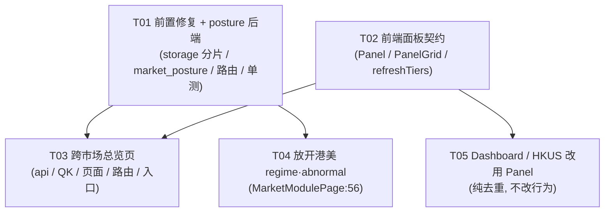

# 面板化架构可行性评估（tick-stock-panel）

> 作者：高见远（架构师） · 日期：2026-09-20
> 类型：**架构评估**（只读代码 + 判断 + 设计，不含业务代码实现，未修改任何源文件）
> 上游输入：`deliverables/worldmonitor-deep-dive-2026-09-19.md`（World Monitor 调研）、`deliverables/panel-portfolio-2026-09-20.md`（面板组合 PRD）
> 触发语：「我们是否可以参考它 也做一些面板出来呢」

---

## TL;DR（约 200 字）

**结论：不要面板化。不要做 World Monitor 那套「109 Panel 子类 + 可拖拽网格 + 布局持久化」的壳。**

三条硬理由：① **用户形态不匹配**——那是为「多租户 SaaS / 6 站点变体 / premium 分层」设计的，我们是**单用户本地终端**，有账号（`Auth.tsx`）、有服务端 preferences、只有一个用户，"每个人进来看到不同默认布局"这个需求不存在；② **真问题不是"不能排版"，是"没被并置"**——用户觉得爽的是"几十路信号在一屏内同时可见且已收敛成判断"，不是"能拖"；把拖拽做完了，可拖的还是那些分散的信号；③ **成本不对称**——二维网格在 React 18 生态没有低成本方案，`@dnd-kit` 只做一维排序（已确认），`react-grid-layout` 依赖 `findDOMNode`（React 19 已移除）且 12 列像素模型与我们 `sm/lg/xl` 三档断点 + 自定义 `xl:grid-cols-[minmax(0,1fr)_20rem]` 冲突，粗估 **8~13 人日纯框架成本、零业务价值**。

**正确方向：新增 1 个跨市场总览页 + 抽出 1 个轻量 `<Panel>` 容器契约，29 个路由页一个都不动。** 且我发现后端已有 `cn/hk/us` 三市场 regime 数据与 `/api/abnormal/hk-us/overview`，前端 `MarketModulePage.tsx:56` 却把它们标成 unavailable——**这是免费的红利，先吃这个。**

---

## 1. 现状盘点（逐条查证，附 文件:行号）

### 1.1 总表

| # | 查证项 | 结论 | 证据（文件:行号） |
|---|---|---|---|
| 1 | 面板/卡片**容器**抽象 | ❌ **没有**。无 `Panel.tsx` / `Card.tsx` / `Widget.tsx` 基类 | `frontend/src/components/` 目录清单（无 Panel/Card/Widget）；`components/StockPanel.tsx` 是"个股面板"业务组件，非容器抽象 |
| 2 | 面板**展示组件**复用 | ✅ **有，且质量不错**：`OverviewKit` 纯展示组件集 | `components/overview/OverviewKit.tsx`：`SectionTitle:60`、`KpiCell:73`、`IndexTicker:85`、`BreadthBar:108`、`DistributionBars:129`、`EmotionRadar:151`、`LadderMini:218`、`MiniMetric:260`、`StockList:269`、`RankColumn:333`、`HotRankCard:375` |
| 3 | 卡片**样式**是否抽象 | ❌ **没有**。同一串 class 手抄 4+ 处 | `pages/Dashboard.tsx:423` / `components/HKUSMarketOverview.tsx:159` 逐字节相同：`rounded-card border border-border bg-surface/80 p-1.5 shadow-[0_1px_2px_hsl(var(--border)/0.4)] backdrop-blur-sm`；另见 `Dashboard.tsx:435/443/483/487`、`HKUSMarketOverview.tsx:171/179/219` |
| 4 | 网格/布局系统 | ⚠️ **只有裸 Tailwind grid，各页各写，无抽象层** | `Dashboard.tsx:402`（`grid-cols-2 sm:grid-cols-4`）、`:405`（`grid-cols-3 sm:grid-cols-6`）、`:420`（`xl:grid-cols-[minmax(0,1fr)_20rem]`）、`:422`（`lg:grid-cols-3`）、`:469`、`:474`；`HKUSMarketOverview.tsx:143/146/156/158/202` 一一对应复制 |
| 5 | 布局**位置/尺寸**持久化 | ❌ **没有** | `lib/storage.ts:88-188` 集中注册 30+ 个 localStorage key，**无一与布局位置/尺寸相关** |
| 6 | 「顺序 + 显隐」持久化（近似物） | ✅ **有，两种** | ① localStorage：`storage.ts:185 dataCardVisible`、`:187 dataCardOrder`，读写在 `components/data/PageSettingsModal.tsx:70/90/111/116`；② 服务端 preferences：`components/Layout.tsx:526`（`prefs?.nav_order`）、`:557`（`prefs?.nav_hidden`），写入 `lib/api.ts:2255 saveNavOrder` / `:2260 saveNavHidden`，UI `pages/settings/MenuSettings.tsx:239/247` |
| 7 | 拖拽能力 | ⚠️ **依赖已装，但只用于一维排序** | `frontend/package.json:13-15`：`@dnd-kit/core ^6.3.1`、`@dnd-kit/sortable ^10.0.0`、`@dnd-kit/utilities ^3.2.2`（pnpm-lock 确认实测版本一致，React 18.3.1）。实际使用 3 处**全是 `verticalListSortingStrategy`**：`components/data/PageSettingsModal.tsx:10-18,162`、`components/ListColumnCustomizer.tsx:14-19`、`pages/settings/MenuSettings.tsx:11-19,307-327`。**未装 `react-grid-layout`（已确认 NOT INSTALLED），未装任何二维网格库** |
| 8 | `Dashboard.tsx` 是什么 | ✅ **是 A 股单市场"真总览"，不是导航页** | 见 §1.2 |
| 9 | 统一刷新/轮询约定 | ⚠️ **机制统一，档位不统一** | 见 §1.3 |
| 10 | 跨市场聚合 | ❌ **不存在**。三市场看板是三份复制 | `pages/Dashboard.tsx`（A 股）、`pages/HKStocks.tsx:5` + `pages/USStocks.tsx:5`（均只是 `<HKUSMarketOverview market=... />`，各 5 行）→ 同一个 `components/HKUSMarketOverview.tsx` |

---

### 1.2 `Dashboard.tsx` 到底是什么？

**结论：它是 A 股单市场的 single pane of glass，且数据来自"后端单次聚合"，不是前端拼装。**

| 维度 | 事实 | 证据 |
|---|---|---|
| 数据入口 | **1 个主聚合端点** `/api/overview/market` | `pages/Dashboard.tsx:181-186`：`useQuery({ queryKey: QK.overviewMarket(selectedDate), queryFn: () => api.overviewMarket(selectedDate), staleTime: 5_000, placeholderData: prev })` |
| 后端实现 | 单次请求聚合，**明确注释"避免前端拉全市场明细后再计算"**，带 5s TTL 缓存 + 跨线程锁 | `backend/app/api/overview.py:357-373`（docstring `:359`）、缓存 `:19-25`、锁 `:364-372` |
| 附带的其他 query | `alertsList(10s)`、`dataStatus`、`capabilities`、`settings`、`preferences`、`dataSources` | `Dashboard.tsx:50-54`、`:180`、`:188`、`:189`、`:195`、`:196-200` |
| 页面结构 | 顶栏 → 指数+KPI → 涨跌分布/情绪雷达/趋势强度 → 概念/行业热度 → 四榜 → 右栏(涨停梯队+监控中心) | `Dashboard.tsx:338`（顶栏）、`:401`（指数+KPI）、`:422`（三卡）、`:469`（概念/行业）、`:474`（四榜）、`:482`（右栏） |
| 面板数量 | 约 **13 个视觉区块**（6 个 `<section>` + 2 个 `HotRankCard` + 4 个 `StockList` + 顶部/监控各 1） | 6 个 `<section>` 位于 `Dashboard.tsx:401/423/435/443/483/487`；`HotRankCard` / `StockList` 内部自带 section（`OverviewKit.tsx:381`、`:274`） |

**关键判断**：我们**已经有一个"真总览页"了**，而且实现路径跟 World Monitor 相反——World Monitor 是前端 N 个 Panel 各拉各的，我们是**后端一次聚合好、前端只渲染**。后者在本地单机场景下**更优**（少 N-1 次往返、少 N 份 loading/error 状态机）。

**所以"用户想要的一屏"我们已有 60%，缺的那 40% 是：它只覆盖 A 股。**

---

### 1.3 统一刷新 / 轮询约定

| 层次 | 事实 | 证据 |
|---|---|---|
| **主机制** | **SSE invalidation，不是轮询** | `lib/useSharedQueries.ts:1-6` 头注释：「实时数据走 SSE invalidation，无需前端轮询。只有管线进度等非 SSE 数据才用 refetchInterval。」 |
| SSE 实现 | 单连接 `/api/intraday/stream`，事件驱动 invalidate，带指数退避（base 5s，上限 60s）+ 失败 3 次弹 toast | `lib/useQuoteStream.ts:121`、`:134-173`（`quotes_updated`）、`:228-231`（退避） |
| invalidate 白名单 | 按 **queryKey 前缀**匹配，集中在一处 | `lib/queryKeys.ts:160-170`：`watchlist-quotes`、`watchlist-enriched`、`quote-status`、`index-quotes`、`overview-market`、`limit-ladder`；`useQuoteStream.ts:153-158` 消费 |
| 用户可配 | 每个前缀可单独开关（`sseRefreshPages`） | `useQuoteStream.ts:138-152`；旧 `watchlist` 单开关向后兼容 `:145-150` |
| QueryClient 默认 | `staleTime: 5_000`、`refetchOnWindowFocus: false` | `main.tsx:36-37` |
| **轮询（兜底）** | `refetchInterval` 出现 **40 处**，值五花八门 | `Dashboard.tsx:53`（10s 告警）、`:222`（1s 管道）；`Layout.tsx:386`（2s/15s）、`:504`（15s 徽标）；`components/HKUSMarketOverview.tsx:62`（60s）；`components/MarketIndices.tsx:33`（hk 10s / us 60s）；`components/MarketRankings.tsx:21`（10s/60s）；`lib/useSharedQueries.ts:77`（30s 默认）；`pages/Data.tsx:81/87`（30s/60s）；`pages/Screener.tsx:449`、`pages/Watchlist.tsx:914`（用户可配） |

**结论**：
- ✅ **机制是统一的**（SSE + 前缀白名单 + `QK` 集中管理 + `placeholderData` 防闪烁）——这套设计是对的，比 World Monitor 每个 Panel 自己 `setInterval` 更干净。
- ❌ **档位没有约定**：40 处 `refetchInterval` 各填各的数字，且 `queryKeys.ts:43-50` / `:48-49` 的注释已经记录了两次"被 SSE 高频失效打挂"的踩坑（全自选日K每秒重拉 / 分时图触限流）。**这是既有的技术债，新增总览页时不能再复制这个模式。**

---

### 1.4 盘点中发现的 5 个具体问题（按严重度）

| # | 问题 | 证据 | 影响 |
|---|---|---|---|
| **P1** | **热点快照跨市场互相覆盖**：`write_topics` 是**整文件覆盖**，`_persist_and_return` 只传**当前市场**的结果 | `services/hotspot/storage.py:186-195`（`path.unlink()` / `_write_parquet_snapshot` 覆盖写）；`service.py:206 storage.write_topics(list(result))`；读取侧 `service.py:76` 按 `snapshot_market` 过滤 | **查一次港股热点 → A 股热点快照被清空**。跨市场并置必踩。见 §5 |
| **P1** | **前端埋没后端已有能力**：`regime`/`abnormal`/`hotspots` 对港美被硬编码为 unavailable，但**后端+数据都已就绪** | 前端 `pages/MarketModulePage.tsx:56` `new Set(['concept-analysis','industry-analysis','regime','abnormal','review'])`；后端 `api/regime.py:25`（`_MARKET_PATTERN = "^(cn\|hk\|us)$"`）、`:101-109`；磁盘 `data/regime_history/{cn,hk,us}/part.parquet` **三份都在**；`api/abnormal.py:26-39`（`/hk-us/overview?market=HK\|US`）；`api/hotspots.py:34`（`_ALLOWED_MARKETS = {"cn","hk","us"}`） | 用户以为港美没有，实际已有。**这是本次最大的免费红利**（精确范围见附录 A-3） |
| **P2** | **热点 history 缺 market 字段，且三市场共用一个 jsonl** | `storage.py:331-366 append_history_row` 写入的 record **无 `snapshot_market` 字段**；`storage.py:43` 单文件 `topics.jsonl` | 题材加速（面板 4）若要覆盖港美会**串数据**。需补字段 + 向后兼容（旧行视为 `cn`） |
| **P2** | **新闻查询无批量端点 → N+1 放大** | `backend/app/api/news.py` 只有 `/search`、`/stock`（**单 symbol**）、`/concept`、`/status`、`/categories`、`/feeds` | 异动归因若对 200 条异动逐条查 `/api/news/stock` = 200 次外部搜索调用，且 `api.ts:118` 明确有 `rpm` 限流字段。**必须后端批量化 + 缓存** |
| **P3** | 新闻来源**未做归一/家族合并** | `services/news_search.py:197` `source=_extract_domain(url)`，仅取域名 | PRD 的"≥2 条**独立**来源"不成立，须降级为"≥2 条不同域名命中"并在 UI 标注。**PM 的待确认 #1 可结案** |

> **PM 的待确认 #2 也可结案**：热点历史快照**已存在**——`storage.py:43 _HISTORY_DIR="history"`、`append_history_row:331`、`load_history_jsonl:368`，磁盘 `data/hotspot/history/topics.jsonl`（553 KB）已落盘。**题材加速榜不需要新建表**，但需新增"按 market + 时间取最近两次快照"的读取函数（受 #P2 制约）。

---

## 2. 如果做「可拖拽 + 可配置 + 布局持久化」的面板网格，代价是什么？

### 2.1 需要新增的依赖（含版本兼容性，React 版本已查证）

**先确认我们的版本**（`frontend/pnpm-lock.yaml:13-52` 实测解析结果，非 `package.json` 声明）：

| 包 | 实测版本 | 来源 |
|---|---|---|
| `react` / `react-dom` | **18.3.1** | `pnpm-lock.yaml:47-52`；`package.json:25-26` 声明 `^18.3.1` |
| `@dnd-kit/core` / `sortable` / `utilities` | **6.3.1 / 10.0.0 / 3.2.2** | `pnpm-lock.yaml:13/16/19` |
| `@tanstack/react-query` | **5.100.11** | `pnpm-lock.yaml:22` |
| `@types/react` | 18.3.5 | `package.json` devDeps |
| vite / typescript | 5.4.3 / 5.5.4 | `package.json` devDeps |

**网格方案候选与兼容性判断**（React 18.3.1 前提下）：

| 方案 | 包名 / 版本 | React 18.3.1 兼容？ | 判断 |
|---|---|---|---|
| A | `react-grid-layout@^1.4.4` + `@types/react-grid-layout`（devDep） | ⚠️ **能跑，但有隐患** | peer 声明 `react >= 16.3` 形式兼容；但它依赖 `react-draggable@^4` + `react-resizable@^3`，二者使用 **`findDOMNode`**——React 18 下仅告警，**React 19 已移除该 API**。我们 `main.tsx:49` 开着 `<React.StrictMode>`，告警会刷屏；且一旦升 React 19 直接崩 |
| B | `react-mosaic-component@^6` | ⚠️ 兼容 | 但它是**树状分屏**（二分/三分），不是自由网格；且维护活跃度低 |
| C | `rc-dock@^3` | ✅ 兼容 | 偏 IDE dock 形态（标签页 + 停靠），语义与"看板"不符 |
| D | **自研**：`@dnd-kit/sortable` 的 `rectSortingStrategy`（**已装**）+ CSS grid + 自研 resize + 自研持久化 | ✅ 无新依赖 | dnd-kit 内置 `rectSortingStrategy` 支持二维网格"换位"，但 **resize 完全没有现成能力**，需自研 |

**我的推荐（如果非做不可）**：只有方案 D 可接受——因为 A/B/C 都要引入一个"和我们设计语言冲突的布局模型"，且 A 埋了 React 19 的雷。

### 2.2 需要新建的文件/模块（相对路径清单，方案 D）

```
frontend/src/
├── components/grid/
│   ├── GridLayout.tsx           # 12 列 CSS grid 容器 + resize 手柄 (~180 行)
│   ├── GridItem.tsx             # 单个可拖拽/可缩放格子 (~120 行)
│   ├── useGridDrag.ts           # dnd-kit rectSortingStrategy 封装 (~90 行)
│   ├── useGridResize.ts         # 自研 resize：pointer 事件 + 列宽换算 (~150 行)
│   └── gridMath.ts              # 列/行 ↔ 像素 ↔ span 换算 (~80 行)
├── lib/
│   ├── layoutSchema.ts          # 布局 schema 类型 + 版本 (~70 行)
│   ├── layoutMigrate.ts         # schema v1→v2→v3 迁移 (~90 行) ← 长期成本大头
│   └── layoutStore.ts           # localStorage 读写 + 校验 + 兜底 (~70 行)
├── panels/
│   ├── registry.tsx             # 面板注册表 (id → 组件 + 默认 span + 标题) (~120 行)
│   └── PanelFrame.tsx           # 面板外壳：标题栏/loading/error/空态/刷新 (~110 行)
└── components/grid/__tests__/
    └── gridMath.test.ts         # 换算单测
```

**合计约 1000+ 行新代码，其中 `layoutMigrate.ts` 是典型的"写了就永远要养"的成本。**

### 2.3 与现有 29 页路由架构的冲突点（**这是最关键的一节**）

| # | 冲突点 | 具体机制 | 证据 |
|---|---|---|---|
| **C1** | **lazy 加载失效** | 现在 29 页全部 `lazy()` 分包（`router.tsx:20-56`），首屏只加载 Layout + Onboarding；注释明确写了是为了"避免首屏打包 ECharts / lightweight-charts / framer-motion 等重库"。面板网格要在一屏挂 N 个面板 → **所有面板的图表重库在同一 chunk 内**，首屏 bundle 直接回到未优化状态 | `router.tsx:17-19` 原注释 |
| **C2** | **URL 语义丢失** | 现在是 `/regime?start=&end=` 可分享、可后退、可书签。网格里"哪个面板展开到什么状态"要么进 URL（变长、难维护、易冲突）要么不进（**无法分享、无法后退**） | `router.tsx:201`（`/regime`）、`pages/Regime.tsx`（79 KB 深度页） |
| **C3** | **SSE invalidate 粒度被击穿**（**最严重**） | `queryKeys.ts:160-170` 的前缀白名单是**按"页面"设计**的。网格化后一屏同时挂载十几个 query，一次 `quotes_updated`（盘中可达 1s/次）会 invalidate **整屏** query → 全屏重拉。`queryKeys.ts:43-50` 和 `:48-49` 的注释已经两次记录了这个坑：「若被 SSE quotes_updated 高频失效会导致全自选日K每秒重拉，staleTime 形同虚设」「导致每次都拉 TickFlow 触限流」 | `queryKeys.ts:43-50`、`:48-49`、`:160-170`；`useQuoteStream.ts:153-158` |
| **C4** | **命令式图表 resize** | `EChartsCandlestick.tsx`（42 KB）、`EChartsIntraday.tsx`（22 KB）、`EChartsMultiDayIntraday.tsx`（15 KB）、`lightweight-charts` 均为**命令式实例**，容器尺寸变化需显式 `chart.resize()`。现在布局是固定的，从来不需要处理；网格 resize 会引入一整类新 bug | `components/ECharts*.tsx`；`package.json:20,23` |
| **C5** | **29 页里 14 页根本不该进网格** | `pages/backtest/` 5 个 + `pages/settings/` 9 个 = 14 个是**配置与研究类**，与看盘无关 | 目录清单 `pages/backtest/`、`pages/settings/` |
| **C6** | **深度页塞进网格会掉信息密度** | `Watchlist.tsx` 88 KB、`LimitUpLadder.tsx` 77 KB、`Regime.tsx` 79 KB、`Screener.tsx` 49 KB —— 这些是**深度页**，价值就在"整页铺开"。塞进 1/3 屏的格子里是降级 | 文件体积 |

### 2.4 现有 29 页：改造还是另起炉灶？

> **答：都不做。保持 29 页路由完全不动，只新增 1 页。**

理由（对应上表）：

1. **路由式页面在本项目是特性而非缺陷**：URL 可分享、可后退（C2）、lazy 分包（C1）、每页可独立演化（C6）、SSE 粒度可控（C3）。这四条恰恰是面板网格的四个弱点。
2. **改造的收益为零**：29 页里 14 页（C5）与看盘无关；剩十几页是被 C6 保护的深度页。**没有任何一页在网格里会变得更好用。**
3. **"另起炉灶"会制造双轨制**：一旦存在"网格版"和"路由版"两套，用户要学两套心智模型，团队要维护两套。对一个单人本地终端是纯负债。
4. **唯一值得做的是"去重"而非"重排"**：`Dashboard.tsx:423` 与 `HKUSMarketOverview.tsx:159` 那串手抄的 section class，抽成 `<Panel>` 容器即可（约 90 行），**不动任何布局顺序，不引入拖拽**。

---

## 3. 关键架构判断：我们到底要不要「面板化」？

### 3.1 结论（不和稀泥）

> **不做通用面板网格。做「1 个跨市场总览页 + 1 个轻量 Panel 容器契约」。**

### 3.2 权衡过程

#### (a) 用户形态：我们和 World Monitor 是两种东西

| 维度 | World Monitor | tick-stock-panel | 结论 |
|---|---|---|---|
| 用户数 | 多租户、公网 SaaS | **单用户、本地跑** | 布局个性化无受益人 |
| 站点变体 | 6 个 hostname 变体，各自默认面板集/图层/刷新间隔/主题 | 1 个 | "不同用户进来看到不同默认布局"这个机制**我们没有需求** |
| 商业化分层 | premium 分层控制面板可见性 | 无 | 同上 |
| 持久化载体 | localStorage（无账号时） | **有账号**（`Auth.tsx`）+ 服务端 preferences（`nav_order`/`nav_hidden`） | 我们已经有**更好**的持久化载体（服务端、跨设备），网格退回 localStorage 是**降级** |
| 布局载体 | 全屏地图是固定底色，面板是信息密度的唯一载体 | **页面分层已经很清晰**：WorkspaceShell(Rail) → MarketTab → Layout(侧栏) → 页面 | 我们没有"唯一载体"这个前提 |

**一句话**：**World Monitor 的面板体系是"为多用户产品形态设计的"。我们的形态是单用户本地终端，这套复杂度里我们能受益的部分约等于 0。**

#### (b) 使用节奏：29 页 vs 一个网格，哪个更好用？

用户的两个真实场景：

| 场景 | 真实诉求 | 29 页路由 | 可配置网格 |
|---|---|---|---|
| **盘中盯盘**（9:30-15:00，注意力稀缺，切换频繁） | ① A 股全景一眼扫完 ② 告警/异动即时可见 ③ 点进某只票要快 | ✅ Dashboard 已是一屏（§1.2）；SSE 已实时推送；`StockPreviewDialog` 弹窗不用跳页 | ⚠️ 网格不会更快：一屏能放的面板数量受物理屏幕限制，且 C3 会让它变卡 |
| **盘后复盘**（15:00 后，时间充裕，需要深度） | ① 今天三市场分别什么状态 ② 主线/题材演化 ③ 逐条深挖 | ⚠️ **当前最痛**：要切 `/` → `/hk` → `/us` 三个 tab 才能拼出全局 | ❌ 网格也解决不了：深度分析（Regime 79 KB、LimitUpLadder 77 KB）在格子里施展不开 |

**关键洞察**：两个场景的痛点**不在同一个地方**。
- 盘中痛的是"**实时性 + 少跳转**"——我们已经用 SSE + Dashboard + 弹窗解决了。
- 盘后痛的是"**跨市场拼图**"——这需要的是**一个新页面**（三市场并置），不是**一个新框架**（拖拽网格）。

**所以：网格对两个场景都不是最优解；跨市场总览页直接命中盘后场景。**

#### (c) 折中路线（推荐）

不做通用网格，但搬 World Monitor 里**真正值钱的那一条工程纪律**：

> **高频区与低频区分容器；容器节点稳定、内容节点可换；渲染做防抖。**

World Monitor 的 `setContent(html)` 150ms 防抖 + 事件委托在稳定的 `this.content` 上——它解决的不是"能拖"，而是"**高频刷新下 DOM 重建导致的监听器泄漏与闪烁**"。

我们不用搬它的实现（我们是 React，不需要事件委托），但**必须遵守同一条纪律**，落到总览页上就是：
- 高频区（A 股指数/广度/告警）与低频区（港美快照/题材/数据健康）**分容器、分 query、分刷新档位**；
- 容器节点（`<Panel>`）在刷新期间**不卸载**，只有内容换（对应 `placeholderData: prev`，`Dashboard.tsx:185` 已在用）。

### 3.3 我对 PRD 的两点补强（与许清楚的结论一致，但工程侧要加码）

| PRD 结论 | 我的补强 |
|---|---|
| 面板 8（可拖拽网格）**建议不做** | ✅ **同意，并升级为"明确不做"**。补充了 C1~C6 六条硬冲突与 8~13 人日的成本估算 |
| 面板 1（三市场态势总览）**P0** | ✅ 同意，但工程上有 **3 个硬前置**：P1 热点覆盖写必须先修（§1.4 #P1）、前端 unavailable 硬编码必须先放开（§1.4 #P1）、`Panel` 容器必须先抽（否则第 4 份手抄 class） |
| 阈值 `up_pct < 35%` / `≥2 类` 待校准 | ⚠️ **纠正一处**：PRD 未指定阈值存放位置。**不要放 `tiers.yaml`**——该文件头注释明确「业务代码永远不读这张表」（`tiers.yaml:9-10`，它是数据源套餐能力对照表）。阈值应放 `backend/app/config.py`（可 env 覆盖）或 `market_posture.py` 顶部常量 + 单测钉死 |

---

## 4. 折中路线的技术设计：跨市场总览页

### 4.1 总览页要聚合哪些信号？（**全部为已查证的真实 API，无编造**）

| 区块 | 信号 | API 路径（已查证） | 前端方法 / 后端定义 | 刷新档 |
|---|---|---|---|---|
| **A. 三市场态势带**（核心新增） | 每市场 posture（进攻/均衡/防守）+ 投票明细 + 不可用维度 + 证据 | **新增** `GET /api/overview/posture?markets=cn,hk,us` | 后端新增，见 §4.2 | T3 日级 |
| **B. 三市场指数** | cn/hk/us 核心指数涨跌幅 | `GET /api/overview/market`（A 股，含 `indices`）· `GET /api/hk/overview` · `GET /api/us/overview` | `api.ts:2576/2577/2578` → `api.overviewMarket/overviewHk/overviewUs`；后端 `api/overview.py:357`、`api/hk.py:122`、`api/us.py:129` | T0(A股) / T2(港美) |
| **C. 三市场广度 + 情绪分** | up/down/flat、strong_up/down、emotion.score+label | 同上三个 overview 端点（`breadth`、`emotion` 字段，schema 统一） | 类型定义 `api.ts:697-733 OverviewMarket` | 同上 |
| **D. 三市场 regime** | state + score | `GET /api/regime/latest?market=cn\|hk\|us` | `api.ts:2594 api.regimeLatest`；后端 `api/regime.py:101-109`，`_MARKET_PATTERN="^(cn\|hk\|us)$"`（`:25`） | T3 日级 |
| **E. 三市场主线/热点 TOP** | topic、heat、stage、leader | `GET /api/v1/hotspots?market=cn\|hk\|us&top=N` | `api.ts:3572 api.hotspots`；后端 `api/hotspots.py:60-73`，`_ALLOWED_MARKETS={"cn","hk","us"}`（`:34`）；港美源 `services/hotspot/hk_us_source.py` | T3 日级 |
| **E2. 行业热度**（仅美股可用，港股标不可用） | sector 聚合 | `GET /api/us/overview` 的 `industry_rank` | `services/hk_us_overview_builder.py:509` `industry_rank: _sector_rank(rows, limit=5)`；美股 universe 带 NASDAQ `sector`/`industry`（`:216-217`），**港股无该字段 → 返回空** | T2 |
| **F. 异动** | A 股异动边缘 + 港美动量异动 | `GET /api/abnormal/overview` · `GET /api/abnormal/hk-us/overview?market=HK\|US` | `api.ts:3394/3398`；后端 `api/abnormal.py:11`、`:26` | T1 盘中 |
| **G. 告警**（已有，复用） | 触发记录 TOP10 | `GET /api/alerts?days=7&limit=10` | `api.ts:3452 api.alertsList`；后端 `api/alerts.py:19-46` | T1 盘中 |
| **H. 数据健康**（已有，提到全局） | 各市场/数据源新鲜度 | `GET /api/data/freshness` · `GET /api/data/status` · `GET /api/v1/hotspots/job-state` · `GET /api/news/status` | `api.ts:2882/2881/3590/2818`；`components/DataFreshnessBar.tsx:181-184`（**已在 Layout 底部常驻**：`Layout.tsx:962`） | T4 元 |
| **I. AI 复盘**（可选，盘后） | 最新复盘报告摘要 | `GET /api/market-recap/reports` | `api.ts:3220 api.reviewReportsList`；后端 `api/market_recap.py:84` | T4 元 |

> **注意 H**：`DataFreshnessBar` **已经在 Layout 底部全局常驻**（`Layout.tsx:962`）。所以"数据健康"这一条**不需要在总览页重做一遍**，只需一条精简的"最后更新时间"行 + 跳转。**PRD 面板 5 可以降级为"总览页的一个状态条 + 复用现有全局条"，不应新建独立面板。**

### 4.2 后端要「聚合端点」还是「前端并行多个 query」？

> **推荐：前端并行 3 个已有 overview query + 1 个新增 posture 端点。不做 `/api/overview/all`。**

#### 为什么**不**做 `/api/overview/all`（三市场合并成一个大端点）

| 理由 | 说明 |
|---|---|
| **TTL 被绑死** | A 股 `/api/overview/market` 有 **5s 后端缓存**（`api/overview.py:19-25`）；港美 `build_hk_us_overview`（`api/hk.py:131`）**无后端缓存**，每次实算。合并后：要么整端点 5s 刷 → 港美每 5s 全市场重算一次（**本地单机也会被自己拖垮**）；要么整端点 60s 刷 → **A 股盘中实时性丢失**（`quote_status.running` 的实时价值作废） |
| **失败域变大** | 现在是"港美失败，A 股照常显示"（`HKUSMarketOverview.tsx:241-243` 已有降级 UI）。合并后任一个市场异常 → 整屏黑 |
| **契约成本** | 新增一个大 schema = 新增一份需要维护、测试、向后兼容的契约，而收益只是"少 2 个 HTTP 请求" |
| **请求数不是瓶颈** | 本地单机、同源，我们已经同时跑着 SSE 长连接 + 15s 告警轮询（`Layout.tsx:504`）+ 30s 新鲜度轮询（`DataFreshnessBar.tsx:184`），再加 3~4 个并发请求无感 |

#### 为什么 posture **必须**放后端（不能前端算）

| 理由 | 说明 |
|---|---|
| 数据够不着 | posture 需要 `regime`（读 `data/regime_history/{market}/part.parquet`）+ `hotspots`（读 `topics.parquet`）+ `breadth`——前两个前端拿不到 |
| 它是"判断"不是"数据" | 放后端可被大盘复盘（`services/market_recap.py`）、推送（`services/webhook_adapter.py`）、未来 Cmd+K 复用 |
| "不可用不计入分母"必须可测 | 这条口径散在 UI 里无法单测。放后端可写 3 个 case 的单元测试钉死 |

#### posture 端点设计

```
GET /api/overview/posture?markets=cn,hk,us
```

**硬约束（写进设计）**：
1. **只读落盘数据，绝不触发任何同步/刷新**。`hotspots` 的 `discover(refresh=True)` 路径会走外部源（慢且可能失败），posture 必须走 `storage.read_topics()`（`storage.py:199`）这类只读路径。
2. **自带 60s 缓存**，复用 `api/overview.py:19-25` 的同款 TTL + Lock 模式。
3. **内部复用已有装配器**：`build_market_overview(repo, quote_service, depth_service, as_of)`——它**已经解耦了 Request 依赖**（`api/overview.py:342-354` 注释：「以解耦对 Request 的依赖, 使大盘复盘等无 Request 的调用方可复用同一装配逻辑」）。港美复用 `build_hk_us_overview("HK"\|"US", data_dir, as_of)`（`api/hk.py:131`）。**不要重写聚合逻辑。**
4. **四态枚举，不要可空**：`vote: 'attack' \| 'neutral' \| 'defend' \| 'unavailable'`。`unavailable` 必须是**一等公民**，避免"忘了判空"静默退化成 `neutral`——这正是 PRD §3.2 面板 1 第③条要防的事。

**响应契约**：
```ts
interface MarketPosture {
  as_of: string | null
  markets: Array<{
    market: 'cn' | 'hk' | 'us'
    posture: 'attack' | 'balanced' | 'defend' | 'unknown'
    votes: Array<{ dim: string; vote: 'attack'|'neutral'|'defend'|'unavailable'; detail: string }>
    unavailable_dims: string[]        // 显式列出，UI 必须渲染
    evidence: Array<{ dim: string; text: string }>   // UI 必须可展开
    freshness: { regime_as_of: string | null; hotspot_age_hours: number | null }
  }>
}
```

### 4.3 刷新策略（**按档位，不要一个 `refetchInterval` 走天下**）

现状的坑：40 处 `refetchInterval` 各填各的（§1.3）。总览页必须开一个**档位常量表**，所有面板引用档位而不是写数字。

| 档 | 语义 | 覆盖数据 | staleTime | 机制 |
|---|---|---|---|---|
| **T0** | 实时 | A 股 `overview-market`、`index-quotes`、`quote-status` | 5s | **SSE** `quotes_updated` → invalidate（前缀已在 `queryKeys.ts:160-170`） |
| **T1** | 盘中 | `alerts`、`limit-ladder`、`abnormal-overview` | 10~15s | `refetchInterval`（沿用 `Dashboard.tsx:53` / `Layout.tsx:504`） |
| **T2** | 慢快照 | 港美 `hk-us-overview` | 60s | `refetchInterval`（沿用 `HKUSMarketOverview.tsx:61-62`） |
| **T3** | 日级 | `regime-latest`、`hotspots`、**`overview-posture`（新）** | 300s | `refetchInterval`；**不进 SSE 前缀**（否则每个 tick 重算 posture） |
| **T4** | 元数据 | `data-freshness`、`news-status` | 30s | 沿用（`DataFreshnessBar.tsx:184` 已全局常驻） |

**三条纪律**：
1. `overview-posture` **绝不能**加进 `SSE_INVALIDATE_PREFIXES`（`queryKeys.ts:160-170`）。它是日级判断 + 后端重算，被 1s/次的 `quotes_updated` 打中会重演 C3。
2. 每个面板用 `placeholderData: (prev) => prev`（`Dashboard.tsx:185` 已在用），保证刷新期间**容器不卸载、不闪烁**——这就是 §3.2(c) 那条纪律的落点。
3. 港美区块必须保留 `HKUSMarketOverview.tsx:241-243` 的"本次刷新失败，继续展示最近一次成功数据"降级 UI。

### 4.4 文件清单 + 实现顺序 + 依赖

#### 依赖（**推荐路线新增 npm 依赖数 = 0**）

无。全部用现有：`@dnd-kit`（不动）、`@tanstack/react-query` 5.100.11、`lucide-react`、`tailwindcss` 3.4。

#### 文件清单

**后端（4 个：1 新 / 2 改 / 1 测）**

| 文件 | 动作 | 说明 |
|---|---|---|
| `backend/app/services/market_posture.py` | **新增** (~180 行) | posture 计算：读 regime + hotspots（只读路径）+ 复用 `build_market_overview`/`build_hk_us_overview`；**不可用维度不计入分母**；阈值常量 |
| `backend/app/api/overview.py` | **改** (~35 行) | 加 `GET /posture` 路由 + 60s 缓存（复用文件内既有 `_cache_lock` 模式 `:19-25`） |
| `backend/app/services/hotspot/storage.py` | **改** (~25 行) | **前置修复**：`write_topics` 改为按 market 分片（`hotspot/topics_{market}.parquet`）或 merge-into-file；`append_history_row` 补 `market` 字段（旧行视为 `cn`） |
| `backend/tests/test_market_posture.py` | **新增** (~90 行) | 3 个 case：① 港美缺维度时不计入分母、不得判 defend；② 一票否决生效；③ 全 unavailable → `unknown` 而非 `defend` |

**前端（7 个：4 新 / 3 改）**

| 文件 | 动作 | 说明 |
|---|---|---|
| `frontend/src/components/panel/Panel.tsx` | **新增** (~90 行) | 面板容器契约：标题/图标/loading/error/空态/**不可用态**/header 右 slot。**不做**拖拽、resize、折叠、span |
| `frontend/src/components/panel/PanelGrid.tsx` | **新增** (~50 行) | 12 列 CSS grid + `span` 常量（**顺序在代码里定死，无持久化**） |
| `frontend/src/lib/refreshTiers.ts` | **新增** (~35 行) | T0~T4 档位常量表，面板引用档位不写数字 |
| `frontend/src/pages/CrossMarketOverview.tsx` | **新增** (~320 行) | 总览页本体：态势带 + 三市场列 + 异动/告警 + 状态条 |
| `frontend/src/lib/api.ts` | **改** (~25 行) | 加 `overviewPosture()`（仿 `:2576` 一行式）+ `MarketPosture` 类型 |
| `frontend/src/lib/queryKeys.ts` | **改** (~2 行) | 加 `overviewPosture: (markets) => [...] as const`；**不加入** `SSE_INVALIDATE_PREFIXES` |
| `frontend/src/router.tsx` | **改** (~3 行) | 加 `{ path: 'markets', element: <CrossMarketOverview /> }` + lazy 导入 |

**入口（1 个，~6 行）**

| 文件 | 动作 | 说明 |
|---|---|---|
| `frontend/src/components/WorkspaceShell.tsx` | **改** | `:216-223` 的 MarketTab 那一行当前是 `justify-between`：左「市场」标签、右 `MarketTab`。在**左侧标签旁**加一个「跨市场总览」链接（指向 `/markets`），不侵占 MarketTab 的语义（MarketTab 驱动路由前缀，加第 4 项会破坏它） |

#### 实现顺序（5 个任务，按依赖排序）

| ID | 任务 | 文件 | 依赖 | 优先级 |
|---|---|---|---|---|
| **T01** | 前置修复 + posture 后端 | `storage.py` 分片补 market、`market_posture.py`、`api/overview.py` 加路由、`test_market_posture.py` | 无 | **P0** |
| **T02** | 前端面板契约 | `Panel.tsx`、`PanelGrid.tsx`、`refreshTiers.ts` | 无（可与 T01 并行） | **P0** |
| **T03** | 跨市场总览页 | `api.ts`、`queryKeys.ts`、`CrossMarketOverview.tsx`、`router.tsx`、`WorkspaceShell.tsx` | T01 + T02 | **P0** |
| **T04** | 放开港美已实现能力（吃红利） | `MarketModulePage.tsx:56` 移除 `regime`/`abnormal`（后端已就绪，见 §1.4 #P1） | T01 | **P0（成本极低，收益极高）** |
| **T05** | 去重回填 | `Dashboard.tsx`、`HKUSMarketOverview.tsx` 改用 `<Panel>` 容器（**只换容器，不动任何布局顺序/行为**） | T02 | **P1** |

**依赖关系图**



**验收口径（架构侧）**
1. 全链路**零新增 npm 依赖**。
2. `overview-posture` **不在** `SSE_INVALIDATE_PREFIXES` 里。
3. 港美任一维度不可用时，UI 显示「不可用」且**不计入投票分母**（单测 3 个 case 通过）。
4. T05 前后 `Dashboard` 与 `HKUSMarketOverview` 的**视觉与交互零差异**（只换容器）。
5. 盘中以 `quote_status.running=true` 跑 10 分钟，浏览器 Network 面板中 `overview-market` 的请求频率与 SSE 推送一致，**不出现整屏重拉**。

---

## 5. 风险登记（架构侧）

| # | 风险 | 严重度 | 缓解 |
|---|---|---|---|
| R1 | **热点快照跨市场覆盖**（§1.4 #P1）：查港/美热点会清掉 A 股快照 | **高** | T01 必须先修。修法二选一：按 market 分片文件；或 `write_topics` 改为「读旧 → 按 market 替换 → 整体写回」。**推荐分片**（更简单、无读改写竞态） |
| R2 | posture 端点因 `build_market_overview` 实算而变慢（三市场各一次） | 中 | 60s 缓存 + 只读落盘。若实测 P95 > 800ms，降级为「前端把 `breadth.up_pct`/`indices` 作为 query 参数传给 posture，后端不再自算 overview」 |
| R3 | `hotspots` 只读路径返回的是**上次成功快照**，可能与 overview 的 `as_of` 不同日 | 中 | `MarketPosture.freshness` 必须带 `hotspot_age_hours`（`HotspotSummary.stale_age_hours` 已有），UI 显示「题材数据 N 小时前」；超过阈值则该维度标 `unavailable` 而非用陈旧数据投票 |
| R4 | 打开 `regime`/`abnormal` 港美入口后，若数据稀疏会暴露「有入口无数据」 | 中 | 沿用 PRD「不可用 ≠ 0」纪律：入口开放但空态必须写明「尚未计算，前往 /data 触发同步」，**不得显示 0 或中性** |
| R5 | `tiers.yaml` 被误用作阈值存放 | 低 | 该文件 `:9-10` 明写「业务代码永远不读这张表」。阈值放 `app/config.py` 或 `market_posture.py` 常量 |
| R6 | 未来若升级 React 19 | 低（但需记录） | 本次**不引入** `react-grid-layout`/`react-draggable`，因此**不存在 `findDOMNode` 阻塞**。若将来要加网格，React 19 下必须换方案 |

---

## 6. 待确认（我不确定的，明确标注）

| # | 待确认 | 影响 | 我做了什么 |
|---|---|---|---|
| 1 | `data/hotspot/topics.parquet` **当前实际**是否已被某市场独占（即 R1 是否已发生过） | 决定 R1 是"潜在"还是"已发生" | 代码层已确认覆盖写逻辑（`storage.py:186-195` + `service.py:206`）；**运行时未验证**（venv python 不可用）。建议用 `pl.read_parquet(...).group_by('snapshot_market').len()` 复核 |
| 2 | `regime_history/{hk,us}/part.parquet` 的**数据覆盖天数**是否足够支撑 posture | 决定港美 posture 能否上线 | 确认文件存在且非空，但未读行数/日期范围。建议 `pl.read_parquet(...).select(pl.col('date').min(), pl.col('date').max())` 复核 |
| 3 | `build_market_overview` 在 posture 场景下的**实测耗时** | R2 是否触发降级方案 | 未实测。T01 完成后应打点 |
| 4 | posture 的 `up_pct < 35%` / `≥2 类` 阈值 | PRD 已标"占位值" | 我确认它们**必须可配置、可单测**，且**不放 `tiers.yaml`**。校准工作不在本次范围 |
| 5 | 是否要把 `/markets` 设为默认首页 | 影响盘中体验 | 我倾向**不设**（`/` 保持 A 股深度看板，盘中主战场）。此为产品决策，需许清楚/用户确认 |
| 6 | `hotspots` 港美 source（`hk_us_source.py`，25 KB，2026-09-19 更新）的**实际产出质量** | 决定港美主线区块是否有内容 | 未验证。若为空，该维度走 `unavailable` |

---

## 附录 A：评审后的修订（2026-09-20，与 software-product-manager 对齐后）

### A-1 已采纳的决策

| # | 决策 | 来源 | 我的态度 |
|---|---|---|---|
| 1 | **`/markets` 不设为默认首页**，`/` 保持 A 股深度看板；但 `/markets` 必须有**一级导航入口并置顶** | PM 拍板 | ✅ 采纳。原 §6 待确认 #5 结案 |
| 2 | **否决"时间感知默认页"**（盘中→`/`，盘前盘后→`/markets`） | PM 主动否决 | ✅ 同意，并从架构侧补一条否决理由：它会引入**"当前路由由系统时钟决定"这一不可测状态**，且 `market_time.py` 的交易时段判定与用户实际作息（夜班/跨时区看美股）必然错配，属于用复杂度换不确定性 |
| 3 | **面板 4 拆出港美加速**：v1 只做 A 股（JSONL 直接够用，零成本），港美加速单独排期 | PM 建议 | ✅ 采纳。理由成立：否则批次 2 会被一个字段迁移卡住 |
| 4 | **面板 2 加工程约束**：后端新增批量归因端点（一次入参 N 个 symbol，内部限速 + 结果缓存），**禁止前端并发逐条打** | PM 升级 | ✅ 采纳，且同意**这不是优化项而是可行性前提** |
| 5 | **面板 5 降级**：不保留为独立面板，折进总览页页脚状态条（PRD 面板数 8→7） | PM 建议 | ✅ 采纳，比我的原建议更彻底 |

### A-2 PM 复核中我确认无误的三项

- `append_history_row`（`storage.py:331-366`）写入 record **无 `snapshot_market`、也无 `snapshot_at` / `leader_stocks`** —— PM 比我的原描述更精确，确认。补充：parquet 路径的 `snapshot_market` 是存在的（`_TOPIC_SCHEMA:135`、`_summary_to_dict():168`），但 `topics.parquet` 是 **latest-only**（docstring `:14`「当前活动快照，sync 时整文件覆盖」），不是历史源。
- 新闻来源未归一（`news_search.py:197`）—— 确认。
- `api/news.py` 无批量端点 —— 确认。

### A-3 ⚠️ 我对 PM 第 ⑤ 项的一处**纠正**（重要，影响面板 1 的降级分支）

> PM 的结论：`concept-analysis` / `industry-analysis` 对港美是**真缺口**（依据是 `compute_mainline_range` 无 `market` 参数），因而"不可用维度从 5 个降到 2 个"。

**签名观察对，但结论错配了对象。** 我复核了两条不同的数据路径：

| 数据 | 计算源 | 是否支持港美 |
|---|---|---|
| **主线排行**（`/api/regime/mainline`，`api.ts:2616 regimeMainline`，**无 market 参数**） | `services/market_mainline.py:123-126 compute_mainline_range(repo, data_dir, start, end, kind, filter_cfg, exclude_st)` —— **确无 `market` 参数** | ❌ **港美均不可用**（PM 此项判断正确） |
| **overview 的 `industry_rank`** | `services/hk_us_overview_builder.py:509` `"industry_rank": _sector_rank(rows, limit=5)`，输入是美股 universe 自带的 NASDAQ `sector`/`industry` 字段（`:216-217`） | ✅ **美股可用**；❌ 港股 universe 无该字段 → 返回空 |
| **overview 的 `concept_rank`** | `hk_us_overview_builder.py:359`（空态）与 `:508`（正常态）**均硬编码** `{"leading": [], "lagging": []}` | ❌ **港美均恒空** |

**所以港美的真实不可用维度是 4 个，不是 2 个，且分布不对称：**

| 维度 | A 股 cn | 美股 us | 港股 hk |
|---|---|---|---|
| `regime` | ✅ | ✅ （数据已落盘） | ✅ （数据已落盘） |
| `abnormal` | ✅ | ✅ | ✅ |
| `hotspots` | ✅ | ✅ | ✅ |
| `industry_rank` | ✅ | ✅ **NASDAQ sector** | ❌ universe 无字段 |
| `concept_rank` | ✅ | ❌ 恒空 | ❌ 恒空 |
| 主线 `mainline` | ✅ | ❌ 无 market 参数 | ❌ 无 market 参数 |

**对设计的三点影响（已写入正文）：**
1. 面板 1 的「不可用不计入分母」逻辑**必须保留且必须支持逐市场、逐维度判定**——不能简化成"港美数据齐了"，也不能简化成"港美一个样"。**美股与港股的不可用维度清单不同**，这是硬约束。
2. 总览页「主线/热点」区块的取数优先级应为：**`hotspots`（三市场全有）> `industry_rank`（仅美股）> `concept_rank`（仅 A 股）**；`mainline` 维度对港美直接标 unavailable，不进投票分母。
3. 投票维度应按市场**动态装配**，类型上用 `unavailable` 一等公民枚举（§4.2 第 4 条硬约束）来保证不会静默退化成 `neutral`。这正是 PRD §3.2 面板 1 第③条要防的事——**现在有了确切的清单，可以钉死单测了。**

### A-5 ⚠️ 我自己一处行号订正（PM-3 提出无法验证，核对后确认我写错了）

我原文引用的是「`tiers.yaml:9-10` 明写业务代码永远不读这张表」。PM-3 反馈无法定位该文件、未能独立验证。**核对后确认我的行号错了，应为 `:8`：**

```
tiers.yaml:8   # 业务代码永远不读这张表,只读运行时探测出的 CapabilitySet。
tiers.yaml:9   # 来源:https://tickflow.org/pricing/
tiers.yaml:10  # 频率单位:次/分钟。batch 单位:标的/次。
```

**结论不变**（原文比我说得更绝对），但**行号以 `:8` 为准**。感谢 PM-3 没有照单全收。

### A-6 对 PM-3 分歧的答复：**必须「静态 + 运行时」双重，但只有一套剔除逻辑**

> PM-3 的问题：A 股 `breadth`/`hotspots` 也可能在特定日缺数据（如刚装完没跑管道）。这类运行时缺失要不要也进"不可用剔除"？还是只按市场静态声明、运行时缺失走页脚健康条？

**我的答复：必须双重。只做静态剔除会漏掉最危险的一类误判。**

**为什么运行时缺失必须剔除（不能只走健康条）**

A 股刚装完还没跑管道时：`breadth.total = 0` → `up_pct = 0/0` → NaN 或 0 → **触发「`up_pct < 35%` 一票否决」→ 判"防守"**。

这是把「没数据」读成了「市场崩了」。而且它**比港美 concept 缺失更危险**：
- 港美 concept 缺失是**已知且稳定**的，用户有预期，UI 灰显即可；
- A 股数据缺失是**意外且静默**的，用户会信以为真。

这恰恰是「不可用 ≠ 0」这条纪律最该防的场景——**只做静态剔除等于这条纪律只防了一半。**

**但两者可修复性不同，UI 必须区分**

| 类型 | 例子 | 可修复 | UI |
|---|---|---|---|
| **静态不可用**（能力级） | 港美 concept、港股 industry | ❌ 不可修复 | 灰显「该市场无此维度」，不打扰 |
| **运行时缺失**（数据级） | A 股 breadth 空、regime 过期、hotspots stale | ✅ 可修复（去 `/data` 跑管道） | 黄显 + 进页脚健康条 + 给跳转 |

**因此实现上：一套剔除逻辑 + 一个 reason 字段，不要两套机制**

```ts
type Vote =
  | { vote: 'attack' | 'neutral' | 'defend'; dim: string; detail: string }
  | { vote: 'unavailable'; dim: string; reason: 'no_capability' | 'stale' | 'empty' }
```

- `vote` 枚举**保持 4 态，不加第五态**；
- `unavailable` 携带 `reason` 区分两类成因；
- **分母剔除逻辑全局只有一条**：`votes.filter(v => v.vote !== 'unavailable')`；
- 呈现层按 `reason` 分流（灰 / 黄）。

> 两套机制会导致口径走偏（"这个维度到底算不算不可用"出现两个答案）。**一个枚举 + 一个 reason 字段**可以从类型上杜绝这种漂移。

**两条必须写进实现约束的规则**

1. **一票否决必须带 available 前置条件**（最容易写错的一行）：
   ```ts
   // ❌ 错：缺失时 up_pct = 0/NaN，会反向触发防守
   if (breadth.up_pct < 35) return 'defend'
   // ✅ 对：只有维度可用时才参与否决
   if (breadth.available && breadth.up_pct < 35) return 'defend'
   ```
2. **全维度 unavailable → `unknown`，不是 `defend`**（§4.2 契约已定）。

**关于"刚装完会不会一直 unknown"**：会，且**这是正确行为**。`unknown` + 一条「前往 /data 获取数据」的引导，远好过 `defend` 的假警报。且这个引导 Dashboard 已经有了（`Dashboard.tsx:312-323` `FetchDataCard`），可直接复用语义，不必新造。

**对 §4.2 契约的修订**：`freshness` 从「市场级」下放到「维度级」，即 `votes[].freshness?: { as_of: string | null; age_hours: number | null }`，使运行时缺失可逐维度判定与呈现。

### A-4 更新后的待确认

| # | 待确认 | 状态 |
|---|---|---|
| 原 #5（`/markets` 是否默认首页） | ✅ **已结案：不设默认首页** | PM 拍板 |
| 新 | 港美 `regime_history` 的**实际覆盖天数**（我确认文件非空，未读日期范围） | 仍待运行时复核 |
| 新 | 港美 `hotspots` 的实际产出质量（`hk_us_source.py`，25 KB，2026-09-19 更新） | 仍待复核；若为空则该维度走 `unavailable` |
| 新 | 是否要把 `mainline` 作为一个**独立投票维度**纳入 posture，还是干脆不进维度清单 | 建议**不进**（它是 A 股专属且依赖 `_SCORE_WEIGHTS` 加权——正好命中 PRD §2"不再引入第三个未回测打分"的纪律） |

---

## 7. 一句话给团队

> 我们**不缺面板，缺的是"把三个市场并到一屏"**。
> 用户看到 World Monitor 觉得爽的是**并置 + 收敛**，不是**能拖**。
> 而巧合的是——**后端已经把港美 regime / abnormal / hotspots 都做完了，只是前端把它们标成了 unavailable**（`MarketModulePage.tsx:56`）。
> **先把这个免费红利吃掉，再谈别的。**
